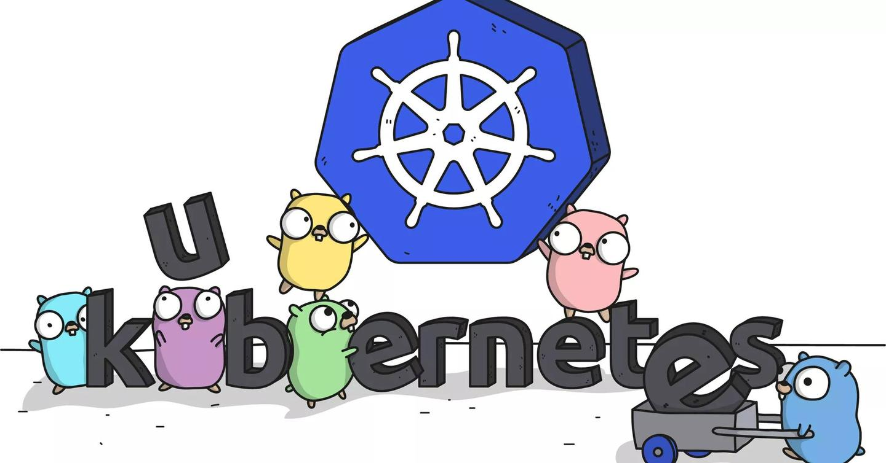

# MyNotes
记录分享自己的学习笔记。欢迎大家讨论和指正。

更多文章: [https://www.cyisme.top](https://www.cyisme.top)

csdn博客：[https://blog.csdn.net/q1403539144](https://blog.csdn.net/q1403539144)

## K8S

### client-go informer
- [informer实现原理第一篇](/k8s/client-go/informer/informer-1.md)
- [informer实现原理第二篇](/k8s/client-go/informer/informer-2.md)
- [informer实现原理第三篇](/k8s/client-go/informer/informer-3.md)
### scheduler
- [从源码解析KubeScheduler调度过程](/k8s/scheduler/scheduler_flow/index.md)
- [从源码解析KubeScheduler Framework插件](/k8s/scheduler/framework/index.md)
### controller
- [从源码解析KubeController Garbagecollector](/k8s/controller/gc/index.md)
- [从源码解析Attachdetach控制器](/k8s/controller/attachdetach/index.md)

## Volcano

### scheduler
- [从源码解析VolcanoScheduler调度过程](/volcano/flow/index.md)
- [从源码解析Volcano常见插件](/volcano/plugins/index.md)

## CNI

- [从源码解析flannel](/cni/flannel/index.md)

## CRI

### containerd
- [从源码解析Containerd容器启动流程](/cri/containerd/run/index.md)
- [从源码解析Containerd Container管理功能](/cri/containerd/container/index.md)
- [从源码解析Containerd Snapshots功能](/cri/containerd/snapshots/index.md)