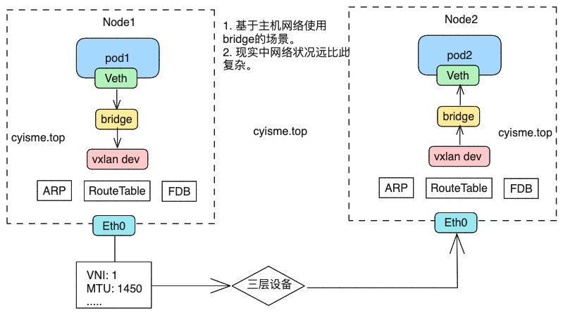
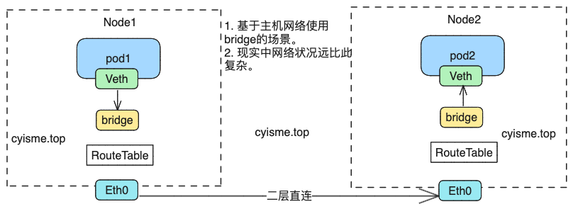

# Flannel源码解析
项目地址: [https://github.com/flannel-io/flannel](https://github.com/flannel-io/flannel)

flannel中有三种工作模式:
1. udp。 性能最低，利用tun/tap设备，通过udp封装ip包。中间需要经过多次内核态和用户态的切换。
2. vxlan。 性能中等，最为常用。 利用vxlan技术， 将ip包封装到vxlan包中，可以在三层网络工作。vxlan是linux内核级别支持的技术。
3. host-gw。 性能最高，利用路由表，修改目标mac地址，只能在二层网络工作。

**注:** flannel中还有alloc、tencent-vpc等。 本文基于`v0.23.0`版本。
## 入口文件
在`main.go`中，首先初始化`SubnetManager`，用作子网管理。然后 `backend.NewManager`方法会根据配置文件中的`BackendType`字段，创建对应的`backend`对象。
```go
func main() {
	// 省略代码
    // 省略掉网卡接口获取、参数初始化等代码

    // 创建subnet管理器
    sm, err := newSubnetManager(ctx)
	if err != nil {
		log.Error("Failed to create SubnetManager: ", err)
		os.Exit(1)
	}

	// 创建backend管理器
	bm := backend.NewManager(ctx, sm, extIface)
    // 根据配置文件中的BackendType字段，创建对应的backend对象
	be, err := bm.GetBackend(config.BackendType)
	if err != nil {
		log.Errorf("Error fetching backend: %s", err)
		cancel()
		wg.Wait()
		os.Exit(1)
	}
    // 调用backend的RegisterNetwork方法，创建Network对象
	bn, err := be.RegisterNetwork(ctx, &wg, config)
	if err != nil {
		log.Errorf("Error registering network: %s", err)
		cancel()
		wg.Wait()
		os.Exit(1)
	}

	// Set up ipMasq if needed
	if opts.ipMasq {
		// 省略代码
        // ipMasq是指隐藏pod的ip地址，只暴露node的ip地址
	}

	if opts.iptablesForwardRules {
		// 省略代码
        // 设置iptables转发规则
	}
    // 写入当前节点的subnet文件
	if err := sm.HandleSubnetFile(opts.subnetFile, config, opts.ipMasq, bn.Lease().Subnet, bn.Lease().IPv6Subnet, bn.MTU()); err != nil {
		// Continue, even though it failed.
		log.Warningf("Failed to write subnet file: %s", err)
	} else {
		log.Infof("Wrote subnet file to %s", opts.subnetFile)
	}
    log.Info("Running backend.")
	wg.Add(1)
	go func() {
        // 启动服务
		bn.Run(ctx)
		wg.Done()
	}()
    // 省略代码
}
```
## SubnetManager
`SubnetManager`用于从`k8s`中监听变化， 维护网络信息。实现方式有两种：
1. kubeApi。利用informer机制， 监听变化
2. etcd。利用etcd的watch机制，监听变化

其中`kubeApi`方式使用率较高。总的来说是利用`informer`监听`node`和`cidr`的变化（可以通过参数控制），`node`的变化会放到事件队列中，由对应的`backend`消费；`cidr`的变化会更新程序内部维护的`subnet`信息。
```go
// pkg/subnet/kube/kube.go
func NewSubnetManager(ctx context.Context, apiUrl, kubeconfig, prefix, netConfPath string, setNodeNetworkUnavailable, useMultiClusterCidr bool) (subnet.Manager, error) {
    // 省略代码
    // 读取本地配置文件
	netConf, err := os.ReadFile(netConfPath)
	if err != nil {
		return nil, fmt.Errorf("failed to read net conf: %v", err)
	}
    // 解析配置文件
	sc, err := subnet.ParseConfig(string(netConf))
	if err != nil {
		return nil, fmt.Errorf("error parsing subnet config: %s", err)
	}
    // 是否从cidr资源中读取信息
	if useMultiClusterCidr {
        // 调用cidr informer list方法，获取cidr资源
		err = readFlannelNetworksFromClusterCIDRList(ctx, c, sc)
		if err != nil {
			return nil, fmt.Errorf("error reading flannel networks from k8s api: %s", err)
		}
	}
    // 创建subnet管理器
	sm, err := newKubeSubnetManager(ctx, c, sc, nodeName, prefix, useMultiClusterCidr)
	if err != nil {
		return nil, fmt.Errorf("error creating network manager: %s", err)
	}
	sm.setNodeNetworkUnavailable = setNodeNetworkUnavailable

	if sm.disableNodeInformer {
		log.Infof("Node controller skips sync")
	} else {
        // 启动informer
		go sm.Run(context.Background())
        // 省略代码
	}

	return sm, nil
}
func newKubeSubnetManager(ctx context.Context, c clientset.Interface, sc *subnet.Config, nodeName, prefix string, useMultiClusterCidr bool) (*kubeSubnetManager, error) {
    // 省略代码
    // 使用ipv4
	ksm.enableIPv4 = sc.EnableIPv4
    // 使用ipv6
	ksm.enableIPv6 = sc.EnableIPv6
    // k8s client
	ksm.client = c
    // 节点名称
	ksm.nodeName = nodeName
    // 子网配置
	ksm.subnetConf = sc
	scale := 5000
	scaleStr := os.Getenv("EVENT_QUEUE_DEPTH")
	if scaleStr != "" {
		n, err := strconv.Atoi(scaleStr)
		if err != nil {
			return nil, fmt.Errorf("env EVENT_QUEUE_DEPTH=%s format error: %v", scaleStr, err)
		}
		if n > 0 {
			scale = n
		}
	}
    // 创建事件队列， 默认长度5000
	ksm.events = make(chan lease.Event, scale)
	// alloc是阿里云上的backend模式
	if sc.BackendType == "alloc" {
		ksm.disableNodeInformer = true
	}
    // 初始化nonde informer
	if !ksm.disableNodeInformer {
		indexer, controller := cache.NewIndexerInformer(
			&cache.ListWatch{
				ListFunc: func(options metav1.ListOptions) (runtime.Object, error) {
					return ksm.client.CoreV1().Nodes().List(ctx, options)
				},
				WatchFunc: func(options metav1.ListOptions) (watch.Interface, error) {
					return ksm.client.CoreV1().Nodes().Watch(ctx, options)
				},
			},
			&v1.Node{},
			resyncPeriod,
            // 通过定义handler，监听node变化，将其放入事件队列中
			cache.ResourceEventHandlerFuncs{
				AddFunc: func(obj interface{}) {
					ksm.handleAddLeaseEvent(lease.EventAdded, obj)
				},
				UpdateFunc: ksm.handleUpdateLeaseEvent,
				DeleteFunc: func(obj interface{}) {
					_, isNode := obj.(*v1.Node)
					// We can get DeletedFinalStateUnknown instead of *api.Node here and we need to handle that correctly.
					if !isNode {
						deletedState, ok := obj.(cache.DeletedFinalStateUnknown)
						if !ok {
							log.Infof("Error received unexpected object: %v", obj)
							return
						}
						node, ok := deletedState.Obj.(*v1.Node)
						if !ok {
							log.Infof("Error deletedFinalStateUnknown contained non-Node object: %v", deletedState.Obj)
							return
						}
						obj = node
					}
					ksm.handleAddLeaseEvent(lease.EventRemoved, obj)
				},
			},
			cache.Indexers{cache.NamespaceIndex: cache.MetaNamespaceIndexFunc},
		)
		ksm.nodeController = controller
		ksm.nodeStore = listers.NewNodeLister(indexer)
	}

	if useMultiClusterCidr {
        // 初始化cidr informer
		_, clusterController := cache.NewIndexerInformer(
			&cache.ListWatch{
				ListFunc: func(options metav1.ListOptions) (runtime.Object, error) {
					return ksm.client.NetworkingV1alpha1().ClusterCIDRs().List(ctx, options)
				},
				WatchFunc: func(options metav1.ListOptions) (watch.Interface, error) {
					return ksm.client.NetworkingV1alpha1().ClusterCIDRs().Watch(ctx, options)
				},
			},
			&networkingv1alpha1.ClusterCIDR{},
			resyncPeriod,
            // cidr信息的变化会被同步到子网管理的对象中
			cache.ResourceEventHandlerFuncs{
				AddFunc: func(obj interface{}) {
					ksm.handleAddClusterCidr(obj)
				},
				DeleteFunc: func(obj interface{}) {
					ksm.handleDeleteClusterCidr(obj)
				},
			},
			cache.Indexers{cache.NamespaceIndex: cache.MetaNamespaceIndexFunc},
		)
		ksm.clusterCIDRController = clusterController
	}
	return &ksm, nil
}
```
flannel的数据会通过`annotation`的方式存储在`node`资源中，在执行资源更新操作时， 会根据`annotation`的变化执行对应的操作.得到更新事件时，也会使用`annotaiton`对比是否需要放入事件队列
```go
func (ksm *kubeSubnetManager) handleAddLeaseEvent(et lease.EventType, obj interface{}) {
	n := obj.(*v1.Node)
    // SubnetKubeManaged 为 false时，不处理
    // flannel.alpha.coreos.com/kube-subnet-manager: "true"
	if s, ok := n.Annotations[ksm.annotations.SubnetKubeManaged]; !ok || s != "true" {
		return
	}
    // 从node对象中解析lease信息。lease租约信息中，包含子网、ip等信息
	l, err := ksm.nodeToLease(*n)
	if err != nil {
		log.Infof("Error turning node %q to lease: %v", n.ObjectMeta.Name, err)
		return
	}
    // 将事件放入事件队列中
	ksm.events <- lease.Event{Type: et, Lease: l}
}
```

## backend
flannel中， 每个工作模式对应了一个`backend`实现。 每个`backend`需实现`RegisterNetwork`方法，此方法返回`Network`对象，`Network`是实际的工作接口。
```go
type Backend interface {
	// Called when the backend should create or begin managing a new network
	RegisterNetwork(ctx context.Context, wg *sync.WaitGroup, config *subnet.Config) (Network, error)
}
type Network interface {
	Lease() *lease.Lease
	MTU() int
	Run(ctx context.Context)
}
```

所有`backend`的实现在 `/pkg/backend/{name}`下。
### vxlan

查看`vxlan.go`文件
```go
type VXLANBackend struct {
    // 子网管理器
	subnetMgr subnet.Manager
    // 网络接口，即提供通信的网卡
	extIface  *backend.ExternalInterface
}
func (be *VXLANBackend) RegisterNetwork(ctx context.Context, wg *sync.WaitGroup, config *subnet.Config) (backend.Network, error) {
	// Parse our configuration
	cfg := struct {
		VNI           int
		Port          int
		MTU           int
		GBP           bool
		Learning      bool
		DirectRouting bool
	}{
        // xvlan的id，相同id的vxlan可以通信。默认为1
		VNI: defaultVNI,
        // mtu即最大传输单元， 默认为1450
		MTU: be.extIface.Iface.MTU,
	}

	if len(config.Backend) > 0 {
		if err := json.Unmarshal(config.Backend, &cfg); err != nil {
			return nil, fmt.Errorf("error decoding VXLAN backend config: %v", err)
		}
	}
	log.Infof("VXLAN config: VNI=%d Port=%d GBP=%v Learning=%v DirectRouting=%v", cfg.VNI, cfg.Port, cfg.GBP, cfg.Learning, cfg.DirectRouting)

	var dev, v6Dev *vxlanDevice
	var err error
	if config.EnableIPv4 {
		devAttrs := vxlanDeviceAttrs{
			vni:       uint32(cfg.VNI),
			name:      fmt.Sprintf("flannel.%v", cfg.VNI),
			MTU:       cfg.MTU,
			vtepIndex: be.extIface.Iface.Index,
			vtepAddr:  be.extIface.IfaceAddr,
			vtepPort:  cfg.Port,
			gbp:       cfg.GBP,
			learning:  cfg.Learning,
		}
        // 创建vxlan设备， 使用的是netlink这个包
		dev, err = newVXLANDevice(&devAttrs)
		if err != nil {
			return nil, err
		}
        // DirectRouting时， 当通信双方处于同一个二层网络时，使用host-gw的方式通信。
		dev.directRouting = cfg.DirectRouting
	}
	if config.EnableIPv6 {
		// 省略ipv6的代码
	}
    // 生成子网信息
	subnetAttrs, err := newSubnetAttrs(be.extIface.ExtAddr, be.extIface.ExtV6Addr, uint16(cfg.VNI), dev, v6Dev)
	if err != nil {
		return nil, err
	}
    // 获取租约信息。可以理解为详细配置
	lease, err := be.subnetMgr.AcquireLease(ctx, subnetAttrs)
    // 省略错误判断代码
	if config.EnableIPv4 {
        // 从子网信息中，获取一个ipv4对象。cidr为空获取不到时，这里会报错
		net, err := config.GetFlannelNetwork(&lease.Subnet)
		if err != nil {
			return nil, err
		}
        // 为xvlan设备配置ip地址
		if err := dev.Configure(ip.IP4Net{IP: lease.Subnet.IP, PrefixLen: 32}, net); err != nil {
			return nil, fmt.Errorf("failed to configure interface %s: %w", dev.link.Attrs().Name, err)
		}
	}
	if config.EnableIPv6 {
		// 省略ipv6的代码
	}
	return newNetwork(be.subnetMgr, be.extIface, dev, v6Dev, ip.IP4Net{}, lease, cfg.MTU)
}
```
上述的`RegisterNetwork`函数，会完成前期准备工作， 返回的`Network`对象会在调用`Run`方法后开始工作。详情看[main.go](#入口文件)
```go
type network struct {
	backend.SimpleNetwork
    // vxlan设备
	dev       *vxlanDevice
	v6Dev     *vxlanDevice
    // 子网管理器
	subnetMgr subnet.Manager
	mtu       int
}
func (nw *network) Run(ctx context.Context) {
	wg := sync.WaitGroup{}

	log.V(0).Info("watching for new subnet leases")
    // 创建一个本地的事件队列
	events := make(chan []lease.Event)
	wg.Add(1)
	go func() {
        // 监听subnetMgr中的事件队列， 转存到本地的事件队列中
		subnet.WatchLeases(ctx, nw.subnetMgr, nw.SubnetLease, events)
		log.V(1).Info("WatchLeases exited")
		wg.Done()
	}()

	defer wg.Wait()

	for {
		evtBatch, ok := <-events
		if !ok {
			log.Infof("evts chan closed")
			return
		}
        // 实事件处理
		nw.handleSubnetEvents(evtBatch)
	}
}
func (nw *network) handleSubnetEvents(batch []lease.Event) {
	for _, event := range batch {
		sn := event.Lease.Subnet
		v6Sn := event.Lease.IPv6Subnet
		attrs := event.Lease.Attrs
		if attrs.BackendType != "vxlan" {
			log.Warningf("ignoring non-vxlan v4Subnet(%s) v6Subnet(%s): type=%v", sn, v6Sn, attrs.BackendType)
			continue
		}
        // 省略变量声明
		if event.Lease.EnableIPv4 && nw.dev != nil {
			if err := json.Unmarshal(attrs.BackendData, &vxlanAttrs); err != nil {
				log.Error("error decoding subnet lease JSON: ", err)
				continue
			}

			// 需要经过xvlan设备时的路由
			vxlanRoute = netlink.Route{
				LinkIndex: nw.dev.link.Attrs().Index,
				Scope:     netlink.SCOPE_UNIVERSE,
				Dst:       sn.ToIPNet(),
				Gw:        sn.IP.ToIP(),
			}
			vxlanRoute.SetFlag(syscall.RTNH_F_ONLINK)

			// 不许要经过xvlan设备时的路由，即在同一个二层网络中
			directRoute = netlink.Route{
				Dst: sn.ToIPNet(),
				Gw:  attrs.PublicIP.ToIP(),
			}
			if nw.dev.directRouting {
				if dr, err := ip.DirectRouting(attrs.PublicIP.ToIP()); err != nil {
					log.Error(err)
				} else {
					directRoutingOK = dr
				}
			}
		}

		if event.Lease.EnableIPv6 && nw.v6Dev != nil {
			// 省略ipv6的代码
		}

		switch event.Type {
		case lease.EventAdded:
			if event.Lease.EnableIPv4 {
				if directRoutingOK {
                    // host-gw模式
                    // 二层网络直连的状况下， 直接添加路由
					if err := retry.Do(func() error {
						return netlink.RouteReplace(&directRoute)
					}); err != nil {
						log.Errorf("Error adding route to %v via %v: %v", sn, attrs.PublicIP, err)
						continue
					}
				} else {
					// vxlan模式
                    // 添加arp、fdb、路由
					if err := retry.Do(func() error {
						return nw.dev.AddARP(neighbor{IP: sn.IP, MAC: net.HardwareAddr(vxlanAttrs.VtepMAC)})
					}); err != nil {
						log.Error("AddARP failed: ", err)
						continue
					}

					if err := retry.Do(func() error {
						return nw.dev.AddFDB(neighbor{IP: attrs.PublicIP, MAC: net.HardwareAddr(vxlanAttrs.VtepMAC)})
					}); err != nil {
						// 省略失败会滚代码
					}
					if err := retry.Do(func() error {
						return netlink.RouteReplace(&vxlanRoute)
					}); err != nil {
						// 省略失败会滚代码
					}
				}
			}
			if event.Lease.EnableIPv6 {
				//省略ipv6的代码
			}
		case lease.EventRemoved:
			if event.Lease.EnableIPv4 {
				if directRoutingOK {
                    // host-gw模式
                    // 删除路由
					if err := retry.Do(func() error {
						return netlink.RouteDel(&directRoute)
					}); err != nil {
						log.Errorf("Error deleting route to %v via %v: %v", sn, attrs.PublicIP, err)
					}
				} else {
                    // vxlan模式
                    // 删除arp、fdb、路由
					if err := retry.Do(func() error {
						return nw.dev.DelARP(neighbor{IP: sn.IP, MAC: net.HardwareAddr(vxlanAttrs.VtepMAC)})
					}); err != nil {
						log.Error("DelARP failed: ", err)
					}

					if err := retry.Do(func() error {
						return nw.dev.DelFDB(neighbor{IP: attrs.PublicIP, MAC: net.HardwareAddr(vxlanAttrs.VtepMAC)})
					}); err != nil {
						log.Error("DelFDB failed: ", err)
					}

					if err := retry.Do(func() error {
						return netlink.RouteDel(&vxlanRoute)
					}); err != nil {
						log.Errorf("failed to delete vxlanRoute (%s -> %s): %v", vxlanRoute.Dst, vxlanRoute.Gw, err)
					}
				}
			}
			if event.Lease.EnableIPv6 {
				// 省略ipv6的代码
			}
		default:
			log.Error("internal error: unknown event type: ", int(event.Type))
		}
	}
}
```
### host-gw

查看`hostgw.go`文件。 `host-gw`模式实现非常简单， 直接修改路由表即可。
```go
func (be *HostgwBackend) RegisterNetwork(ctx context.Context, wg *sync.WaitGroup, config *subnet.Config) (backend.Network, error) {
	n := &backend.RouteNetwork{
		SimpleNetwork: backend.SimpleNetwork{
			ExtIface: be.extIface,
		},
		SM:          be.sm,
		BackendType: "host-gw",
		Mtu:         be.extIface.Iface.MTU,
		LinkIndex:   be.extIface.Iface.Index,
	}

	attrs := lease.LeaseAttrs{
		BackendType: "host-gw",
	}

	if config.EnableIPv4 {
		attrs.PublicIP = ip.FromIP(be.extIface.ExtAddr)
		n.GetRoute = func(lease *lease.Lease) *netlink.Route {
            // 生成路由规则，监听到事件后直接修改路由表
			return &netlink.Route{
				Dst:       lease.Subnet.ToIPNet(),
				Gw:        lease.Attrs.PublicIP.ToIP(),
				LinkIndex: n.LinkIndex,
			}
		}
	}

	if config.EnableIPv6 {
		// 省略ipv6的代码
	}

	l, err := be.sm.AcquireLease(ctx, &attrs)
	switch err {
	case nil:
		n.SubnetLease = l

	case context.Canceled, context.DeadlineExceeded:
		return nil, err

	default:
		return nil, fmt.Errorf("failed to acquire lease: %v", err)
	}

	return n, nil
}
```
### 总结
1. host-gw模式性能最好，因为不需要经过vxlan设备，不需要封装数据。但是局限性也最大，只能在二层网络中使用。
2. vxlan模式通过tun/tap设备，封装数据，然后通过udp发送到目标节点，可以在三层网络中使用。使用场景更为广泛。
3. 当开启`isMasq`时， 会在节点上添加iptables转发规则，将pod的ip地址隐藏，只暴露node的ip地址。
4. flannel本身负责跨设备间的通信， 同设备间通信通过bridge、namespce等方式实现。
5. flannel项目中并没有实现cni接口， 是通过另外一个cni-plugin项目实现的。所以容器中的veth设备也是通过cni-plugin创建的。