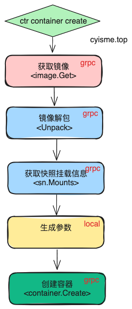

# Containerd Container管理功能解析
> container是containerd的一个核心功能，用于创建和管理容器的基本信息。
> 本篇containerd版本为`v1.7.9`。
> 
> csdn文章地址 [https://blog.csdn.net/q1403539144/article/details/134648729](https://blog.csdn.net/q1403539144/article/details/134648729)

本文从`ctr c create`命令出发，分析containerd的容器及镜像管理相关功能。


## ctr命令
`ctr container`相关命令的实现在`cmd/ctr/commands/containers`目录中。

```go
// 查看文件 cmd/ctr/commands/containers/containers.go
var createCommand = cli.Command{
    // 省略内容...
	Action: func(context *cli.Context) error {
		// 省略内容...
		client, ctx, cancel, err := commands.NewClient(context)
		if err != nil {
			return err
		}
		defer cancel()
		_, err = run.NewContainer(ctx, client, context)
		if err != nil {
			return err
		}
		return nil
	},
}
// 查看文件`cmd/ctr/commands/run/run_unix.go`
func NewContainer(ctx gocontext.Context, client *containerd.Client, context *cli.Context) (containerd.Container, error) {
    // 省略内容...
	if config {
		cOpts = append(cOpts, containerd.WithContainerLabels(commands.LabelArgs(context.StringSlice("label"))))
		opts = append(opts, oci.WithSpecFromFile(context.String("config")))
	} else {
		// 省略内容...
		if context.Bool("rootfs") {
            // 是否以指定的本地文件系统运行，而不是镜像
			rootfs, err := filepath.Abs(ref)
			if err != nil {
				return nil, err
			}
			opts = append(opts, oci.WithRootFSPath(rootfs))
			cOpts = append(cOpts, containerd.WithContainerLabels(commands.LabelArgs(context.StringSlice("label"))))
		} else {
			snapshotter := context.String("snapshotter")
			var image containerd.Image
            // 获取镜像信息 grpc
			i, err := client.ImageService().Get(ctx, ref)
			if err != nil {
				return nil, err
			}
            // 是否指定了平台， 未指定则使用默认平台（client.platform）
			if ps := context.String("platform"); ps != "" {
				platform, err := platforms.Parse(ps)
				if err != nil {
					return nil, err
				}
				image = containerd.NewImageWithPlatform(client, i, platforms.Only(platform))
			} else {
				image = containerd.NewImage(client, i)
			}
            // 目标镜像是否已经解压，未解压则解压
            // 解压相关解析可以看我的《Containerd Snapshots功能解析》这篇文章
			unpacked, err := image.IsUnpacked(ctx, snapshotter)
			if err != nil {
				return nil, err
			}
			if !unpacked {
				if err := image.Unpack(ctx, snapshotter); err != nil {
					return nil, err
				}
			}
            //省略生成配置代码...
			
		}
		// 省略生成配置代码...
        // 容器是否为特权容器，有直接访问宿主机的权限
		privileged := context.Bool("privileged")
		privilegedWithoutHostDevices := context.Bool("privileged-without-host-devices")
		if privilegedWithoutHostDevices && !privileged {
			return nil, fmt.Errorf("can't use 'privileged-without-host-devices' without 'privileged' specified")
		}
		if privileged {
			if privilegedWithoutHostDevices {
				opts = append(opts, oci.WithPrivileged)
			} else {
				opts = append(opts, oci.WithPrivileged, oci.WithAllDevicesAllowed, oci.WithHostDevices)
			}
		}
		// 省略生成配置代码...
        // rootfsPropagation 用于控制容器文件系统的挂载传播行为
        // 响容器内部文件系统和主机文件系统之间的挂载关系
        // 当容器内的文件系统发生变更时，这些变更如何传播到主机文件系统。
		rootfsPropagation := context.String("rootfs-propagation")
		if rootfsPropagation != "" {
			opts = append(opts, func(_ gocontext.Context, _ oci.Client, _ *containers.Container, s *oci.Spec) error {
				if s.Linux != nil {
					s.Linux.RootfsPropagation = rootfsPropagation
				} else {
					s.Linux = &specs.Linux{
						RootfsPropagation: rootfsPropagation,
					}
				}

				return nil
			})
		}
		// 省略生成配置代码...
	}
    // 省略生成配置代码...
	// oci.WithImageConfig (WithUsername, WithUserID) depends on access to rootfs for resolving via
	// the /etc/{passwd,group} files. So cOpts needs to have precedence over opts.
	return client.NewContainer(ctx, id, cOpts...)
}
// client.go
func (c *Client) NewContainer(ctx context.Context, id string, opts ...NewContainerOpts) (Container, error) {
	// 调用grpc, 创建container
	r, err := c.ContainerService().Create(ctx, container)
	if err != nil {
		return nil, err
	}
	return containerFromRecord(c, r), nil
}
```
## containerd grpc
主要涉及到`image`和`container`两个服务。

### image服务

```go
// 获取镜像信息 grpc
i, err := client.ImageService().Get(ctx, ref)
if err != nil {
    return nil, err
}
```
containerd中的image服务相关实现，在 services/images/local.go 中。

这里解析Get和Delete两个方法, Create和Update可以看 [《Containerd Snapshots功能解析》](/cloud_native/containerd/snapshots/) 这篇文章。

```go
// image service 结构体定义
type local struct {
    // bbolt 数据库
	store     images.Store
    // 用于删除时的清理操作
	gc        gcScheduler
    // 用于发布事件
	publisher events.Publisher
    // 这里用于发出弃用警告
	warnings  warning.Service
}
// 获取镜像
func (l *local) Get(ctx context.Context, req *imagesapi.GetImageRequest, _ ...grpc.CallOption) (*imagesapi.GetImageResponse, error) {
    // 从数据库中获取镜像信息
	image, err := l.store.Get(ctx, req.Name)
	if err != nil {
		return nil, errdefs.ToGRPC(err)
	}
    // 省略代码...
}
// 删除镜像
func (l *local) Delete(ctx context.Context, req *imagesapi.DeleteImageRequest, _ ...grpc.CallOption) (*ptypes.Empty, error) {
	log.G(ctx).WithField("name", req.Name).Debugf("delete image")

	if err := l.store.Delete(ctx, req.Name); err != nil {
		return nil, errdefs.ToGRPC(err)
	}
    // 省略代码...
    // 清理操作
	if req.Sync {
		if _, err := l.gc.ScheduleAndWait(ctx); err != nil {
			return nil, err
		}
	}
	return &ptypes.Empty{}, nil
}
```
镜像管理的接口逻辑比较简单，最终都是对`bbolt`数据库的操作。

这里仅用`Get`方法举例说明， 其他操作均是调用`bbolt`数据库的相关方法。
```go
// 镜像存储结构体定义
type imageStore struct {
	db *DB
}
func (s *imageStore) Get(ctx context.Context, name string) (images.Image, error) {
	var image images.Image
    // 获取namespace
    // namespace是containerd中的一个概念，用于隔离不同的用户或者应用
    // 一个namespace独享一个bucket
	namespace, err := namespaces.NamespaceRequired(ctx)
	if err != nil {
		return images.Image{}, err
	}

	if err := view(ctx, s.db, func(tx *bolt.Tx) error {
        // 使用namespce，获取镜像所在的bucket
		bkt := getImagesBucket(tx, namespace)
		if bkt == nil {
			return fmt.Errorf("image %q: %w", name, errdefs.ErrNotFound)
		}
        // 获取镜像信息
		ibkt := bkt.Bucket([]byte(name))
		if ibkt == nil {
			return fmt.Errorf("image %q: %w", name, errdefs.ErrNotFound)
		}

		image.Name = name
		if err := readImage(&image, ibkt); err != nil {
			return fmt.Errorf("image %q: %w", name, err)
		}

		return nil
	}); err != nil {
		return images.Image{}, err
	}

	return image, nil
}
```
### snapshot服务
镜像的解压操作会涉及到snapshot服务，相关解析可以看 [《Containerd Snapshots功能解析》](/cloud_native/containerd/snapshots/) 这篇文章。
```go
if !unpacked {
    if err := image.Unpack(ctx, snapshotter); err != nil {
        return nil, err
    }
}
```

### container服务
```go
// 调用grpc, 创建container
r, err := c.ContainerService().Create(ctx, container)
if err != nil {
    return nil, err
}
```
containerd中的image服务相关实现，在 services/containers/local.go 中。

这里仅解析Create和Update方法， 其余方法逻辑比较简单。
```go
// container service 结构体定义
type local struct {
    // 用于存储container的基础信息
    // containers.Store是定义的interface， 限制了容器相关的操作范围，仅增删查改，并做了业务逻辑处理
	containers.Store
    // 用于存储container的元数据
    // metadata.DB是基础的数据存储模块。
	db        *metadata.DB
    // 实际运行时,实现containers.Store接口的结构内部也有一个db对象，实际上和上述的db是同一个对象。
	publisher events.Publisher
}
// 创建container
func (l *local) Create(ctx context.Context, req *api.CreateContainerRequest, _ ...grpc.CallOption) (*api.CreateContainerResponse, error) {
	var resp api.CreateContainerResponse

    // 在bbolt数据库中创建container记录
	if err := l.withStoreUpdate(ctx, func(ctx context.Context) error {
		container := containerFromProto(req.Container)

		created, err := l.Store.Create(ctx, container)
		if err != nil {
			return err
		}

		resp.Container = containerToProto(&created)

		return nil
	}); err != nil {
		return &resp, errdefs.ToGRPC(err)
	}
	// 省略代码...
	return &resp, nil
}
// 更新container
func (l *local) Update(ctx context.Context, req *api.UpdateContainerRequest, _ ...grpc.CallOption) (*api.UpdateContainerResponse, error) {
    // 省略代码...
	if err := l.withStoreUpdate(ctx, func(ctx context.Context) error {
        // 获取需要更新的字段
		var fieldpaths []string
		if req.UpdateMask != nil && len(req.UpdateMask.Paths) > 0 {
			fieldpaths = append(fieldpaths, req.UpdateMask.Paths...)
		}

		updated, err := l.Store.Update(ctx, container, fieldpaths...)
		if err != nil {
			return err
		}

		resp.Container = containerToProto(&updated)
		return nil
	})
    // 省略代码...
}
```
实际调用的是`containers.Store`接口的方法， 接口实现在 metadata/containers.go。
```go
// 创建container
// metadata/containers.go
func (s *containerStore) Create(ctx context.Context, container containers.Container) (containers.Container, error) {
    // 获取namespace
	namespace, err := namespaces.NamespaceRequired(ctx)
	if err != nil {
		return containers.Container{}, err
	}
    // 验证container
	if err := validateContainer(&container); err != nil {
		return containers.Container{}, fmt.Errorf("create container failed validation: %w", err)
	}
    // 在bbolt数据库中创建container记录
	if err := update(ctx, s.db, func(tx *bolt.Tx) error {
        // 获取namespace对应的bucket
		bkt, err := createContainersBucket(tx, namespace)
		if err != nil {
			return err
		}
        // 创建container对应的bucket
		cbkt, err := bkt.CreateBucket([]byte(container.ID))
		if err != nil {
			if err == bolt.ErrBucketExists {
				err = fmt.Errorf("container %q: %w", container.ID, errdefs.ErrAlreadyExists)
			}
			return err
		}
        // 更新container时间相关信息
		container.CreatedAt = time.Now().UTC()
		container.UpdatedAt = container.CreatedAt
		if err := writeContainer(cbkt, &container); err != nil {
			return fmt.Errorf("failed to write container %q: %w", container.ID, err)
		}

		return nil
	}); err != nil {
		return containers.Container{}, err
	}

	return container, nil
}
func (s *containerStore) Update(ctx context.Context, container containers.Container, fieldpaths ...string) (containers.Container, error) {
	// 省略获取namespace代码...
	var updated containers.Container
	if err := update(ctx, s.db, func(tx *bolt.Tx) error {
		// 省略获取bucket、container代码...
		if len(fieldpaths) == 0 {
			// only allow updates to these field on full replace.
			fieldpaths = []string{"labels", "spec", "extensions", "image", "snapshotkey"}

            // 这里是container的一些基础信息，不允许更新
            // Snapshotter改变会导致container的快照信息丢失， 相当于从新创建
            // Runtime改变会导致container的运行时信息丢失， 相当于从新创建
			if updated.Snapshotter != container.Snapshotter {
				return fmt.Errorf("container.Snapshotter field is immutable: %w", errdefs.ErrInvalidArgument)
			}

			if updated.Runtime.Name != container.Runtime.Name {
				return fmt.Errorf("container.Runtime.Name field is immutable: %w", errdefs.ErrInvalidArgument)
			}
		}

		// 省略更新字段更新代码...
		return nil
	}); err != nil {
		return containers.Container{}, err
	}

	return updated, nil
}
```

## 总结
containerd的容器管理功能，主要是通过grpc调用containerd的image和container服务实现的。

container创建时会获取镜像快照信息（解压/挂载），命令行参数会转换成oci配置，最终生成container的基础信息。

container的创建动作仅生成数据，用于后续的container start(task)操作。