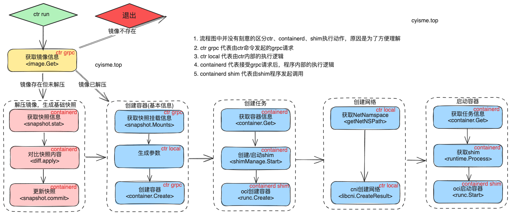
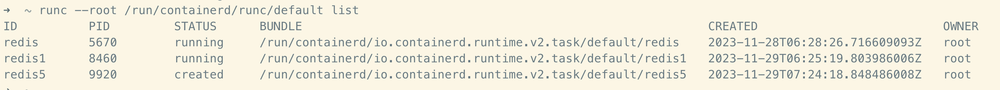
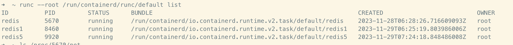

# 从源码解析Containerd容器启动流程
> 本文从源码的角度分析containerd容器启动流程以及相关功能的实现。
> 本篇containerd版本为`v1.7.9`。
> 
> csdn文章地址 [https://blog.csdn.net/q1403539144/article/details/134696191](https://blog.csdn.net/q1403539144/article/details/134696191)

本文从`ctr run`命令出发，分析containerd的容器启动流程。



## ctr命令
查看文件`cmd/ctr/commands/run/run.go`
```go
// cmd/ctr/commands/run/run.go
var Command = cli.Command{
    // 省略其他代码
	Action: func(context *cli.Context) error {
		// 省略其他代码
        // 获取grpc客户端
		client, ctx, cancel, err := commands.NewClient(context)
		if err != nil {
			return err
		}
		defer cancel()
        // 创建容器（基本信息）
		container, err := NewContainer(ctx, client, context)
		if err != nil {
			return err
		}
        // 创建任务
        task, err := tasks.NewTask(ctx, client, container, context.String("checkpoint"), con, context.Bool("null-io"), context.String("log-uri"), ioOpts, opts...)
		if err != nil {
			return err
		}
		// 省略其他代码 
        // 用于阻塞进程，等待容器退出
		var statusC <-chan containerd.ExitStatus
		if !detach {
            // 清理容器网络
			defer func() {
				if enableCNI {
					if err := network.Remove(ctx, commands.FullID(ctx, container), ""); err != nil {
						logrus.WithError(err).Error("network review")
					}
				}
				task.Delete(ctx)
			}()
            // 等待容器退出
			if statusC, err = task.Wait(ctx); err != nil {
				return err
			}
		}
		// 创建容器网络
		if enableCNI {
            // nspath /proc/%d/ns/net
			netNsPath, err := getNetNSPath(ctx, task)
			if err != nil {
				return err
			}

			if _, err := network.Setup(ctx, commands.FullID(ctx, container), netNsPath); err != nil {
				return err
			}
		}
        // 启动任务（启动容器）
		if err := task.Start(ctx); err != nil {
			return err
		}
        // 如果是后台(detach)运行，直接返回
		if detach {
            // detach运行的任务，containerd不会主动进行数据清理
			return nil
		}
        // 前台运行时， 判断是否开启交互终端
		if tty {
			if err := tasks.HandleConsoleResize(ctx, task, con); err != nil {
				logrus.WithError(err).Error("console resize")
			}
		} else {
			sigc := commands.ForwardAllSignals(ctx, task)
			defer commands.StopCatch(sigc)
		}
        // 等待容器退出
		status := <-statusC
		code, _, err := status.Result()
		if err != nil {
			return err
		}
        // 非detach模式，会执行清理
        // 清理任务
		if _, err := task.Delete(ctx); err != nil {
			return err
		}
		if code != 0 {
			return cli.NewExitError("", int(code))
		}
		return nil
	},
}

```

## 创建容器
在`containerd`中，创建容器实际为创建一个`container`对象，该对象包含容器的基本信息，如`id`、`image`、`rootfs`等。
```go
// cmd/ctr/commands/run/run.go:162
// client, ctx, cancel, err := commands.NewClient(context)
// if err != nil {
//     return err
// }
// defer cancel()
// 创建容器（基本信息）
// container, err := NewContainer(ctx, client, context)
// if err != nil {
//     return err
// }
//
// cmd/ctr/commands/run/run_unix.go:88
func NewContainer(ctx gocontext.Context, client *containerd.Client, context *cli.Context) (containerd.Container, error) {
    // 省略其他代码

	if config {
		cOpts = append(cOpts, containerd.WithContainerLabels(commands.LabelArgs(context.StringSlice("label"))))
		opts = append(opts, oci.WithSpecFromFile(context.String("config")))
	} else {
		// 省略其他代码

		if context.Bool("rootfs") {
			rootfs, err := filepath.Abs(ref)
			if err != nil {
				return nil, err
			}
			opts = append(opts, oci.WithRootFSPath(rootfs))
			cOpts = append(cOpts, containerd.WithContainerLabels(commands.LabelArgs(context.StringSlice("label"))))
		} else {
			// 省略其他代码
            // 解压镜像
			if !unpacked {
				if err := image.Unpack(ctx, snapshotter); err != nil {
					return nil, err
				}
			}
			// 省略其他代码
		}
		// 省略其他代码
        // 特权模式判断
		privileged := context.Bool("privileged")
		privilegedWithoutHostDevices := context.Bool("privileged-without-host-devices")
		if privilegedWithoutHostDevices && !privileged {
			return nil, fmt.Errorf("can't use 'privileged-without-host-devices' without 'privileged' specified")
		}
		if privileged {
			if privilegedWithoutHostDevices {
				opts = append(opts, oci.WithPrivileged)
			} else {
				opts = append(opts, oci.WithPrivileged, oci.WithAllDevicesAllowed, oci.WithHostDevices)
			}
		}
		// 省略其他代码
        // 参数生成
	}
    // 省略其他代码
    // 创建容器
	return client.NewContainer(ctx, id, cOpts...)
}
```
### 解压镜像
`ctr run`命令执行时，强制要求镜像存在。不存在则会退出命令。

镜像存在时，会根据镜像的layer信息，解压镜像到指定目录,生成`快照`数据。具体流程可以看[《Containerd Snapshots功能解析》](/cloud_native/containerd/snapshots/)这篇文章。这里不再赘述。
```go
// image.go:339
func (i *image) Unpack(ctx context.Context, snapshotterName string, opts ...UnpackOpt) error {
    // 省略其他代码
}
```
### 创建容器
创建容器完成后，此时容器为`一条记录`，并没有真正调用`oci runtime`进行创建，也没有真实运行。 具体流程可以看[《Containerd Container管理功能解析》](/cloud_native/containerd/container/)这篇文章。 这里不再赘述。
```go
// client.go:280
func (c *Client) NewContainer(ctx context.Context, id string, opts ...NewContainerOpts) (Container, error) {
    // 省略其他代码
}
```
## 创建任务
`task`是`containerd`中真正运行的对象，它包含了容器的所有信息，如`rootfs`、`namespace`、`进程`等。
### ctr 本地准备阶段
```go
// task, err := tasks.NewTask(ctx, client, container, context.String("checkpoint"), con, context.Bool("null-io"), context.String("log-uri"), ioOpts, opts...)
// if err != nil {
//     return err
// }
// cmd/ctr/commands/task/task_unix.go:71
func NewTask(ctx gocontext.Context, client *containerd.Client, container containerd.Container, checkpoint string, con console.Console, nullIO bool, logURI string, ioOpts []cio.Opt, opts ...containerd.NewTaskOpts) (containerd.Task, error) {
    // 获取checkpoint信息
    // checkpoint需要criu支持
	if checkpoint != "" {
		im, err := client.GetImage(ctx, checkpoint)
		if err != nil {
			return nil, err
		}
		opts = append(opts, containerd.WithTaskCheckpoint(im))
	}
    // 获取目标容器信息
	spec, err := container.Spec(ctx)
	if err != nil {
		return nil, err
	}
    // 省略其他代码
    // io创建，用于输出容器日志等终端输出
	var ioCreator cio.Creator
	if con != nil {
		if nullIO {
			return nil, errors.New("tty and null-io cannot be used together")
		}
		ioCreator = cio.NewCreator(append([]cio.Opt{cio.WithStreams(con, con, nil), cio.WithTerminal}, ioOpts...)...)
	}
    // 省略其他代码
    // 创建task
	t, err := container.NewTask(ctx, ioCreator, opts...)
	if err != nil {
		return nil, err
	}
	stdinC.closer = func() {
		t.CloseIO(ctx, containerd.WithStdinCloser)
	}
	return t, nil
}
// container.go:210
func (c *container) NewTask(ctx context.Context, ioCreate cio.Creator, opts ...NewTaskOpts) (_ Task, err error) {
    // 省略其他代码
    // 获取容器信息
	r, err := c.get(ctx)
	if err != nil {
		return nil, err
	}
    // 处理快照信息
	if r.SnapshotKey != "" {
		if r.Snapshotter == "" {
			return nil, fmt.Errorf("unable to resolve rootfs mounts without snapshotter on container: %w", errdefs.ErrInvalidArgument)
		}

		// get the rootfs from the snapshotter and add it to the request
		s, err := c.client.getSnapshotter(ctx, r.Snapshotter)
		if err != nil {
			return nil, err
		}
        // 获取挂载位置
		mounts, err := s.Mounts(ctx, r.SnapshotKey)
		if err != nil {
			return nil, err
		}
		spec, err := c.Spec(ctx)
		if err != nil {
			return nil, err
		}
        // 处理挂载信息
		for _, m := range mounts {
			if spec.Linux != nil && spec.Linux.MountLabel != "" {
				context := label.FormatMountLabel("", spec.Linux.MountLabel)
				if context != "" {
					m.Options = append(m.Options, context)
				}
			}
            // 快照的挂载信息，最终会添加到容器的根文件系统中
            // 根文件系统容器不可更改
			request.Rootfs = append(request.Rootfs, &types.Mount{
				Type:    m.Type,
				Source:  m.Source,
				Target:  m.Target,
				Options: m.Options,
			})
		}
	}
	// 省略其他代码
	t := &task{
        // grpc客户端
		client: c.client,
        // io信息， 用于处理终端数据
		io:     i,
        // 容器id
		id:     c.id,
        // 容器对象
		c:      c,
	}
	// grpc请求containerd， 创建task
	response, err := c.client.TaskService().Create(ctx, request)
	if err != nil {
		return nil, errdefs.FromGRPC(err)
	}
    // shim进程id
	t.pid = response.Pid
	return t, nil
}
```
### containerd grpc阶段
`c.client.TaskService().Create(ctx, request)`会以`grpc`方式调用`containerd`。
```go
// services/tasks/local.go:166
func (l *local) Create(ctx context.Context, r *api.CreateTaskRequest, _ ...grpc.CallOption) (*api.CreateTaskResponse, error) {
    // 省略其他代码
    // 获取容器信息
	container, err := l.getContainer(ctx, r.ContainerID)
	if err != nil {
		return nil, errdefs.ToGRPC(err)
	}
	checkpointPath, err := getRestorePath(container.Runtime.Name, r.Options)
	if err != nil {
		return nil, err
	}
	// jump get checkpointPath from checkpoint image
	if checkpointPath == "" && r.Checkpoint != nil {
		// checkpioint相关，需要criu支持，这里省略
	}
	opts := runtime.CreateOpts{
		Spec: container.Spec,
		IO: runtime.IO{
            // 终端信息, 实际为系统中的一个文件
            // 如：/run/containerd/fifo/1096067688/redis6-stdin
			Stdin:    r.Stdin,
			Stdout:   r.Stdout,
			Stderr:   r.Stderr,
			Terminal: r.Terminal,
		},
        // 一些runtime配置
		Checkpoint:     checkpointPath,
		Runtime:        container.Runtime.Name,
		RuntimeOptions: container.Runtime.Options,
		TaskOptions:    r.Options,
		SandboxID:      container.SandboxID,
	}
	// 省略其他代码
    // 获取runtime
	rtime, err := l.getRuntime(container.Runtime.Name)
	if err != nil {
		return nil, err
	}
    // 获取任务信息，实际是获取shim相关信息
    // 这里实际是为了判断任务是否存在
	_, err = rtime.Get(ctx, r.ContainerID)
	if err != nil && !errdefs.IsNotFound(err) {
		return nil, errdefs.ToGRPC(err)
	}
	if err == nil {
		return nil, errdefs.ToGRPC(fmt.Errorf("task %s: %w", r.ContainerID, errdefs.ErrAlreadyExists))
	}
    // 创建任务
	c, err := rtime.Create(ctx, r.ContainerID, opts)
	if err != nil {
		return nil, errdefs.ToGRPC(err)
	}
	labels := map[string]string{"runtime": container.Runtime.Name}
    // 将提供的容器添加到监视器中
	if err := l.monitor.Monitor(c, labels); err != nil {
		return nil, fmt.Errorf("monitor task: %w", err)
	}
    // 在当前返回时，这个pid对应着 runc init进程
    // 后续会随着容器内进程的启动，pid变为对应着容器内的进程
	pid, err := c.PID(ctx)
	if err != nil {
		return nil, fmt.Errorf("failed to get task pid: %w", err)
	}
	return &api.CreateTaskResponse{
		ContainerID: r.ContainerID,
		Pid:         pid,
	}, nil
}
```
#### 启动shim进程
任务创建会启动`shim`进程，`shim`会与`oci runtime`交互，完成容器的创建。

> shim进程是一个短暂的进程，它的生命周期与容器一致。它的主要作用是与oci runtime交互，完成容器的创建。
>
> 可以理解为，shim进程是oci runtime的代理。
shim有v1和v2两个版本，当前containerd版本使用v2。
```go
// 创建任务
// c, err := rtime.Create(ctx, r.ContainerID, opts)
// if err != nil {
//     return nil, errdefs.ToGRPC(err)
// }
// runtime/v2/manager.go:420
func (m *TaskManager) Create(ctx context.Context, taskID string, opts runtime.CreateOpts) (runtime.Task, error) {
    // 启动shim进程
	shim, err := m.manager.Start(ctx, taskID, opts)
	if err != nil {
		return nil, fmt.Errorf("failed to start shim: %w", err)
	}

	// 获取shim客户端
	shimTask, err := newShimTask(shim)
	if err != nil {
		return nil, err
	}
    // 通知对应的oci runtime创建容器
    // 这个函数逻辑比较简单，省略函数解析
	t, err := shimTask.Create(ctx, opts)
	if err != nil {
		// 创建失败会清理shim相关信息
        // 此处省略
		return nil, fmt.Errorf("failed to create shim task: %w", err)
	}

	return t, nil
}
// m.manager.Start(ctx, taskID, opts)
// runtime/v2/manager.go:184
func (m *ShimManager) Start(ctx context.Context, id string, opts runtime.CreateOpts) (_ ShimInstance, retErr error) {
    // 省略其他代码

	if opts.SandboxID != "" {
		// 省略其他代码
        // 如果绑定了sandbox，直接获取shim信息，不再创建新的shim
		shim, err := loadShim(ctx, bundle, func() {})
		if err != nil {
			return nil, fmt.Errorf("failed to load sandbox task %q: %w", opts.SandboxID, err)
		}
        // 添加shim信息
		if err := m.shims.Add(ctx, shim); err != nil {
			return nil, err
		}

		return shim, nil
	}
    // 启动shim进程
	shim, err := m.startShim(ctx, bundle, id, opts)
	if err != nil {
		return nil, err
	}
	defer func() {
		if retErr != nil {
			m.cleanupShim(ctx, shim)
		}
	}()
    // 添加shim信息
	if err := m.shims.Add(ctx, shim); err != nil {
		return nil, fmt.Errorf("failed to add task: %w", err)
	}

	return shim, nil
}
```
这个阶段完成后，使用`runc`命令可以看见一个状态为`created`的容器

## 创建网络
`task`准备好之后， 如果容器需要网络，`ctr`会调用`cni`插件，创建容器网络。
```go
// if enableCNI {
//     netNsPath, err := getNetNSPath(ctx, task)
//     
//     if err != nil {
//         return err
//     }
// 
//     if _, err := network.Setup(ctx, commands.FullID(ctx, container), netNsPath); err != nil {
//         return err
//     }
// }
// 这里不赘述，项目地址：
// https://github.com/containerd/go-cni
func (c *libcni) Setup(ctx context.Context, id string, path string, opts ...NamespaceOpts) (*Result, error) {
	if err := c.Status(); err != nil {
		return nil, err
	}
	ns, err := newNamespace(id, path, opts...)
	if err != nil {
		return nil, err
	}
	result, err := c.attachNetworks(ctx, ns)
	if err != nil {
		return nil, err
	}
	return c.createResult(result)
}
```
## 启动任务
启动任务本质是启动容器。启动容器就比较简单了，因为前面的工作都已经完成了，这里只需要调用`oci runtime`的`start`接口，就可以完成容器的启动。
### ctr 本地准备阶段
```go
// if err := task.Start(ctx); err != nil {
//     return err
// }
// task.go:215
func (t *task) Start(ctx context.Context) error {
    // grpc调用containerd
	r, err := t.client.TaskService().Start(ctx, &tasks.StartRequest{
		ContainerID: t.id,
	})
	if err != nil {
		if t.io != nil {
			t.io.Cancel()
			t.io.Close()
		}
		return errdefs.FromGRPC(err)
	}
	t.pid = r.Pid
	return nil
}
```
### containerd grpc阶段
```go
// services/tasks/local.go:258
func (l *local) Start(ctx context.Context, r *api.StartRequest, _ ...grpc.CallOption) (*api.StartResponse, error) {
    // 获取task信息
	t, err := l.getTask(ctx, r.ContainerID)
	if err != nil {
		return nil, err
	}
	p := runtime.Process(t)
	if r.ExecID != "" {
		if p, err = t.Process(ctx, r.ExecID); err != nil {
			return nil, errdefs.ToGRPC(err)
		}
	}
    // 启动
    // start函数最终会调用shim客户端，由shim进程去启动容器
    // 这里函数逻辑比较简单，不对函数展开分析
	if err := p.Start(ctx); err != nil {
		return nil, errdefs.ToGRPC(err)
	}
    // 获取容器状态
	state, err := p.State(ctx)
	if err != nil {
		return nil, errdefs.ToGRPC(err)
	}
	return &api.StartResponse{
		Pid: state.Pid,
	}, nil
}
```
当这个阶段完成后，可以看见容器的状态变为`running`。容器启动完成


## 总结
1. `task`是`containerd`中真正运行的对象，它包含了容器的所有信息，如rootfs、namespace、进程等。创建`task`时，会启动`shim`进程。
2. `shim`进程是一个短暂的进程，它的生命周期与容器一致。它的主要作用是与`oci runtime`交互，完成容器的创建。
3. 容器的网络配置是在task创建之后，由`ctr`调用`cni`插件完成的。