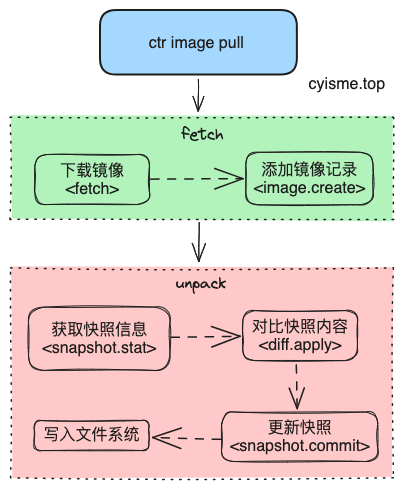
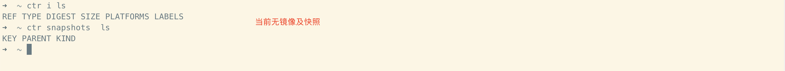
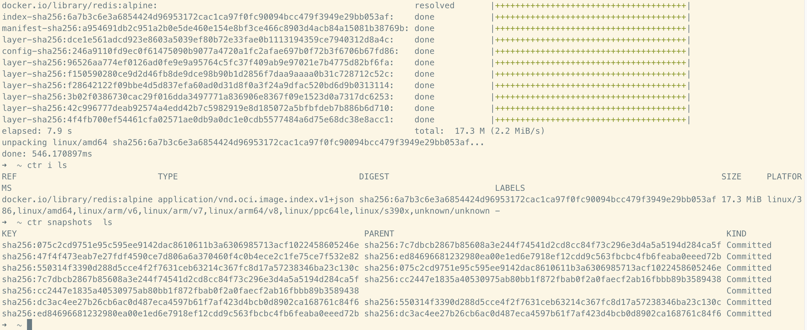
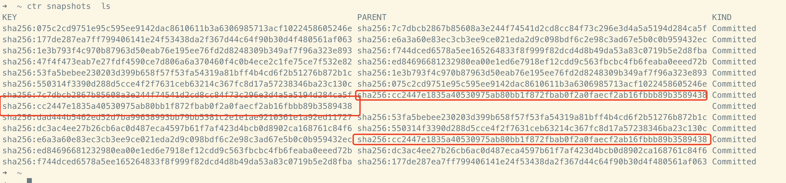

# containerd Snapshots功能解析
> snapshot是containerd的一个核心功能，用于创建和管理容器的文件系统。
> 本篇containerd版本为`v1.7.9`。
>
> csdn文章地址 [https://blog.csdn.net/q1403539144/article/details/134583315](https://blog.csdn.net/q1403539144/article/details/134583315)

本文以 `ctr i pull`命令为例，分析containerd的snapshot ***“创建”*** 相关的功能。


## ctr命令
`ctr image`相关命令的实现在`cmd/ctr/commands/images`目录中。

查看文件`cmd/ctr/commands/images/pull.go`
```go
// 查看Action中注册的函数
func(context *cli.Context) error {
		// 省略内容....
        // 获取grpc客户端
		client, ctx, cancel, err := commands.NewClient(context)
		if err != nil {
			return err
		}
		defer cancel()
        // 这里的功能是将pull动作，通过grpc调用完全交给远端实现。
        // 当前的代码版本, 此块代码永远不会执行。
		if !context.BoolT("local") {
            // grpc调用
			return client.Transfer(ctx, reg, is, transfer.WithProgress(pf))
		}

		// 省略内容....
        // fetch阶段
		img, err := content.Fetch(ctx, client, ref, config)
		if err != nil {
			return err
		}

		// 省略内容....
        // unpack阶段
        // 根据平台信息，解压镜像，创建快照等
		start := time.Now()
		for _, platform := range p {
			fmt.Printf("unpacking %s %s...\n", platforms.Format(platform), img.Target.Digest)
			i := containerd.NewImageWithPlatform(client, img, platforms.Only(platform))
			err = i.Unpack(ctx, context.String("snapshotter"))
			if err != nil {
				return err
			}
			if context.Bool("print-chainid") {
				diffIDs, err := i.RootFS(ctx)
				if err != nil {
					return err
				}
				chainID := identity.ChainID(diffIDs).String()
				fmt.Printf("image chain ID: %s\n", chainID)
			}
		}
		fmt.Printf("done: %s\t\n", time.Since(start))
		return nil
	}
```
## fetch阶段
fetch阶段分为两步:
1. 下载镜像
2. 在数据库中添加镜像记录

查看文件`client/client.go`
```go
func (c *Client) Fetch(ctx context.Context, ref string, opts ...RemoteOpt) (images.Image, error) {
    // 省略内容....
	ctx, done, err := c.WithLease(ctx)
	if err != nil {
		return images.Image{}, err
	}
	defer done(ctx)
    // 下载镜像
	img, err := c.fetch(ctx, fetchCtx, ref, 0)
	if err != nil {
		return images.Image{}, err
	}
    // 在数据库中添加镜像记录
	return c.createNewImage(ctx, img)
}
```
### 下载镜像
```go
c.fetch(ctx, fetchCtx, ref, 0)
```
下载镜像没什么好说的，需要注意的是，当前的代码版本，下载的功能是在`ctr`中实现的，而不是调用`grpc`接口实现的。
> 在`fetch`函数中，提供镜像版本升级的功能。
> 如果镜像版本为 docker schema1，则会将镜像升级为 docker schema2, 即oci格式。
```go
func (c *Client) fetch(ctx context.Context, rCtx *RemoteContext, ref string, limit int) (images.Image, error) {
	// 省略内容...
	// 判断镜像版本， 如果为 application/vnd.docker.distribution.manifest.v1+prettyjws，则转换
	// rCtx.ConvertSchema1 未控制是否转换， 默认为true，且此参数已弃用
	if desc.MediaType == images.MediaTypeDockerSchema1Manifest && rCtx.ConvertSchema1 {
		schema1Converter := schema1.NewConverter(store, fetcher)

		handler = images.Handlers(append(rCtx.BaseHandlers, schema1Converter)...)

		isConvertible = true

		converterFunc = func(ctx context.Context, _ ocispec.Descriptor) (ocispec.Descriptor, error) {
			return schema1Converter.Convert(ctx)
		}

		originalSchema1Digest = desc.Digest.String()
	} else {
		// 省略内容...
	}
	// 省略内容...
	// ...
}
// Convert a docker manifest to an OCI descriptor
func (c *Converter) Convert(ctx context.Context, opts ...ConvertOpt) (ocispec.Descriptor, error) {
	// 省略内容...
	// 转换函数
	// remotes/docker/schema1/convert.go
}
```
### 添加镜像记录
```go
// c.createNewImage(ctx, img)
func (c *Client) createNewImage(ctx context.Context, img images.Image) (images.Image, error) {
    // 省略内容....
	is := c.ImageService()
	for {
		if created, err := is.Create(ctx, img); err != nil {
			if !errdefs.IsAlreadyExists(err) {
				return images.Image{}, err
			}
             // 如果镜像已经存在，则更新镜像
			updated, err := is.Update(ctx, img)
			if err != nil {
				// if image was removed, try create again
				if errdefs.IsNotFound(err) {
					continue
				}
				return images.Image{}, err
			}

			img = updated
		} else {
			img = created
		}

		return img, nil
	}
}
```
最终会以`grpc`方式调用`containerd`的`ImageService`接口。

`containerd`中的接口，均是以`plugin`的方式注册实现的。`plugin`的实现我们后面再分析。
```go
// image service注册
// services/images/service.go
func init() {
	plugin.Register(&plugin.Registration{
		Type: plugin.GRPCPlugin,
		ID:   "images",
		Requires: []plugin.Type{
			plugin.ServicePlugin,
		},
		InitFn: func(ic *plugin.InitContext) (interface{}, error) {
			// 省略内容....
		},
	})
}
```
`images.create`没有太多逻辑，主要是在`bbolt`中添加一条数据记录。
`bbolt`是一个`key-value`数据库，`containerd`中的大部分数据都是存储在`bbolt`中的。
[https://pkg.go.dev/go.etcd.io/bbolt#section-readme](https://pkg.go.dev/go.etcd.io/bbolt#section-readme)
```go
func (l *local) Create(ctx context.Context, req *imagesapi.CreateImageRequest, _ ...grpc.CallOption) (*imagesapi.CreateImageResponse, error) {
	// 省略内容....
    // 在bbolt中添加一条数据记录
	created, err := l.store.Create(ctx, image)
	if err != nil {
		return nil, errdefs.ToGRPC(err)
	}

	resp.Image = imageToProto(&created)
    // 发布事件
    // 事件发布是containerd中的一个重要功能，后面会详细分析。
	if err := l.publisher.Publish(ctx, "/images/create", &eventstypes.ImageCreate{
		Name:   resp.Image.Name,
		Labels: resp.Image.Labels,
	}); err != nil {
		return nil, err
	}

	l.emitSchema1DeprecationWarning(ctx, &image)
	return &resp, nil

}
```
`images.update`对比`create`，多了一些逻辑，主要是更新镜像的某些字段。
```go
func (l *local) Update(ctx context.Context, req *imagesapi.UpdateImageRequest, _ ...grpc.CallOption) (*imagesapi.UpdateImageResponse, error) {
    // 省略内容....
    // 更新镜像的某些字段
	if req.UpdateMask != nil && len(req.UpdateMask.Paths) > 0 {
		fieldpaths = append(fieldpaths, req.UpdateMask.Paths...)
	}

	if req.SourceDateEpoch != nil {
		tm := req.SourceDateEpoch.AsTime()
		ctx = epoch.WithSourceDateEpoch(ctx, &tm)
	}
    // 在bbolt中更新一条数据记录
    // fieldpaths 为需要更新的字段
	updated, err := l.store.Update(ctx, image, fieldpaths...)
	if err != nil {
		return nil, errdefs.ToGRPC(err)
	}
    // 省略内容....
    // 发布事件....
	return &resp, nil
}
```

## unpack阶段
`fetch`阶段下载的镜像，可以理解为压缩包，`unpack`阶段就是解压镜像，创建快照等操作。

解压镜像好理解，创建快照是什么意思呢？
> 镜像的文件系统是只读的，容器的文件系统是可写的，容器的文件系统是基于镜像的文件系统创建的，这个过程就是创建快照。
> 在containerd中， 每个容器都有一个自己的快照，利用这个特性，可以实现容器的快速创建和销毁。
>> containerd实现有两种`Snapshotter`，一种是通过`overlayfs`实现，一种是通过`native`实现。
>>
>> `overlayfs`是`linux`内核的一个功能，`native`是`containerd`自己实现的一种快照方式。
>>
>> 在`native`实现中，所有的快照都将是完全copy，所以`native`的快照方式，会占用更多的磁盘空间。

以下代码为`ctr`部分实现。
```go
// unpack主要代码
// i := containerd.NewImageWithPlatform(client, img, platforms.Only(platform))
// err = i.Unpack(ctx, context.String("snapshotter"))
// image.go
func (i *image) Unpack(ctx context.Context, snapshotterName string, opts ...UnpackOpt) error {
    // 省略内容....

	manifest, err := i.getManifest(ctx, i.platform)
	if err != nil {
		return err
	}
    // 获取镜像的所有层
	layers, err := i.getLayers(ctx, i.platform, manifest)
	if err != nil {
		return err
	}

	var (
        // 用于对比镜像的层和快照的层，如果镜像的层和快照的层一致，则不需要创建快照
		a  = i.client.DiffService()
        // 用于更新数据
		cs = i.client.ContentStore()

		chain    []digest.Digest
		unpacked bool
	)
    // 获取snapshotter
	snapshotterName, err = i.client.resolveSnapshotterName(ctx, snapshotterName)
	if err != nil {
		return err
	}
	sn, err := i.client.getSnapshotter(ctx, snapshotterName)
	if err != nil {
		return err
	}
	// 省略内容...

	for _, layer := range layers {
        // 获取镜像的层的数据、创建快照
		unpacked, err = rootfs.ApplyLayerWithOpts(ctx, layer, chain, sn, a, config.SnapshotOpts, config.ApplyOpts)
		if err != nil {
			return err
		}

		if unpacked {
			// Set the uncompressed label after the uncompressed
			// digest has been verified through apply.
			cinfo := content.Info{
				Digest: layer.Blob.Digest,
				Labels: map[string]string{
					labels.LabelUncompressed: layer.Diff.Digest.String(),
				},
			}
            // 更新数据库
			if _, err := cs.Update(ctx, cinfo, "labels."+labels.LabelUncompressed); err != nil {
				return err
			}
		}

		chain = append(chain, layer.Diff.Digest)
	}

	// 省略内容....
    // 更新数据库
	_, err = cs.Update(ctx, cinfo, fmt.Sprintf("labels.containerd.io/gc.ref.snapshot.%s", snapshotterName))
	return err
}
// rootts/apply.go
func ApplyLayerWithOpts(ctx context.Context, layer Layer, chain []digest.Digest, sn snapshots.Snapshotter, a diff.Applier, opts []snapshots.Opt, applyOpts []diff.ApplyOpt) (bool, error) {
    // 省略内容....
    // 以grpc方式获取快照状态，判断是否存在
	if _, err := sn.Stat(ctx, chainID); err != nil {
        // 省略内容....
        // 对比差异， 同步数据
		if err := applyLayers(ctx, []Layer{layer}, append(chain, layer.Diff.Digest), sn, a, opts, applyOpts); err != nil {
			if !errdefs.IsAlreadyExists(err) {
				return false, err
			}
		} else {
			applied = true
		}
	}
	return applied, nil
}

func applyLayers(ctx context.Context, layers []Layer, chain []digest.Digest, sn snapshots.Snapshotter, a diff.Applier, opts []snapshots.Opt, applyOpts []diff.ApplyOpt) error {
	// 省略内容....

	for {
		key = fmt.Sprintf(snapshots.UnpackKeyFormat, uniquePart(), chainID)

		// Prepare snapshot with from parent, label as root
        // 以grpc方式调用，准备快照
		mounts, err = sn.Prepare(ctx, key, parent.String(), opts...)
		if err != nil {
			if errdefs.IsNotFound(err) && len(layers) > 1 {
                // 递归调用
				if err := applyLayers(ctx, layers[:len(layers)-1], chain[:len(chain)-1], sn, a, opts, applyOpts); err != nil {
					if !errdefs.IsAlreadyExists(err) {
						return err
					}
				}
				// Do no try applying layers again
				layers = nil
				continue
			} else if errdefs.IsAlreadyExists(err) {
				// Try a different key
				continue
			}

			// Already exists should have the caller retry
			return fmt.Errorf("failed to prepare extraction snapshot %q: %w", key, err)

		}
		break
	}
	defer func() {
        // 失败回滚操作
		if err != nil {
			if !errdefs.IsAlreadyExists(err) {
				log.G(ctx).WithError(err).WithField("key", key).Infof("apply failure, attempting cleanup")
			}
            // 以grpc方式调用，删除快照
			if rerr := sn.Remove(ctx, key); rerr != nil {
				log.G(ctx).WithError(rerr).WithField("key", key).Warnf("extraction snapshot removal failed")
			}
		}
	}()
    // 以grpc方式调用，对比，提取数据
	diff, err = a.Apply(ctx, layer.Blob, mounts, applyOpts...)
	if err != nil {
		err = fmt.Errorf("failed to extract layer %s: %w", layer.Diff.Digest, err)
		return err
	}
	if diff.Digest != layer.Diff.Digest {
		err = fmt.Errorf("wrong diff id calculated on extraction %q", diff.Digest)
		return err
	}
    // 以grpc方式调用，提交快照，更新数据库
	if err = sn.Commit(ctx, chainID.String(), key, opts...); err != nil {
		err = fmt.Errorf("failed to commit snapshot %s: %w", key, err)
		return err
	}

	return nil
}
```
`a.Apply`,`sn.Prepare`,`sn.Commit`等接口，均在`congainerd`实现。以`plugin`的方式注册，grpc调用。

`diff`接口实现。
```go
// services/diff/local.go
type local struct {
    // 用于存储处理函数
	differs []differ
}
// 将快照数据（差异数据）同步到指定位置
func (l *local) Apply(ctx context.Context, er *diffapi.ApplyRequest, _ ...grpc.CallOption) (*diffapi.ApplyResponse, error) {
    // 省略内容....
	for _, differ := range l.differs {
        // 执行同步操作
        // 这里不展开分析
		ocidesc, err = differ.Apply(ctx, desc, mounts, opts...)
		if !errdefs.IsNotImplemented(err) {
			break
		}
	}
    // 省略内容....
	return &diffapi.ApplyResponse{
		Applied: fromDescriptor(ocidesc),
	}, nil
}
// 快照数据比对差异
func (l *local) Diff(ctx context.Context, dr *diffapi.DiffRequest, _ ...grpc.CallOption) (*diffapi.DiffResponse, error) {
    // 省略内容....
	for _, d := range l.differs {
        // 执行对比操作
        // 提供已经存在的挂载（快照），和新的镜像层进行差异比对
        // 这里不展开分析
		ocidesc, err = d.Compare(ctx, aMounts, bMounts, opts...)
		if !errdefs.IsNotImplemented(err) {
			break
		}
	}
	// 省略内容....
	return &diffapi.DiffResponse{
		Diff: fromDescriptor(ocidesc),
	}, nil
}
```
`snapshotter`接口实现。
```go
// services/snapshots/service.go
type service struct {
    // Snapshotter的具体实现，上文提到的overlayfs或者native
	ss map[string]snapshots.Snapshotter
	snapshotsapi.UnimplementedSnapshotsServer
}
// 准备快照
// 准备好的快照会交给diff接口，进行数据同步
func (s *service) Prepare(ctx context.Context, pr *snapshotsapi.PrepareSnapshotRequest) (*snapshotsapi.PrepareSnapshotResponse, error) {
	// 省略内容....
    // 返回快照挂载位置，以及当前快照的父快照
    // 默认挂载位置/var/lib/containerd/io.containerd.snapshotter.v1.overlayfs/snapshots/自增数字id/fs
	mounts, err := sn.Prepare(ctx, pr.Key, pr.Parent, opts...)
	if err != nil {
		return nil, errdefs.ToGRPC(err)
	}

	return &snapshotsapi.PrepareSnapshotResponse{
		Mounts: fromMounts(mounts),
	}, nil
}
// 提交快照
// 提交的快照可以进行使用
func (s *service) Commit(ctx context.Context, cr *snapshotsapi.CommitSnapshotRequest) (*ptypes.Empty, error) {
    // 省略内容....
    // 提交快照
    // 提交后快照将变为active状态
	if err := sn.Commit(ctx, cr.Name, cr.Key, opts...); err != nil {
		return nil, errdefs.ToGRPC(err)
	}

	return empty, nil
}
```
## 命令测试
`ctr i pull`运行前，系统中无镜像及快照

`ctr i pull`运行后，系统中有镜像及快照

当前的快照为镜像的基础数据，可以看见`key`为`sha256`。这个基础数据是只读的，容器的文件系统是基于这个基础数据创建的,且不可单独删除。

## 总结
`ctr image pull`命令执行可以大致分为两步：
1. fetch阶段，下载镜像，创建镜像记录
2. unpack阶段，解压镜像，创建快照

快照的创建中包含差异对比，可以大大减少磁盘空间的占用。

可以看到key为`sha256:cc2447e1835a40530975ab80bb1f872fbab0f2a0faecf2ab16fbbb89b3589438`的快照只有一个，但是却被两个镜像使用。
> 当获取系统中第一个镜像时， 每一个layer都会创建一个快照。
> 当获取系统中第二个镜像时， 如果第二个镜像的layer和第一个镜像的layer一致，则这一layer不会创建快照。

快照创建流程梳理, 以单一layer为例。

