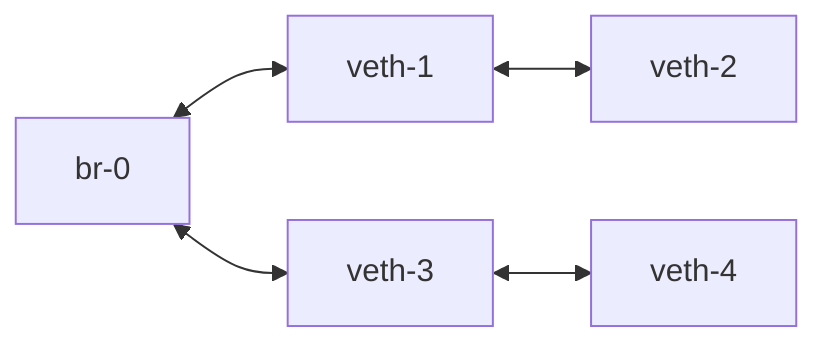

## veth与bridge
我们知道， 容器是依赖于linux系统中的cgroup与namespace机制。 所以要了解容器网络要先知道怎么在宿主中管理网络命名空间（namespace）。

linux中提供了强大的`ip`命令可以管理网络。
```bash
root@test:~# ip a
1: lo: <LOOPBACK,UP,LOWER_UP> mtu 65536 qdisc noqueue state UNKNOWN group default qlen 1000
    link/loopback 00:00:00:00:00:00 brd 00:00:00:00:00:00
    inet 127.0.0.1/8 scope host lo
       valid_lft forever preferred_lft forever
    inet6 ::1/128 scope host
       valid_lft forever preferred_lft forever
2: ens3: <BROADCAST,MULTICAST,UP,LOWER_UP> mtu 1500 qdisc fq_codel state UP group default qlen 1000
    link/ether 52:54:00:86:d7:c2 brd ff:ff:ff:ff:ff:ff
    altname enp0s3
    inet 192.168.64.6/24 metric 100 brd 192.168.64.255 scope global dynamic ens3
       valid_lft 82572sec preferred_lft 82572sec
    inet6 fdf8:4676:9d4e:a478:5054:ff:fe86:d7c2/64 scope global dynamic mngtmpaddr noprefixroute
       valid_lft 2591907sec preferred_lft 604707sec
    inet6 fe80::5054:ff:fe86:d7c2/64 scope link
       valid_lft forever preferred_lft forever
root@test:~# ip netns ls
root@test:~# # 当前没有创建ns
```
有了ns之后， 我们就可以实现网络隔离了。那么如何打通不同ns间的壁垒（不同容器间的通讯）， 实现通讯呢？那就需要为它们分配网络设备了，这个创建出的网络设备，被称之为veth(虚拟网卡)。
```bash
root@test:~# ip netns add n1 # 创建一个ns
root@test:~# ip netns list
n1
root@test:~# ip link add veth-1 type veth peer name veth-2 # 创建一对veth设备
root@test:~# ip a
1: lo: <LOOPBACK,UP,LOWER_UP> mtu 65536 qdisc noqueue state UNKNOWN group default qlen 1000
    link/loopback 00:00:00:00:00:00 brd 00:00:00:00:00:00
    inet 127.0.0.1/8 scope host lo
       valid_lft forever preferred_lft forever
    inet6 ::1/128 scope host
       valid_lft forever preferred_lft forever
2: ens3: <BROADCAST,MULTICAST,UP,LOWER_UP> mtu 1500 qdisc fq_codel state UP group default qlen 1000
    link/ether 52:54:00:86:d7:c2 brd ff:ff:ff:ff:ff:ff
    altname enp0s3
    inet 192.168.64.6/24 metric 100 brd 192.168.64.255 scope global dynamic ens3
       valid_lft 82052sec preferred_lft 82052sec
    inet6 fdf8:4676:9d4e:a478:5054:ff:fe86:d7c2/64 scope global dynamic mngtmpaddr noprefixroute
       valid_lft 2591941sec preferred_lft 604741sec
    inet6 fe80::5054:ff:fe86:d7c2/64 scope link
       valid_lft forever preferred_lft forever
10: veth-2@veth-1: <BROADCAST,MULTICAST,M-DOWN> mtu 1500 qdisc noop state DOWN group default qlen 1000
    link/ether 56:28:03:e9:d6:ad brd ff:ff:ff:ff:ff:ff
11: veth-1@veth-2: <BROADCAST,MULTICAST,M-DOWN> mtu 1500 qdisc noop state DOWN group default qlen 1000
    link/ether 1e:8d:b2:73:eb:b9 brd ff:ff:ff:ff:ff:ff
```
`veth`总是成对出现的，当前两个veth都处于默认的ns（宿主机网络）中。 接下来我们将其中一个veth放到ns中，这样就可以实现指定ns与宿主机通信了
```bash
root@test:~# ip link set veth-2 up netns n1
root@test:~# ip a
1: lo: <LOOPBACK,UP,LOWER_UP> mtu 65536 qdisc noqueue state UNKNOWN group default qlen 1000
    link/loopback 00:00:00:00:00:00 brd 00:00:00:00:00:00
    inet 127.0.0.1/8 scope host lo
       valid_lft forever preferred_lft forever
    inet6 ::1/128 scope host
       valid_lft forever preferred_lft forever
2: ens3: <BROADCAST,MULTICAST,UP,LOWER_UP> mtu 1500 qdisc fq_codel state UP group default qlen 1000
    link/ether 52:54:00:86:d7:c2 brd ff:ff:ff:ff:ff:ff
    altname enp0s3
    inet 192.168.64.6/24 metric 100 brd 192.168.64.255 scope global dynamic ens3
       valid_lft 81876sec preferred_lft 81876sec
    inet6 fdf8:4676:9d4e:a478:5054:ff:fe86:d7c2/64 scope global dynamic mngtmpaddr noprefixroute
       valid_lft 2591946sec preferred_lft 604746sec
    inet6 fe80::5054:ff:fe86:d7c2/64 scope link
       valid_lft forever preferred_lft forever
11: veth-1@if10: <BROADCAST,MULTICAST> mtu 1500 qdisc noop state DOWN group default qlen 1000
    link/ether 1e:8d:b2:73:eb:b9 brd ff:ff:ff:ff:ff:ff link-netns n1
```
可以看到， 我们将`veth-2`开启并指定到n1命名空间后， 在宿主机执行`ip a`命令， 就看不到`veth-2`了。 `veth-1`后面有连接到`n1`的提示(link-netns n1)。 

`veth-2`可以通过指定命名空间查看。`ip netns exec`命名用于在指定的命名空间中执行命令。
```bash
root@test:~# ip netns exec n1 ip a
1: lo: <LOOPBACK> mtu 65536 qdisc noop state DOWN group default qlen 1000
    link/loopback 00:00:00:00:00:00 brd 00:00:00:00:00:00
10: veth-2@if11: <NO-CARRIER,BROADCAST,MULTICAST,UP> mtu 1500 qdisc noqueue state LOWERLAYERDOWN group default qlen 1000
    link/ether 56:28:03:e9:d6:ad brd ff:ff:ff:ff:ff:ff link-netnsid 0
```
上文说到， `veth`总是成对出现， 那如果我想一对多，创建一个`veth-3`也与`veth-1`通信怎么办？ 这时候就需要`bridge`了。 

`bridge`是linux中的一个虚拟设备， 他可以将多个网络设备连接起来， 形成一个网络。也可将其理解为一个虚拟交换机。 

安装docker时创建的`docker0`就是一个网桥设备。
```bash
root@test:~# ip link add veth-3 type veth peer name veth-1 # 再次绑定一个veth会提示错误
RTNETLINK answers: File exists
root@test:~# ip link add br-0 type bridge
root@test:~# ip a # 其他网卡信息省略掉了
12: br-0: <BROADCAST,MULTICAST> mtu 1500 qdisc noop state DOWN group default qlen 1000
    link/ether ae:d6:21:1e:15:ca brd ff:ff:ff:ff:ff:ff
root@test:~# brctl show # 使用这个命令可以更清楚的看到bridge的信息
bridge name	bridge id		STP enabled	interfaces
br-0		8000.aed6211e15ca	no
docker0		8000.02423ef99232	no
```
将`veth-1`和`veth-3`与`br-0`连接起来。
```bash
root@test:~# ip link add veth-3 type veth peer veth-4
root@test:~# brctl addif br-0 veth-1
root@test:~# brctl addif br-0 veth-3
root@test:~# brctl show
bridge name	bridge id		STP enabled	interfaces
br-0		8000.aed6211e15ca	no		veth-1
							veth-3
docker0		8000.02423ef99232	no
```
这样， 我们就可以通过`br-0`将`veth-1`和`veth-3`连接起来了。网络拓扑看起来是这样的：

## 容器与宿主机间的网络
> 我们清空上一段中所有的网络配置， 仅保留一个`br-0`网桥设备

`containerd`是从`docker`中分离出的运行时， 他与`runc`交互，创建并管理容器。 下面我们使用`containerd`来创建容器，演示网络原理。

当我们使用`ctr`创建一个容器时， 默认是没有任何网络的。(ctr是containerd的命令行工具)
```bash
root@test:~# ctr run -t -d docker.io/library/busybox:latest busybox-1
root@test:~# ctr task exec -t -exec-id 123 busybox-1 sh
/ # ip a
1: lo: <LOOPBACK,UP,LOWER_UP> mtu 65536 qdisc noqueue qlen 1000
    link/loopback 00:00:00:00:00:00 brd 00:00:00:00:00:00
    inet 127.0.0.1/8 scope host lo
       valid_lft forever preferred_lft forever
    inet6 ::1/128 scope host
       valid_lft forever preferred_lft forever
```
接下来我们为这个容器分配网络。

首先需要找到容器的namespace。这里需要找到容器的`PID`。
```bash
root@test:~# ctr task ls
TASK         PID     STATUS
busybox-1    2592    RUNNING
root@test:~# ls /proc/2592/net/
dev  peer  snmp  stat  tcp  udp  unix
```
为容器创建veth并分配网络。 
> 无需为veth-1分配ip地址， 因为连接到网桥， veth-1在这里相当于网线的角色。
```bash
root@test:~# ip link add veth-1 type veth peer name veth-2
root@test:~# ip link set veth-2 up netns 2592
root@test:~# brctl addif br-0 veth-1
root@test:~# ip link set veth-1 up
root@test:~# ip link set br-0 up
root@test:~# ip addr add 172.16.100.1/24 dev br-0
```
尝试为在容器中的veth`veth-2`配置ip地址。 因为ip netns从/var/run/netns目录中检查ns，但是目前不存在，所以会报错。

我们创建一个软连接，指向容器的ns。
> 创建后的软连接记得及时删除， 因为存在软连接时，即使容器删除掉ns也不会被回收。

```bash
root@test:~# ip netns exec 2592 ip a
Cannot open network namespace "2592": No such file or directory
root@test:~# ln -s /proc/2592/ns/net /var/run/netns/2592
root@test:~# ip netns ls
2592 (id: 1)
root@test:~# ip netns exec 2592 ip addr add 172.16.100.101/24 dev veth-2
root@test:~# ip netns exec 2592 ip route add default  dev veth-2 # 为容器添加默认路由
```
进入到容器中， 查看网卡状态。并测试网络连通性。
```bash
root@test:~# ctr task exec -t --exec-id 123 busybox-1 sh
/ # ip a
1: lo: <LOOPBACK,UP,LOWER_UP> mtu 65536 qdisc noqueue qlen 1000
    link/loopback 00:00:00:00:00:00 brd 00:00:00:00:00:00
    inet 127.0.0.1/8 scope host lo
       valid_lft forever preferred_lft forever
    inet6 ::1/128 scope host
       valid_lft forever preferred_lft forever
15: veth-2@if16: <BROADCAST,MULTICAST,UP,LOWER_UP,M-DOWN> mtu 1500 qdisc noqueue qlen 1000
    link/ether 56:28:03:e9:d6:ad brd ff:ff:ff:ff:ff:ff
    inet 172.16.100.101/24 scope global veth-2
       valid_lft forever preferred_lft forever
    inet6 fe80::5428:3ff:fee9:d6ad/64 scope link
       valid_lft forever preferred_lft forever
root@test:~# ctr task exec -t --exec-id 123 busybox-1 sh
/ # ping 172.16.100.1
PING 172.16.100.1 (172.16.100.1): 56 data bytes
64 bytes from 172.16.100.1: seq=0 ttl=64 time=1.234 ms
64 bytes from 172.16.100.1: seq=1 ttl=64 time=0.119 ms
/ # ping 192.168.64.6 # 宿主机ip
PING 192.168.64.6 (192.168.64.6): 56 data bytes
64 bytes from 192.168.64.6: seq=0 ttl=64 time=0.426 ms
64 bytes from 192.168.64.6: seq=1 ttl=64 time=0.111 ms
```
ok， 至此完成了容器与宿主机间的网络通信。
## 容器间的网络
### 不同命名空间间的通信
与上文类似， 我们创建一个新的容器， 并为其分配网络。
```bash
root@test:~# ctr run -t -d docker.io/library/busybox:latest busybox-2
root@test:~# ctr task list
TASK         PID     STATUS
busybox-2    6306    RUNNING
busybox-1    2592    RUNNING
root@test:~# ip link add veth-3 type veth peer veth-4
root@test:~# ip link set veth-4 up netns 6306
root@test:~# ip link set veth-3 up
root@test:~# ln -s /proc/6306/ns/net /var/run/netns/6306
root@test:~# ip netns exec 6306 ip addr add 172.16.100.102/24 dev veth-4
root@test:~# brctl addif br-0 veth-3
```
进入到容器中， 查看网卡状态。并测试网络连通性。
```bash
/ # ping 172.16.100.101
PING 172.16.100.101 (172.16.100.101): 56 data bytes
^C
--- 172.16.100.101 ping statistics ---
1 packets transmitted, 0 packets received, 100% packet loss
/ # ping 172.16.100.1
PING 172.16.100.1 (172.16.100.1): 56 data bytes
64 bytes from 172.16.100.1: seq=0 ttl=64 time=0.107 ms
64 bytes from 172.16.100.1: seq=1 ttl=64 time=0.119 ms
^C
--- 172.16.100.1 ping statistics ---
2 packets transmitted, 2 packets received, 0% packet loss
round-trip min/avg/max = 0.107/0.113/0.119 ms
```
发现到容器`busybox-1`的网络是不通的，但是与`br-0`之间是通的。 查看`busybox-2`的arp表。
```bash
/ # arp -a
? (172.16.100.1) at ae:d6:21:1e:15:ca [ether]  on veth-4
? (172.16.100.101) at 56:28:03:e9:d6:ad [ether]  on veth-4
```
arp表中的映射关系是存在并正确的， 抓包查看`br-0`和`veth-4`, 发现有`arp`应答， 但是没有`icmp`应答。而`veth-2`仅收到了`arp`请求。
> - `ICMP echo request`发起ICMP请求
> - `ARP, Request`发起ARP请求
> - `ARP, Reply`应答ARP请求， 返回目标MAC
```bash
/ # ping 172.16.100.101  # busybox-2中发起ping 101
PING 172.16.100.101 (172.16.100.101): 56 data bytes
root@test:~#  tcpdump -n -i br-0 # 宿主机执行抓包
tcpdump: verbose output suppressed, use -v[v]... for full protocol decode
listening on br-0, link-type EN10MB (Ethernet), snapshot length 262144 bytes
17:27:39.096134 IP 172.16.100.102 > 172.16.100.101: ICMP echo request, id 31, seq 0, length 64
17:27:40.097519 IP 172.16.100.102 > 172.16.100.101: ICMP echo request, id 31, seq 1, length 64
17:27:41.099411 IP 172.16.100.102 > 172.16.100.101: ICMP echo request, id 31, seq 2, length 64
17:27:42.100348 IP 172.16.100.102 > 172.16.100.101: ICMP echo request, id 31, seq 3, length 64
17:27:43.101999 IP 172.16.100.102 > 172.16.100.101: ICMP echo request, id 31, seq 4, length 64
17:27:44.103190 IP 172.16.100.102 > 172.16.100.101: ICMP echo request, id 31, seq 5, length 64
17:27:44.157837 ARP, Request who-has 172.16.100.101 tell 172.16.100.102, length 28
17:27:44.157965 ARP, Reply 172.16.100.101 is-at 56:28:03:e9:d6:ad, length 28
17:27:45.104252 IP 172.16.100.102 > 172.16.100.101: ICMP echo request, id 31, seq 6, length 64
17:27:46.105001 IP 172.16.100.102 > 172.16.100.101: ICMP echo request, id 31, seq 7, length 64
root@test:~#
root@test:~# ip netns exec 6306 tcpdump -n -i veth-4 # busybox-2容器中执行抓包
tcpdump: verbose output suppressed, use -v[v]... for full protocol decode
listening on veth-4, link-type EN10MB (Ethernet), snapshot length 262144 bytes
17:27:39.096117 IP 172.16.100.102 > 172.16.100.101: ICMP echo request, id 31, seq 0, length 64
17:27:40.097504 IP 172.16.100.102 > 172.16.100.101: ICMP echo request, id 31, seq 1, length 64
17:27:41.099395 IP 172.16.100.102 > 172.16.100.101: ICMP echo request, id 31, seq 2, length 64
17:27:42.100333 IP 172.16.100.102 > 172.16.100.101: ICMP echo request, id 31, seq 3, length 64
17:27:43.101980 IP 172.16.100.102 > 172.16.100.101: ICMP echo request, id 31, seq 4, length 64
17:27:44.103157 IP 172.16.100.102 > 172.16.100.101: ICMP echo request, id 31, seq 5, length 64
17:27:44.157806 ARP, Request who-has 172.16.100.101 tell 172.16.100.102, length 28
17:27:44.158072 ARP, Reply 172.16.100.101 is-at 56:28:03:e9:d6:ad, length 28
17:27:45.104238 IP 172.16.100.102 > 172.16.100.101: ICMP echo request, id 31, seq 6, length 64
17:27:46.104987 IP 172.16.100.102 > 172.16.100.101: ICMP echo request, id 31, seq 7, length 64
root@test:~# 
root@test:~# ip netns exec 2592 tcpdump -n -i veth-2 # busybox-1容器中执行抓包, 只收到了arp请求
tcpdump: verbose output suppressed, use -v[v]... for full protocol decode
listening on veth-2, link-type EN10MB (Ethernet), snapshot length 262144 bytes
^C17:27:44.157934 ARP, Request who-has 172.16.100.101 tell 172.16.100.102, length 28
17:27:44.157954 ARP, Reply 172.16.100.101 is-at 56:28:03:e9:d6:ad, length 28
17:28:32.287811 ARP, Request who-has 172.16.100.101 tell 172.16.100.102, length 28
17:28:32.287833 ARP, Reply 172.16.100.101 is-at 56:28:03:e9:d6:ad, length 28
17:29:19.388786 ARP, Request who-has 172.16.100.101 tell 172.16.100.102, length 28
17:29:19.388808 ARP, Reply 172.16.100.101 is-at 56:28:03:e9:d6:ad, length 28
17:30:07.517868 ARP, Request who-has 172.16.100.101 tell 172.16.100.102, length 28
```
也就是说二层网络是通的， 但是被某些不知道的东西拦截了， 那我们首先怀疑的就是防火墙。 

再次查找解决方案，最终定位为以下内核参数的问题。当它开启时， 二层的转发请求会经过防火墙处理， 我们把它关闭掉则恢复正常。
> 注意， 这个内核参数在运行k8s的机器上应该是为`1`开启状态，随意改动会影响pod间的网络通信。
```bash
root@test:~# sysctl net.bridge.bridge-nf-call-iptables
net.bridge.bridge-nf-call-iptables = 1
root@test:~# modprobe br_netfilter
sysctl -w net.bridge.bridge-nf-call-arptables=0
sysctl -w net.bridge.bridge-nf-call-ip6tables=0
sysctl -w net.bridge.bridge-nf-call-iptables=0
net.bridge.bridge-nf-call-arptables = 0
net.bridge.bridge-nf-call-ip6tables = 0
net.bridge.bridge-nf-call-iptables = 0
```
再次测试网络连通性， 发现已经可以ping通了。
```bash
/ # ping 172.16.100.101
PING 172.16.100.101 (172.16.100.101): 56 data bytes
64 bytes from 172.16.100.101: seq=0 ttl=64 time=0.679 ms
64 bytes from 172.16.100.101: seq=1 ttl=64 time=0.136 ms
^C
--- 172.16.100.101 ping statistics ---
2 packets transmitted, 2 packets received, 0% packet loss
round-trip min/avg/max = 0.136/0.407/0.679 ms
```
### 同一命名空间间的通信
在`k8s`中同一pod的内的容器是可以互相通信的， 这就是通过共享用一个命名空间实现的。

创建一个新的容器， 并指定与`busybox-1`相同的网络命名空间,以共享网络。
```bash
root@test:~# ctr run -t -d --with-ns network:/var/run/netns/2592  docker.io/library/busybox:latest busybox-3
```
进入容器查看网络并测试连通性。
```bash
root@test:~# ctr task exec -t --exec-id 444 busybox-3 sh
/ # ip a
1: lo: <LOOPBACK,UP,LOWER_UP> mtu 65536 qdisc noqueue qlen 1000
    link/loopback 00:00:00:00:00:00 brd 00:00:00:00:00:00
    inet 127.0.0.1/8 scope host lo
       valid_lft forever preferred_lft forever
    inet6 ::1/128 scope host
       valid_lft forever preferred_lft forever
15: veth-2@if16: <BROADCAST,MULTICAST,UP,LOWER_UP,M-DOWN> mtu 1500 qdisc noqueue qlen 1000
    link/ether 56:28:03:e9:d6:ad brd ff:ff:ff:ff:ff:ff
    inet 172.16.100.101/24 scope global veth-2
       valid_lft forever preferred_lft forever
    inet6 fe80::5428:3ff:fee9:d6ad/64 scope link
       valid_lft forever preferred_lft forever
/ # ping 172.16.100.102
PING 172.16.100.102 (172.16.100.102): 56 data bytes
64 bytes from 172.16.100.102: seq=0 ttl=64 time=0.096 ms

--- 172.16.100.102 ping statistics ---
1 packets transmitted, 1 packets received, 0% packet loss
round-trip min/avg/max = 0.096/0.096/0.096 ms
```
可以看到网络信息与`busybox-1`容器是相同的， 并且同样可以ping通`102`容器。

## 跨主机通信
至此， 我们在同一物理机上容器通讯问题已经解决， 那不同物理机呢？

在`k8s`中， 是通过`cni`插件来解决通信问题的。 `cni`插件大体来说会分为两个网络部分：
1. 宿主机网络。 通过执行宿主机中的`cni`命令，创建网桥及veth设备，实现通讯，就是我们上文中的方式。
2. 跨宿主机网络。在宿主机网络正常的情况下， `cni`控制器会通过vxlan、hostgw、tun/tap等方式，将不同宿主机的网络连接起来。
跨主机通讯的具体实现每个`cni`插件的具体实现都不同， 本文不过多介绍。 

之前有写过`flannel`网络插件的源码解析，感兴趣的可以看一下。[《Flannel源码解析》](/cloud_native/flannel)

ok， 感谢大家阅读，后续有机会会写一篇《从0实现cni》的文章， 本文到此结束。