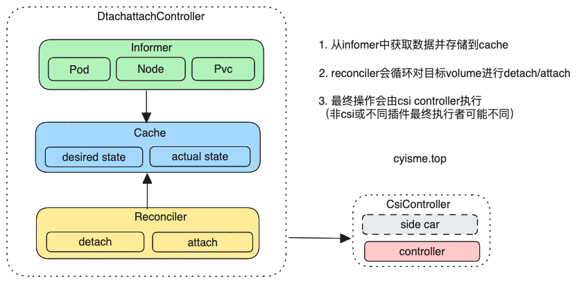
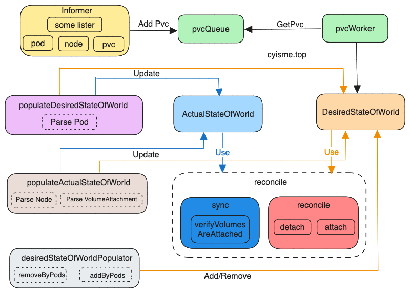

# Attachdetach控制器源码解析
本文从源码的角度分析KubeController Attachdetach相关功能的实现。 

本篇kubernetes版本为v1.27.3。

>kubernetes项目地址: [https://github.com/kubernetes/kubernetes](https://github.com/kubernetes/kubernetes)
>
>controller命令main入口: cmd/kube-controller-manager/controller-manager.go
>
>controller相关代码目录: pkg/controller

`AttachdetachController`与pod、pv、pvc是密切绑定的， 只有当pod被正常调度，并且关联的pvc已经与pv处于绑定状态， 才会执行attach操作（或者后续的反向detach操作）。

## AttachdetachController定义
源码文件路径： pkg/controller/volume/attachdetach/attach_detach_controller.go
```go
// type attachDetachController 结构体定义
type attachDetachController struct {
	kubeClient clientset.Interface
    // 省略informer相关定义
    // 主要监听pvc/pv/pod/node/csinode/csidriver/volumeattachment对象
    // 
	// 云厂商提供的接口
	cloud cloudprovider.Interface
    // 主要负责的volumeplugin的管理
    // 包含intree以及outtree的桥接转换
	volumePluginMgr volume.VolumePluginMgr
    // 存储期望达到的状态，主要是用来做信息校对
	desiredStateOfWorld cache.DesiredStateOfWorld
    // 实际的状态，detach/attach操作会更新这个状态
	actualStateOfWorld cache.ActualStateOfWorld
	// 实际提供attach/detach操作的执行者， 执行attach成功会创建volumeattachments对象
	attacherDetacher operationexecutor.OperationExecutor
    // 周期性的调用attacherDetacher，并同步期望状态与实际状态
	reconciler reconciler.Reconciler
    // 更新node status中和attach/detach相关的信息
	nodeStatusUpdater statusupdater.NodeStatusUpdater
    // 更新pod信息
	desiredStateOfWorldPopulator populator.DesiredStateOfWorldPopulator
	// 通知
	broadcaster record.EventBroadcaster
	// pvc对象会被放入到该队列中，reconciler的周期循环会从中消费
	pvcQueue workqueue.RateLimitingInterface
    // 检测迁移的插件
    // k8s将原本内置的（in-tree）插件拆分出项目，以插件的形式提供
    // 独立出的插件称为CSI插件，同时pervisor也会变化， 代码里面兼容了新旧的命名
	csiMigratedPluginManager csimigration.PluginManager
    // 用于将in-tree的插件转换为csi插件
	intreeToCSITranslator csimigration.InTreeToCSITranslator
    // 未使用
	filteredDialOptions *proxyutil.FilteredDialOptions
}
```
`AttachdetachController`对象创建时，对pod/node/pvc的informer增加了event订阅
```go
func NewAttachDetachController(
    //....
    ){
    //...
    // pod和node的主要是更新内部缓存
    podInformer.Informer().AddEventHandler(kcache.ResourceEventHandlerFuncs{
		AddFunc: func(obj interface{}) {
			adc.podAdd(logger, obj)
		},
		UpdateFunc: func(oldObj, newObj interface{}) {
			adc.podUpdate(logger, oldObj, newObj)
		},
		DeleteFunc: func(obj interface{}) {
			adc.podDelete(logger, obj)
		},
	})
    // 省略node
    // pvc的主要是将pvc对象放入到pvcQueue队列中
    pvcInformer.Informer().AddEventHandler(kcache.ResourceEventHandlerFuncs{
		AddFunc: func(obj interface{}) {
			adc.enqueuePVC(obj)
		},
		UpdateFunc: func(old, new interface{}) {
			adc.enqueuePVC(new)
		},
	})
    //...
}
```
### 启动
启动分为两部分：
- 初始化期望状态和实际状态
- 启动后台goroutine
```go
func (adc *attachDetachController) Run(ctx context.Context) {
    // 省略无关代码...
    // 初始化实际状态
	err := adc.populateActualStateOfWorld(logger)
    // 初始化期望状态
	err = adc.populateDesiredStateOfWorld(logger)
    // 启动reconciler
	go adc.reconciler.Run(ctx)
    // 启动更新pod信息的goroutine
	go adc.desiredStateOfWorldPopulator.Run(ctx)
    // 从pvcQueue队列中获取pvc对象
	go wait.UntilWithContext(ctx, adc.pvcWorker, time.Second)
    // 省略无关代码...
}
```

## 工具函数
两个出现比较多的工具函数， 单独说一下作用
### util.DetermineVolumeAction
根据`pod`的相关信息， 生成动作。 

配合下面的`util.ProcessPodVolumes`函数使用，返回为`true`时增加信息， 反之移除信息
```go
func DetermineVolumeAction(pod *v1.Pod, desiredStateOfWorld cache.DesiredStateOfWorld, defaultAction bool) bool {
	if pod == nil || len(pod.Spec.Volumes) <= 0 {
		return defaultAction
	}
    // 根据node上的两个annotation判断podterminate后的动作
    // "volumes.kubernetes.io/controller-managed-attach-detach" 是否由controller管理
    // "volumes.kubernetes.io/keep-terminated-pod-volumes" pod terminate后是否保留volume
	if util.IsPodTerminated(pod, pod.Status) {
		nodeName := types.NodeName(pod.Spec.NodeName)
		keepTerminatedPodVolume := desiredStateOfWorld.GetKeepTerminatedPodVolumesForNode(nodeName)
		// if pod is terminate we let kubelet policy dictate if volume
		// should be detached or not
		return keepTerminatedPodVolume
	}
	return defaultAction
}
```
### util.ProcessPodVolumes
根据`pod`信息维护期望状态
```go
func ProcessPodVolumes(logger klog.Logger, pod *v1.Pod, addVolumes bool, desiredStateOfWorld cache.DesiredStateOfWorld, volumePluginMgr *volume.VolumePluginMgr, pvcLister corelisters.PersistentVolumeClaimLister, pvLister corelisters.PersistentVolumeLister, csiMigratedPluginManager csimigration.PluginManager, csiTranslator csimigration.InTreeToCSITranslator) {
	if len(pod.Spec.Volumes) <= 0 {
		// pod没有绑定volume则跳过
		return
	}
	nodeName := types.NodeName(pod.Spec.NodeName)
	if nodeName == "" {
		// pod未被调度则跳过
		return
	} else if !desiredStateOfWorld.NodeExists(nodeName) {
		// 不是由controller管理的node则跳过
		return
	}
	for _, podVolume := range pod.Spec.Volumes {
        // 省略代码...
        // 获取pod名称， 实际是pod的UID
		uniquePodName := util.GetUniquePodName(pod)
        // 根据传进来的标识，决定是添加还是删除
        // 
		if addVolumes {
			// 增加相关信息到期望状态
			_, err := desiredStateOfWorld.AddPod(
				uniquePodName, pod, volumeSpec, nodeName)
		} else {
			// 删除
			desiredStateOfWorld.DeletePod(
				uniquePodName, uniqueVolumeName, nodeName)
		}
	}
	return
}
```
## pvcWorker
从`pvcQueue`队列中获取pvc对象并找到与其关联的`pod`, 将信息更新到期望状态中
```go
// go wait.UntilWithContext(ctx, adc.pvcWorker, time.Second)
func (adc *attachDetachController) pvcWorker(ctx context.Context) {
	for adc.processNextItem(klog.FromContext(ctx)) {
	}
}
func (adc *attachDetachController) processNextItem(logger klog.Logger) bool {
    // 从pvcQueue队列中获取pvc对象
	keyObj, shutdown := adc.pvcQueue.Get()
	if shutdown {
		return false
	}
	defer adc.pvcQueue.Done(keyObj)

	if err := adc.syncPVCByKey(logger, keyObj.(string)); err != nil {
		// 失败会重新入队，在一段时间后才能被重新get
		adc.pvcQueue.AddRateLimited(keyObj)
		return true
	}
    // 没有错误则从队列中遗忘（删除）掉这个对象
	adc.pvcQueue.Forget(keyObj)
	return true
}
// 最终是由这个函数执行的
func (adc *attachDetachController) syncPVCByKey(logger klog.Logger, key string) error {
    // 省略无关代码..
    // 
	if pvc.Status.Phase != v1.ClaimBound || pvc.Spec.VolumeName == "" {
		// pvc未绑定或者没有绑定volume则跳过
		return nil
	}
    // pod的infomer中注册了一个自定义的indexer
    // 可以通过pod中的pvc信息，生成索引， 这里用pvc的名称反查pod
	objs, err := adc.podIndexer.ByIndex(common.PodPVCIndex, key)
	if err != nil {
		return err
	}
	for _, obj := range objs {
		pod, ok := obj.(*v1.Pod)
		// pod未调度或者已经终止则跳过
		if len(pod.Spec.NodeName) == 0 || volumeutil.IsPodTerminated(pod, pod.Status) {
			continue
		}
        // 放入到期望状态中
		volumeActionFlag := util.DetermineVolumeAction(
			pod,
			adc.desiredStateOfWorld,
			true /* default volume action */)

		util.ProcessPodVolumes(logger, pod, volumeActionFlag, /* addVolumes */
			adc.desiredStateOfWorld, &adc.volumePluginMgr, adc.pvcLister, adc.pvLister, adc.csiMigratedPluginManager, adc.intreeToCSITranslator)
	}
	return nil
}
```
## desiredStateOfWorldPopulator.Run
每过一段时间：
- 从期望状态中删除已经不存在的`pod`信息。分别从pod的角度和pv attach的角度删除
- 获取活跃的`pod`加入到期望状态中
```go
func (dswp *desiredStateOfWorldPopulator) Run(ctx context.Context) {
	wait.UntilWithContext(ctx, dswp.populatorLoopFunc(ctx), dswp.loopSleepDuration)
}
func (dswp *desiredStateOfWorldPopulator) populatorLoopFunc(ctx context.Context) func(ctx context.Context) {
	return func(ctx context.Context) {
		logger := klog.FromContext(ctx)
        // 删除已经不存在的pod
        // 对比cahce中的pod和informer中的pod，uid都是否一致， 不一致则删除
        // 查看需要attch的pv状态， 如果不是volumeAttachable则删除
		dswp.findAndRemoveDeletedPods(logger)
        // 重试间隔判断
		if time.Since(dswp.timeOfLastListPods) < dswp.listPodsRetryDuration {
			return
		}
        // 获取活跃的pod
        // 实际就是获取全量的pod列表，调用util.ProcessPodVolumes函数将其更新
		dswp.findAndAddActivePods(logger)
	}
}
```
## populateActualStateOfWorld
根据`node`状态中的attch相关信息， 初始化实际状态缓存
```go
// err := adc.populateActualStateOfWorld(logger)
func (adc *attachDetachController) populateActualStateOfWorld(logger klog.Logger) error {
    // 遍历node列表
	for _, node := range nodes {
		nodeName := types.NodeName(node.Name)
		for _, attachedVolume := range node.Status.VolumesAttached {
            // volume uid
			uniqueName := attachedVolume.Name
			// 更新到实际状态中， 并标记为attached
			err = adc.actualStateOfWorld.MarkVolumeAsAttached(logger, uniqueName, nil /* VolumeSpec */, nodeName, attachedVolume.DevicePath)
            // 更新在用的volumes信息， 即已经mount的
			adc.processVolumesInUse(logger, nodeName, node.Status.VolumesInUse)
            // 更新到期望状态中。
            // 实际是设置这个node是否被controller管理、是否开启了podterminate后的动作
			adc.addNodeToDswp(node, types.NodeName(node.Name))
		}
	}
    // 根据volumeattachment对象更新实际状态
	err = adc.processVolumeAttachments(logger)
	return err
}
func (adc *attachDetachController) processVolumeAttachments(logger klog.Logger) error {
	vas, err := adc.volumeAttachmentLister.List(labels.Everything())
	for _, va := range vas {
        // 省略无关代码...

		var plugin volume.AttachableVolumePlugin
		volumeSpec := volume.NewSpecFromPersistentVolume(pv, false)

		// 判断是否为intree的插件， 是否开启了迁移
		if inTreePluginName, err := adc.csiMigratedPluginManager.GetInTreePluginNameFromSpec(pv, nil); err == nil {
			if adc.csiMigratedPluginManager.IsMigrationEnabledForPlugin(inTreePluginName) {
                // 使用csi插件处理
				plugin, _ = adc.volumePluginMgr.FindAttachablePluginByName(csi.CSIPluginName)
				volumeSpec, err = csimigration.TranslateInTreeSpecToCSI(volumeSpec, "" /* podNamespace */, adc.intreeToCSITranslator)
	
			}
		}
		if plugin == nil {
            // 查找附加插件。 这都是在初始化时注册的
			plugin, err = adc.volumePluginMgr.FindAttachablePluginBySpec(volumeSpec)
			if err != nil || plugin == nil {
				// Currently VA objects are created for CSI volumes only. nil plugin is unexpected, generate a warning
				logger.Info("Skipping processing the volume on node, no attacher interface found", "node", klog.KRef("", string(nodeName)), "PV", klog.KRef("", *pvName), "err", err)
				continue
			}
		}
        // 获取volume名称
		volumeName, err := volumeutil.GetUniqueVolumeNameFromSpec(plugin, volumeSpec)
		// 获取状态
		attachState := adc.actualStateOfWorld.GetAttachState(volumeName, nodeName)
		if attachState == cache.AttachStateDetached {
			// 设置成不确定, 实际就是未attach
			err = adc.actualStateOfWorld.MarkVolumeAsUncertain(logger, volumeName, volumeSpec, nodeName)

		}
	}
	return nil
}
```
## populateDesiredStateOfWorld
根据`pod`状态中的`volume`相关信息， 初始化期望状态缓存。 

期望状态实际上维护的是node信息， 维护了node是否由controller管理、pod terminate后的动作（删除还是保留）的元信息。

所以这个函数实际上也会更新实际状态的缓存。
> ps: 并不是想象中的期望/实际状态缓存做差集，两个对比更新状态（反正我看见命名的第一反应是这么想的...）
```go
func (adc *attachDetachController) populateDesiredStateOfWorld(logger klog.Logger) error {
    // 遍历pod列表
	for _, pod := range pods {
		podToAdd := pod
        // 添加到期望状态缓存
		adc.podAdd(logger, podToAdd)
		for _, podVolume := range podToAdd.Spec.Volumes {
			// 获取对应的volume插件
			plugin, err := adc.volumePluginMgr.FindAttachablePluginBySpec(volumeSpec)
			if err != nil || plugin == nil {
				logger.V(10).Info(
					"Skipping volume for pod: it does not implement attacher interface",
					"pod", klog.KObj(podToAdd),
					"volumeName", podVolume.Name,
					"err", err)
				continue
			}
            // 获取volume名称， 实际是插件名和volume名的组合
			volumeName, err := volumeutil.GetUniqueVolumeNameFromSpec(plugin, volumeSpec)
			// 从实际缓存中获取状态
			attachState := adc.actualStateOfWorld.GetAttachState(volumeName, nodeName)
			if attachState == cache.AttachStateAttached {
				devicePath, err := adc.getNodeVolumeDevicePath(volumeName, nodeName)
				if err != nil {
					logger.Error(err, "Failed to find device path")
					continue
				}
                // 更新实际状态中
				err = adc.actualStateOfWorld.MarkVolumeAsAttached(logger, volumeName, volumeSpec, nodeName, devicePath)
				if err != nil {
					logger.Error(err, "Failed to update volume spec for node", "node", klog.KRef("", string(nodeName)))
				}
			}
		}
	}

	return nil
}
```
## reconciler.Run
`reconciler`是真正执行attach/detach操作的地方， 会周期性的执行
```go
// Run最终调用的是reconciliationLoopFunc这个函数
func (rc *reconciler) reconciliationLoopFunc(ctx context.Context) func(context.Context) {
	return func(ctx context.Context) {
        // 执行attach/detach操作
		rc.reconcile(ctx)
		logger := klog.FromContext(ctx)
		if rc.disableReconciliationSync {
			// 打印日志
		} else if rc.syncDuration < time.Second {
			// 打印日志
		} else if time.Since(rc.timeOfLastSync) > rc.syncDuration {
			// 打印日志
            // 同步attach状态
			rc.sync()
		}
	}
}
```
### sync 
先看`rc.sync`函数。
```go
func (rc *reconciler) syncStates() {
    // 获取节点上已经attach的volume信息
    // {nodename: [voulumes]} 
	volumesPerNode := rc.actualStateOfWorld.GetAttachedVolumesPerNode()
    // 验证attach状态
	rc.attacherDetacher.VerifyVolumesAreAttached(volumesPerNode, rc.actualStateOfWorld)
}
```
`VerifyVolumesAreAttached`会从缓存中记录的已经attached的volume中遍历验证是否真的attach成功了。
```go
func (oe *operationExecutor) VerifyVolumesAreAttached(
	attachedVolumes map[types.NodeName][]AttachedVolume,
	actualStateOfWorld ActualStateOfWorldAttacherUpdater) {

	// 支持批量验证的
    // 能否批量验证是由对应插件的实现决定的， 遍历中会询问插件是否支持批量验证
	bulkVerifyPluginsByNode := make(map[string]map[types.NodeName][]*volume.Spec)
    // voluemSpec -> volumeName
	volumeSpecMapByPlugin := make(map[string]map[*volume.Spec]v1.UniqueVolumeName)

	for node, nodeAttachedVolumes := range attachedVolumes {
		needIndividualVerifyVolumes := []AttachedVolume{}
		for _, volumeAttached := range nodeAttachedVolumes {
            // 追加到 bulkVerifyPluginsByNode 或者单独验证
            // 省略代码
        }
    }
    for pluginName, pluginNodeVolumes := range bulkVerifyPluginsByNode {
        // 批量验证
        // 省略代码
    }
}
```
上面的`oe`对象的结构体中， 包含了两个字段
```go
type operationExecutor struct {
	// 提供与csi交互的接口， 也可以避免重复attach的操作
	pendingOperations nestedpendingoperations.NestedPendingOperations
    // 这是一个工厂对象， 它提供了生成各种与csi交互的对象的方法
    // 上面的验证函数也是由它生成的
	operationGenerator OperationGenerator
}
```
最终的验证函数是由 `OperationGenerator`对象生成的， 生成的函数逻辑不复杂， 主要就是获取对应的插件信息， 然后调用插件的验证函数。这里就不展开了。
```go
// 生成单独验证函数
func (oe *operationExecutor) VerifyVolumesAreAttachedPerNode(
	attachedVolumes []AttachedVolume,
	nodeName types.NodeName,
	actualStateOfWorld ActualStateOfWorldAttacherUpdater) error {
	generatedOperations, err :=
        // 工厂函数生成对应的函数
		oe.operationGenerator.GenerateVolumesAreAttachedFunc(attachedVolumes, nodeName, actualStateOfWorld)
	if err != nil {
		return err
	}
    // 执行操作
	return oe.pendingOperations.Run("" /* volumeName */, "" /* podName */, "" /* nodeName */, generatedOperations)
}
```
### rc.reconcile
`rc.reconcile`是核心操作， 这个里面会实际调用attach/detach操作， 并在成功后创建`volumeattachment`对象。
#### detach操作
```go
func (rc *reconciler) reconcile(ctx context.Context) {

	logger := klog.FromContext(ctx)
    // 首先执行detach操作
    // 以便腾出空余的位置给attach操作
	for _, attachedVolume := range rc.actualStateOfWorld.GetAttachedVolumes() {
		if !rc.desiredStateOfWorld.VolumeExists(
			attachedVolume.VolumeName, attachedVolume.NodeName) {
            // 判断当前的volume是否支持多重挂载
            // 多重挂载是由spec.AccessModes决定
            // 由对应csi验证的
            // AccessModes为空或者包含ReadWriteMany/ReadOnlyMany为支持
			// 即使支持多重Attach， 也需要进行排他性的操作
			if util.IsMultiAttachAllowed(attachedVolume.VolumeSpec) {
				if !rc.attacherDetacher.IsOperationSafeToRetry(attachedVolume.VolumeName, "" /* podName */, attachedVolume.NodeName, operationexecutor.DetachOperationName) {
					continue
				}
			} else {
				if !rc.attacherDetacher.IsOperationSafeToRetry(attachedVolume.VolumeName, "" /* podName */, "" /* nodeName */, operationexecutor.DetachOperationName) {
					continue
				}
			}
            // 获取状态并检查， 如果为Detached则跳过
            // 这里的检查是避免出现状态不一致的情况
			attachState := rc.actualStateOfWorld.GetAttachState(attachedVolume.VolumeName, attachedVolume.NodeName)
			if attachState == cache.AttachStateDetached {
				logger.V(5).Info("Volume detached--skipping", "volume", attachedVolume)
				continue
			}
			// 设置或获取detach请求时间
            // 然后使用time.Since计算时间差，
			elapsedTime, err := rc.actualStateOfWorld.SetDetachRequestTime(logger, attachedVolume.VolumeName, attachedVolume.NodeName)
			// 判断是否超时
			timeout := elapsedTime > rc.maxWaitForUnmountDuration
            // 获取节点是否健康
			isHealthy, err := rc.nodeIsHealthy(attachedVolume.NodeName)
			if err != nil {
				logger.Error(err, "Failed to get health of node", "node", klog.KRef("", string(attachedVolume.NodeName)))
			}
            // 判断是否强制detach，如果超时或者节点不健康则强制detach
			forceDetach := !isHealthy && timeout
            // 判断节点是否有out-of-service taint
			hasOutOfServiceTaint, err := rc.hasOutOfServiceTaint(attachedVolume.NodeName)
			if err != nil {
				logger.Error(err, "Failed to get taint specs for node", "node", klog.KRef("", string(attachedVolume.NodeName)))
			}
            // 如果当前volume正在被mount，并且服务正常，则跳过detach操作
			if attachedVolume.MountedByNode && !forceDetach && !hasOutOfServiceTaint {
				logger.V(5).Info("Cannot detach volume because it is still mounted", "volume", attachedVolume)
				continue
			}
            // 在执行detach操作前，先将volume从实际状态中删除
			err = rc.actualStateOfWorld.RemoveVolumeFromReportAsAttached(attachedVolume.VolumeName, attachedVolume.NodeName)
			// 更新节点状态
			err = rc.nodeStatusUpdater.UpdateNodeStatusForNode(logger, attachedVolume.NodeName)
			if err != nil {
				// 如果设置失败， 则将volume重新加入到实际状态中
				rc.actualStateOfWorld.AddVolumeToReportAsAttached(logger, attachedVolume.VolumeName, attachedVolume.NodeName)
				continue
			}
            // 如果超时或者节点不健康，则跳过安全检查
			verifySafeToDetach := !(timeout || hasOutOfServiceTaint)
            // 执行detach操作
			err = rc.attacherDetacher.DetachVolume(logger, attachedVolume.AttachedVolume, verifySafeToDetach, rc.actualStateOfWorld)
			if err == nil {
				// 省略log
			}
			if err != nil {
				// 执行失败， 则将volume重新加入到实际状态中
				rc.actualStateOfWorld.AddVolumeToReportAsAttached(logger, attachedVolume.VolumeName, attachedVolume.NodeName)
                // 省略代码...
			}
		}
	}
    // 执行attach操作
	rc.attachDesiredVolumes(logger)

	// 更新node状态
	err := rc.nodeStatusUpdater.UpdateNodeStatuses(logger)
	if err != nil {
		logger.Info("UpdateNodeStatuses failed", "err", err)
	}
}
```
#### attach操作
`detach`操作执行完毕后， 执行`attach`操作
```go
//rc.attachDesiredVolumes(logger)
func (rc *reconciler) attachDesiredVolumes(logger klog.Logger) {
	// Ensure volumes that should be attached are attached.
	for _, volumeToAttach := range rc.desiredStateOfWorld.GetVolumesToAttach() {
        // 省略与detach操作类似的代码， 判断是否支持多重attach
	
        // 获取attach状态
		attachState := rc.actualStateOfWorld.GetAttachState(volumeToAttach.VolumeName, volumeToAttach.NodeName)
		if attachState == cache.AttachStateAttached {
			rc.actualStateOfWorld.ResetDetachRequestTime(logger, volumeToAttach.VolumeName, volumeToAttach.NodeName)
			continue
		}
        // 不支持多重attach， 并且已经attach过则跳过
		if !util.IsMultiAttachAllowed(volumeToAttach.VolumeSpec) {
			nodes := rc.actualStateOfWorld.GetNodesForAttachedVolume(volumeToAttach.VolumeName)
			if len(nodes) > 0 {
				if !volumeToAttach.MultiAttachErrorReported {
					rc.reportMultiAttachError(logger, volumeToAttach, nodes)
                    // 更新状态
					rc.desiredStateOfWorld.SetMultiAttachError(volumeToAttach.VolumeName, volumeToAttach.NodeName)
				}
				continue
			}
		}
        // 执行attach操作
		err := rc.attacherDetacher.AttachVolume(logger, volumeToAttach.VolumeToAttach, rc.actualStateOfWorld)
		if err == nil {
            // 省略log
		}
		if err != nil && !exponentialbackoff.IsExponentialBackoff(err) {
            // 省略log
		}
	}
}
```
#### cisAttacher
最终的操作会由对应的`attacher`执行， 这里以`csi`为例。
```go
func (c *csiAttacher) Attach(spec *volume.Spec, nodeName types.NodeName) (string, error) {
    // 执行操作的node
    // csi attch是通过sidecar的方式， 监听VolumeAttachment资源， 调用csicontroller的接口实现的
    // Kubelet的方式已经被废弃
	_, ok := c.plugin.host.(volume.KubeletVolumeHost)
	if ok {
		return "", errors.New("attaching volumes from the kubelet is not supported")
	}
    // 省略无关代码...
    // 获取attachment
	attachment, err := c.plugin.volumeAttachmentLister.Get(attachID)
	if err != nil && !apierrors.IsNotFound(err) {
		return "", errors.New(log("failed to get volume attachment from lister: %v", err))
	}
    // 如果不存在则创建
	if attachment == nil {
        // 省略无关代码...
		_, err = c.k8s.StorageV1().VolumeAttachments().Create(context.TODO(), attachment, metav1.CreateOptions{})
		// 省略无关代码...
	}

	// 等待状态
	if err := c.waitForVolumeAttachmentWithLister(spec, pvSrc.VolumeHandle, attachID, c.watchTimeout); err != nil {
		return "", err
	}
	return "", nil
}
```
## 总结
1. 实际执行attach/detach操作的是`rc.reconcile`方法， 其他启动时运行的方法都是为了维护缓存的状态
2. 实际操作的“执行函数”是由`operationGenerator`生成的
3. csi的attach/detach是由sidecar监听VolumeAttachment资源， 调用csicontroller的接口实现的(不同的pervisor可能会有不同的实现)