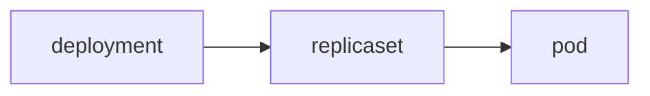
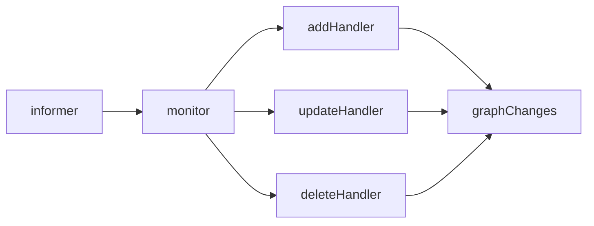
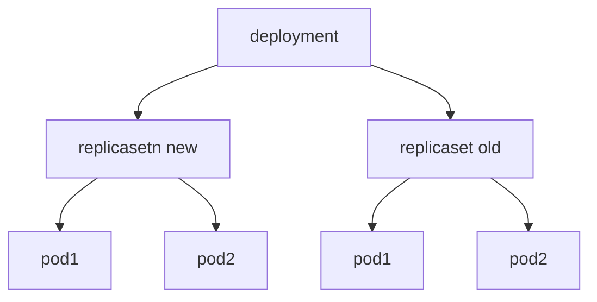
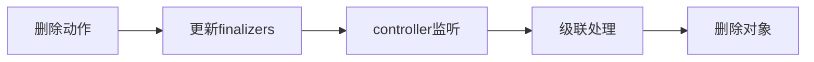
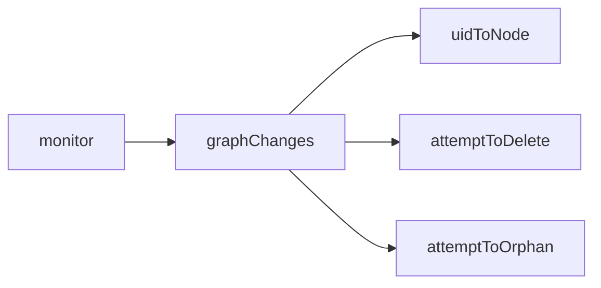
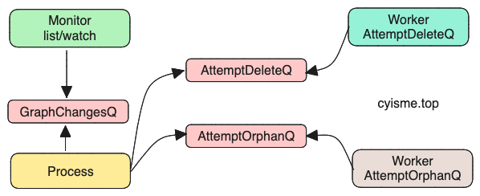

# KubeController Garbagecollector
本文从源码的角度分析KubeController Garbagecollector相关功能的实现。 

本篇kubernetes版本为v1.27.3。

>kubernetes项目地址: [https://github.com/kubernetes/kubernetes](https://github.com/kubernetes/kubernetes)
>
>controller命令main入口: cmd/kube-controller-manager/controller-manager.go
>
>controller相关代码目录: pkg/controller

在`k8s`中， 像`deployment`、`statefulset`等这些资源都是属于higher-level的资源; 比如`deployment`会控制`replicaset`， `replicaset`会控制pod， 它们的创建、更新、删除等操作都是通过`controller`来完成的。

这些对象的关联关系， 会通过`ownerReference`来标识， 例如一个处于被控状态的`replicaset`的`ownerReference`会指向它的`deployment`，一个处于被控状态的pod的`ownerReference`会指向它的`replicaset`（在`deployment`的资源场景下）。

 `GC Controller`的作用就是在资源被删除时， 通过`ownerReference`来生成一个“关联图”， 并利用这个“图”，来删除（或其他动作）它所控制的资源。

`GC Controller`启动时， 会调用`RUN`和`Sync`方法
```go
func startGarbageCollectorController(ctx context.Context, controllerContext ControllerContext) (controller.Interface, bool, error) {
    // 省略部分代码
    // 用于创建metadata informer
    // finalizer的变动普通的informer是无法感知的， 所以需要使用metadata informer监听
	metadataClient, err := metadata.NewForConfig(config)
	if err != nil {
		return nil, true, err
	}
    // 创建GC Controller
	garbageCollector, err := garbagecollector.NewGarbageCollector(
		gcClientset,
		metadataClient,
		controllerContext.RESTMapper,
		ignoredResources,
		controllerContext.ObjectOrMetadataInformerFactory,
		controllerContext.InformersStarted,
	)
	if err != nil {
		return nil, true, fmt.Errorf("failed to start the generic garbage collector: %v", err)
	}

	// 启动gc进程
	go garbageCollector.Run(ctx, workers)

	// 定期刷新k8s中的资源列表， 并更新到informer监听中
    // 这里的作用是为了保证informer中的资源列表是最新的（全部的）
	go garbageCollector.Sync(ctx, discoveryClient, 30*time.Second)

	return garbageCollector, true, nil
}
```
## 组件信息
`GC Controller`从功能职责上，大致上可以分为两部分:
- `GarbageCollector`: 负责执行清理动作
- `GraphBuilder`: 负责list/watch资源， 更新并维护“关联图”
`GraphBuilder`的作用是提供数据， `GarbageCollector`的作用是消费数据。从`GarbageCollector`定义可以看出：
```go
type GarbageCollector struct {
    // 用于获取gvk
	restMapper     meta.ResettableRESTMapper
    // 用于获取资源
	metadataClient metadata.Interface
	// 待删除的队列
	attemptToDelete workqueue.RateLimitingInterface
	// 孤儿队列
	attemptToOrphan        workqueue.RateLimitingInterface
    // 生成“关联图”
	dependencyGraphBuilder *GraphBuilder
	// 缓存对象
	absentOwnerCache *ReferenceCache

	kubeClient       clientset.Interface
	eventBroadcaster record.EventBroadcaster
	workerLock sync.RWMutex
}
```
## GraphBuilder
`GraphBuilder`代码文件: pkg/controller/garbagecollector/graph_builder.go
```go
type GraphBuilder struct {
	restMapper meta.RESTMapper
    // list/watch资源
	monitors    monitors
	monitorLock sync.RWMutex
	informersStarted <-chan struct{}
	stopCh <-chan struct{}
	running bool
    // 事件记录
	eventRecorder record.EventRecorder
	metadataClient metadata.Interface
	// 存放发生变动的资源
	graphChanges workqueue.RateLimitingInterface
	// node是“图”中的节点， 存放关联信息
    // 这是一个map， key是资源的uid， value是一个node
	uidToNode *concurrentUIDToNode
	// 待删除资源
	attemptToDelete workqueue.RateLimitingInterface
    // 孤儿资源
	attemptToOrphan workqueue.RateLimitingInterface
	absentOwnerCache *ReferenceCache
	sharedInformers  informerfactory.InformerFactory
	ignoredResources map[schema.GroupResource]struct{}
}
```
`monitor`用于list/watch资源meta信息， 使用`eventHandler`机制， 将数据添加到`graphChanges`队列中。

`GraphBuilder`的`Run`方法会启动`monitors`和`graphChanges`的处理。
```go
func (gb *GraphBuilder) Run(ctx context.Context) {
    // 省略部分代码

    // 启动monitor， 数据list/watch
	gb.startMonitors(logger)
    // 启动数据处理
	wait.Until(func() { gb.runProcessGraphChanges(logger) }, 1*time.Second, ctx.Done())
    // 省略部分代码
}
```
最终资源间的关联关系会形成一个树状的关系图。


### Monitors
`monitors`是一个map类型，他以`GVK`为键，对应的`informer`为值.
```go
type monitors map[schema.GroupVersionResource]*monitor
type monitor struct {
    // infomer的控制器和缓存
	controller cache.Controller
	store      cache.Store
	stopCh chan struct{}
}
```
`gb.startMonitors`其实就是对`monitors`中的所有infomer执行`Run`操作， 也就是启动list/watch,这里不展开说明。

`gb.startMonitors`除了在启动时调用， 还有一个`resyncMonitors`方法也调用了他。这个方法其实就是“整理”了一下`monitors`。 这个方法会被`GarbageCollector.Sync`调用。
```go
func (gc *GarbageCollector) resyncMonitors(logger klog.Logger, deletableResources map[schema.GroupVersionResource]struct{}) error {
	if err := gc.dependencyGraphBuilder.syncMonitors(logger, deletableResources); err != nil {
		return err
	}
	gc.dependencyGraphBuilder.startMonitors(logger)
	return nil
}
func (gb *GraphBuilder) syncMonitors(logger klog.Logger, resources map[schema.GroupVersionResource]struct{}) error {
    // 省略部分代码
	toRemove := gb.monitors
	for resource := range resources {
		if _, ok := gb.ignoredResources[resource.GroupResource()]; ok {
			continue
		}
        // 如果已经存在， 则不需要再创建
		if m, ok := toRemove[resource]; ok {
			current[resource] = m
			delete(toRemove, resource)
			kept++
			continue
		}
        // 获取资源的GVK
		kind, err := gb.restMapper.KindFor(resource)
        // 创建informer
		c, s, err := gb.controllerFor(logger, resource, kind)
		current[resource] = &monitor{store: s, controller: c}
		added++
	}
	gb.monitors = current
    // 停止不需要的informer
	for _, monitor := range toRemove {
		if monitor.stopCh != nil {
			close(monitor.stopCh)
		}
	}
    // 省略部分代码
}
```
`controllerFor`中创建了`infomer`, 并添加handler，也就是将数据添加到`graphChanges`队列。
```go
func (gb *GraphBuilder) controllerFor(logger klog.Logger, resource schema.GroupVersionResource, kind schema.GroupVersionKind) (cache.Controller, cache.Store, error) {
	handlers := cache.ResourceEventHandlerFuncs{
		// add the event to the dependencyGraphBuilder's graphChanges.
		AddFunc: func(obj interface{}) {
			event := &event{
				eventType: addEvent,
				obj:       obj,
				gvk:       kind,
			}
			gb.graphChanges.Add(event)
		},
        // 省略update和delete
        }
        // 省略创建informer
}
```
启动时调用的`gb.startMonitors(logger)`实际就是对所有monitor执行`Run`操作。
```go
func (gb *GraphBuilder) startMonitors(logger klog.Logger) {
    // 省略部分代码
	for _, monitor := range monitors {
		if monitor.stopCh == nil {
			monitor.stopCh = make(chan struct{})
			gb.sharedInformers.Start(gb.stopCh)
			go monitor.Run()
			started++
		}
	}
}
```
### runProcessGraphChanges
在执行资源的删除操作时， 会根据不同的删除策略更新`finalizers`， 从而触发`update`事件。
```bash
# 前台删除，finalizers中增加foregroundDeletion
kubectl delete deployment nginx-deployment --cascade=foreground
# 孤儿删除，finalizers中增加orphan
kubectl delete deployment nginx-deployment --cascade=orphan
# 后台删除，不更新finalizers
kubectl delete deployment nginx-deployment
```
后台/前台删除在感官上区别不大（在正常情况下，最终都会被删除）
- 前台： 先删除从属对象，再删除主对象 （速度会慢一些， 从属对象的删除结果会影响主对象）
- 后台： 先删除主对象，后台清理从属对象 （速度快一些， 从属对象的删除结果不会影响主对象）
- 孤儿： 删除主对象，不清理从属对象



对象变动被监听到后， 会由`processGraphChanges`函数处理， 这个函数会从`graphChanges`队列中获取数据， 并更新`uidToNode`， 然后分发到`attemptToDelete`和`attemptToOrphan`。

一个资源有可能有多个owner, 所以需对每个owner的身份信息进行处理。
```yaml
apiVersion: v1
kind: Pod
metadata:
  creationTimestamp: "2023-12-27T10:11:00Z"
  generateName: test-5f6778868d-
  labels:
    app: test
    pod-template-hash: 5f6778868d
  name: test-5f6778868d-6zt4h
  namespace: default
  ownerReferences:
  // ownerReferences是一个数组， 代表有多个owner
  - apiVersion: apps/v1
    blockOwnerDeletion: true
    controller: true
    kind: ReplicaSet
    name: test-5f6778868d
    uid: a5a436cb-3212-4fbe-85d3-ec80ab9b4208
  resourceVersion: "50228752"
  uid: 0bce606e-1f1c-4f6f-bba0-229a55cb656b
```
先来看一个频繁出现的处理函数`partitionDependents`。这个函数用于判断给定的依赖列表，与给定的owner身份信息是否匹配， 最终返回匹配/不匹配两个列表。
1. 检测当前依赖的ns与给定owner的ns是否一致
2. 检测当前依赖的owners中，是否有与给定owner uid一致的
3. 如果当前依赖中的某个owner与给定owner uid一致， 则检测ownerReference中的其他字段是否一致
```go
func partitionDependents(dependents []*node, matchOwnerIdentity objectReference) (matching, nonmatching []*node) {
    // 判断是否有ns绑定
	ownerIsNamespaced := len(matchOwnerIdentity.Namespace) > 0
	for i := range dependents {
		dep := dependents[i]
		foundMatch := false
		foundMismatch := false
		// 如果命名空间不匹配， 则直接认为不匹配
		if ownerIsNamespaced && matchOwnerIdentity.Namespace != dep.identity.Namespace {
			// all references to the parent do not match, since the dependent namespace does not match the owner
			foundMismatch = true
		} else {
			for _, ownerRef := range dep.owners {
				// 如果uid匹配， 则进行更细致的判断
				if ownerRef.UID == matchOwnerIdentity.UID {
					// 对剩余的其他字段进行匹配检测， uid、name、apiVersion、kind
					if ownerReferenceMatchesCoordinates(ownerRef, matchOwnerIdentity.OwnerReference) {
						foundMatch = true
					} else {
						foundMismatch = true
					}
				}
			}
		}

		if foundMatch {
			matching = append(matching, dep)
		}
		if foundMismatch {
			nonmatching = append(nonmatching, dep)
		}
	}
	return matching, nonmatching
}
```
`processGraphChanges`中就用到了上述的`partitionDependents`来处理依赖关系。
```go
func (gb *GraphBuilder) processGraphChanges(logger klog.Logger) bool {
    // 获取数据
	item, quit := gb.graphChanges.Get()
	if quit {
		return false
	}
	// 省略部分代码
    // item最终会被转换成accessor
	accessor, err := meta.Accessor(obj)
	
	existingNode, found := gb.uidToNode.Read(accessor.GetUID())
    // 不会以虚拟事件更新真实节点
    // 如果节点已经存在， 且已经存在的节点为虚拟节点、当前的事件非虚拟事件
	if found && !event.virtual && !existingNode.isObserved() {
		// 获取观察到的身份信息
		observedIdentity := identityFromEvent(event, accessor)
        // 如果观察到的身份信息和已经存在的节点身份信息不一致
		if observedIdentity != existingNode.identity {
			// 找到与当前观察到的身份信息不匹配的依赖
			_, potentiallyInvalidDependents := partitionDependents(existingNode.getDependents(), observedIdentity)
			// 不匹配的依赖会放到待删除的队列中
			for _, dep := range potentiallyInvalidDependents {
				if len(observedIdentity.Namespace) > 0 && dep.identity.Namespace != observedIdentity.Namespace {
					// 会记录事件
					gb.reportInvalidNamespaceOwnerRef(dep, observedIdentity.UID)
				}
                // 放到待清理队列中
				gb.attemptToDelete.Add(dep)
			}
            // 更新节点的身份信息
			existingNode = existingNode.clone()
			existingNode.identity = observedIdentity
			gb.uidToNode.Write(existingNode)
		}
        // 将virtual标记为false，代表是观察到的真实节点
		existingNode.markObserved()
	}
	switch {
	case (event.eventType == addEvent || event.eventType == updateEvent) && !found:
		newNode := &node{
			identity:           identityFromEvent(event, accessor),
			dependents:         make(map[*node]struct{}),
			owners:             accessor.GetOwnerReferences(),
			deletingDependents: beingDeleted(accessor) && hasDeleteDependentsFinalizer(accessor),
			beingDeleted:       beingDeleted(accessor),
		}
        // 将节点添加到uidToNode中，并解析其owners写入关联关系
        // 如果owner在uidToNode不存在， 则会创建一个虚拟节点
        // 虚拟节点将会被添加到待删除队列， 再后续的处理中将会对这个虚拟节点进行真实性核对
		gb.insertNode(logger, newNode)
		// 如果是更新事件， 需要处理ownerReference的变化
        // 判断对象中的fiinalizers的变化， 从而放到不同的队列中
        // 如果finalizers中有foregroundDeletion， 则放到attemptToDelete队列中. 并标记为isDeletingDependents
        // 如果finalizers中有forphan， 则放到attemptToOrphan队列中
		gb.processTransitions(logger, event.oldObj, accessor, newNode)
	case (event.eventType == addEvent || event.eventType == updateEvent) && found:
		// 对比差异， 并差异更新
		added, removed, changed := referencesDiffs(existingNode.owners, accessor.GetOwnerReferences())
		if len(added) != 0 || len(removed) != 0 || len(changed) != 0 {
			// 分别判断removed，和change的BlockOwnerDeletion的状态，决定是否放到attemptToDelete队列中
			gb.addUnblockedOwnersToDeleteQueue(logger, removed, changed)
			// 更新节点数据
			existingNode.owners = accessor.GetOwnerReferences()
			// 添加到从属列表
			gb.addDependentToOwners(logger, existingNode, added)
			// 删除关联关系
			gb.removeDependentFromOwners(existingNode, removed)
		}
        // 如果当前节点有DeletionTimestamp, 代表正在删除中， 更新其标记
		if beingDeleted(accessor) {
			existingNode.markBeingDeleted()
		}
		gb.processTransitions(logger, event.oldObj, accessor, existingNode)
	case event.eventType == deleteEvent:
        // 省略不存在则跳过的代码
		removeExistingNode := true
        // 虚拟事件代表不是从infomer监听到的
        // 如果查找的节点没有找到， 会生成一个虚拟节点， 并创建虚拟事件
		if event.virtual {
			// this is a virtual delete event, not one observed from an informer
			deletedIdentity := identityFromEvent(event, accessor)
			if existingNode.virtual {

				// 获取节点关联信息
				if matchingDependents, nonmatchingDependents := partitionDependents(existingNode.getDependents(), deletedIdentity); len(nonmatchingDependents) > 0 {
					removeExistingNode = false
                    // 匹配到的依赖会放到attemptToDelete队列中
                    // 将当前节点的身份信息放到absentOwnerCache
                    // absentOwnerCache用来存放未找到的节点
					if len(matchingDependents) > 0 {
						gb.absentOwnerCache.Add(deletedIdentity)
						for _, dep := range matchingDependents {
							gb.attemptToDelete.Add(dep)
						}
					}

					// 更新虚拟节点信息
					if existingNode.identity == deletedIdentity {
						replacementIdentity := getAlternateOwnerIdentity(nonmatchingDependents, deletedIdentity)
						if replacementIdentity != nil {
							replacementNode := existingNode.clone()
							replacementNode.identity = *replacementIdentity
							gb.uidToNode.Write(replacementNode)
							// 从新入队
							gb.attemptToDelete.AddRateLimited(replacementNode)
						}
					}
				}

			} else if existingNode.identity != deletedIdentity {
				// 不会根据因为虚拟事件删除真实节点
				removeExistingNode = false
            
				matchingDependents, _ := partitionDependents(existingNode.getDependents(), deletedIdentity)
                // 更新缺失缓存
                // 关联删除
				if len(matchingDependents) > 0 {
					// mark the observed deleted identity as absent
					gb.absentOwnerCache.Add(deletedIdentity)
					// attempt to delete dependents that do match the verified deleted identity
					for _, dep := range matchingDependents {
						gb.attemptToDelete.Add(dep)
					}
				}
			}
		}

		if removeExistingNode {
			// 删除节点
			gb.removeNode(existingNode)
			existingNode.dependentsLock.RLock()
			defer existingNode.dependentsLock.RUnlock()
			if len(existingNode.dependents) > 0 {
				gb.absentOwnerCache.Add(identityFromEvent(event, accessor))
			}
			for dep := range existingNode.dependents {
				gb.attemptToDelete.Add(dep)
			}
			for _, owner := range existingNode.owners {
                // 如果owner是正在删除的状态， 即等待从属节点删除结束， 则放到attemptToDelete队列中
                // isDeletingDependents状态是由processTransitions方法标记的
				ownerNode, found := gb.uidToNode.Read(owner.UID)
				if !found || !ownerNode.isDeletingDependents() {
					continue
				}
				gb.attemptToDelete.Add(ownerNode)
			}
		}
	}
	return true
}
```

## GarbageCollector


`GarbageCollector`的`Run`方法会启动`GraphBuilder`和`runAttemptToDeleteWorker`、`runAttemptToOrphanWorker`。
- attemptToDelete 处理待删除的资源
- attemptToOrphan 处理孤儿资源
```go
func (gc *GarbageCollector) Run(ctx context.Context, workers int) {
	// 省略部分代码
    // 启动GraphBuilder
	go gc.dependencyGraphBuilder.Run(ctx)
    // 省略部分代码

    // 启动工作进程
	for i := 0; i < workers; i++ {
		go wait.UntilWithContext(ctx, gc.runAttemptToDeleteWorker, 1*time.Second)
		go wait.Until(func() { gc.runAttemptToOrphanWorker(logger) }, 1*time.Second, ctx.Done())
	}
}
```
因为主要的数据处理逻辑都由`GraphBuilder`完成， 所以`GarbageCollector`的处理逻辑就简单一些
### runAttemptToDeleteWorker
`runAttemptToDeleteWorker`处理待删除的资源
```go
func (gc *GarbageCollector) processAttemptToDeleteWorker(ctx context.Context) bool {
	item, quit := gc.attemptToDelete.Get()
	gc.workerLock.RLock()
	defer gc.workerLock.RUnlock()
	if quit {
		return false
	}
	defer gc.attemptToDelete.Done(item)

	action := gc.attemptToDeleteWorker(ctx, item)
	switch action {
	case forgetItem:
        // 代表处理完成，从队列中删除
		gc.attemptToDelete.Forget(item)
	case requeueItem:
        // 代表处理失败，重新入队
		gc.attemptToDelete.AddRateLimited(item)
	}

	return true
}
```
这里跳过对`gc.attemptToDeleteWorker`的代码展开。
> `gc.attemptToDeleteWorker`最终调用的是`attemptToDeleteItem`。
>
> `gc.attemptToDeleteWorker`主要是做了一些状态判断和错误判断，用于返回`action`。 

最终的删除动作是由`gc.deleteObject`执行的， 它会调用api删除资源， 以此实现递归删除。

`attemptToDeleteItem`中出现的`gc.classifyReferences`方法，是用于检查owner的状态， 并返回三个列表:
- solid 代表存在的owner资源列表，这个owner不能处于"删除中"的状态
- dangling 代表不存在的owner资源列表，这个owner已经不存在与集群中了
- waitingForDependentsDeletion 代表存在的owner资源列表，这个owner处于"删除中"的状态
当执行删除时， 会根据这三个列表的情况， 来决定删除策略。
```go
func (gc *GarbageCollector) attemptToDeleteItem(ctx context.Context, item *node) error {
	// 省略部分代码

    // 从api中获取对象
	latest, err := gc.getObject(item.identity)
	switch {
    // 未找到时代表item是一个虚拟节点
	case errors.IsNotFound(err):
		// 会生成一个虚拟删除事件
		gc.dependencyGraphBuilder.enqueueVirtualDeleteEvent(item.identity)
		return enqueuedVirtualDeleteEventErr
	case err != nil:
		return err
	}
    // 如果uid不匹配，会生成一个虚拟删除事件
	if latest.GetUID() != item.identity.UID {
		gc.dependencyGraphBuilder.enqueueVirtualDeleteEvent(item.identity)
		return enqueuedVirtualDeleteEventErr
	}

    // 移除finalizers
	if item.isDeletingDependents() {
		return gc.processDeletingDependentsItem(logger, item)
	}
	ownerReferences := latest.GetOwnerReferences()
    // solid 代表有owner的资源
    // dangling 代表没有owner的资源
    // waitingForDependentsDeletion 代表有owner， 但是owner正在删除中,并且有finalizers
	solid, dangling, waitingForDependentsDeletion, err := gc.classifyReferences(ctx, item, ownerReferences)

	switch {
	case len(solid) != 0:
        // 如果有solid， 代表有owner， 还不能删除这个资源
        // 省略部分代码
        // 
        // 但是可以调用api更新资源ref信息，从ref中移除已经不存在的owner和正在删除中的owner
		ownerUIDs := append(ownerRefsToUIDs(dangling), ownerRefsToUIDs(waitingForDependentsDeletion)...)
		p, err := c.GenerateDeleteOwnerRefStrategicMergeBytes(item.identity.UID, ownerUIDs)
		_, err = gc.patch(item, p, func(n *node) ([]byte, error) {
			return gc.deleteOwnerRefJSONMergePatch(n, ownerUIDs...)
		})
		return err
	case len(waitingForDependentsDeletion) != 0 && item.dependentsLength() != 0:
		deps := item.getDependents()
		for _, dep := range deps {
			if dep.isDeletingDependents() {
				// 先调用api将其依赖的blockOwnerDeletion设置为false
				patch, err := item.unblockOwnerReferencesStrategicMergePatch()
				if err != nil {
					return err
				}
				if _, err := gc.patch(item, patch, gc.unblockOwnerReferencesJSONMergePatch); err != nil {
					return err
				}
				break
			}
		}
		// 所有owner都处于可删除的状态， 那么可以删除这个资源(进入递归删除)
        // 当这个资源再次被监听到时， 因为关联已经被清空（假如已清空）， 所以会直接删除
		policy := metav1.DeletePropagationForeground
		return gc.deleteObject(item.identity, &policy)
	default:
		// 如果没有owner则需要进行垃圾回收
        // 根据其finalizers中的信息， 选择不同的删除策略
		var policy metav1.DeletionPropagation
		switch {
		case hasOrphanFinalizer(latest):
			policy = metav1.DeletePropagationOrphan
		case hasDeleteDependentsFinalizer(latest):
			policy = metav1.DeletePropagationForeground
		default:
			policy = metav1.DeletePropagationBackground
		}
		return gc.deleteObject(item.identity, &policy)
	}
}
```
### runAttemptToOrphanWorker
孤儿资源的处理就相对比较简:
1.  对所有关联资源的ownerReference进行更新， 解除关联关系。 如删除deployments时指定孤儿删除， 那么关联的rs的ownerReference中会移除这个deployment。
2.  删除finalizers使其可以被删除
3.  等待再次被监听到时执行删除操作
```go
func (gc *GarbageCollector) attemptToOrphanWorker(logger klog.Logger, item interface{}) workQueueItemAction {
	// 省略部分代码
    // 
    // 更新关联资源的ownerReference
	err := gc.orphanDependents(logger, owner.identity, dependents)
	if err != nil {
		utilruntime.HandleError(fmt.Errorf("orphanDependents for %s failed with %v", owner.identity, err))
		return requeueItem
	}
	// 删除finalizers
	err = gc.removeFinalizer(logger, owner, metav1.FinalizerOrphanDependents)
	if err != nil {
		utilruntime.HandleError(fmt.Errorf("removeOrphanFinalizer for %s failed with %v", owner.identity, err))
		return requeueItem
	}
	return forgetItem
}
func (gc *GarbageCollector) orphanDependents(logger klog.Logger, owner objectReference, dependents []*node) error {
    // 多线程处理
	wg := sync.WaitGroup{}
	wg.Add(len(dependents))
	for i := range dependents {
		go func(dependent *node) {
			defer wg.Done()
			// 生成patch的请求内容
			p, err := c.GenerateDeleteOwnerRefStrategicMergeBytes(dependent.identity.UID, []types.UID{owner.UID})
			// 执行patch, 删除对应的owner信息
			_, err = gc.patch(dependent, p, func(n *node) ([]byte, error) {
                // 这里是兼容处理， 实际干的是同一件事
				return gc.deleteOwnerRefJSONMergePatch(n, owner.UID)
			})
		}(dependents[i])
	}
	wg.Wait()
	close(errCh)
    // 省略部分代码
	return nil
}
```

## 总结
1. 在执行删除资源时， 不同的删除策略会使资源在finalizers中增加不同的字段， 从而触发不同的处理逻辑。
2. 想要删除一个资源需要满足几个条件：
   1. 清空关联关系
   2. 无owner
   3. finalizers为空
3. 不同的删除策略决定了上述几个条件具体执行的方式， 但最终需要满足的条件是一致。
4. 删除是按固定的逻辑执行的，整个流程可以理解为递归的处理方式。 