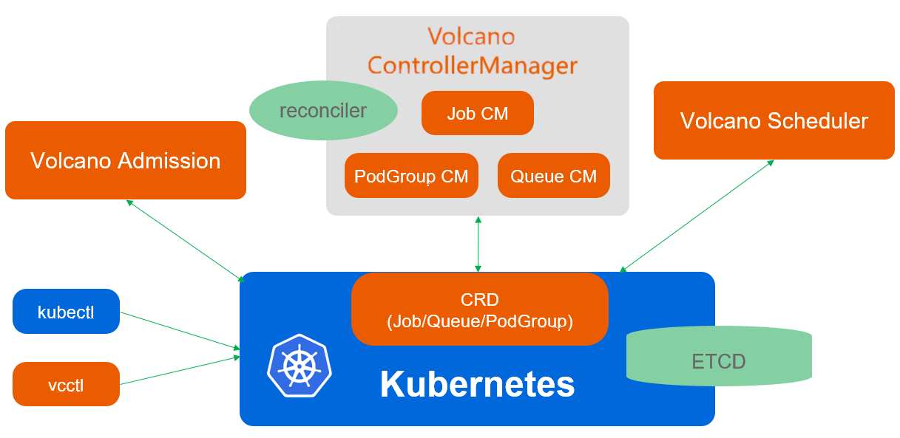
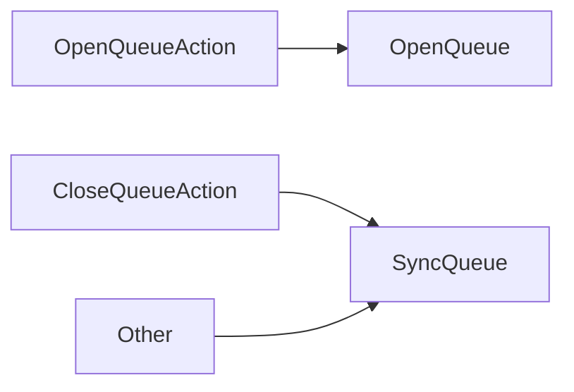
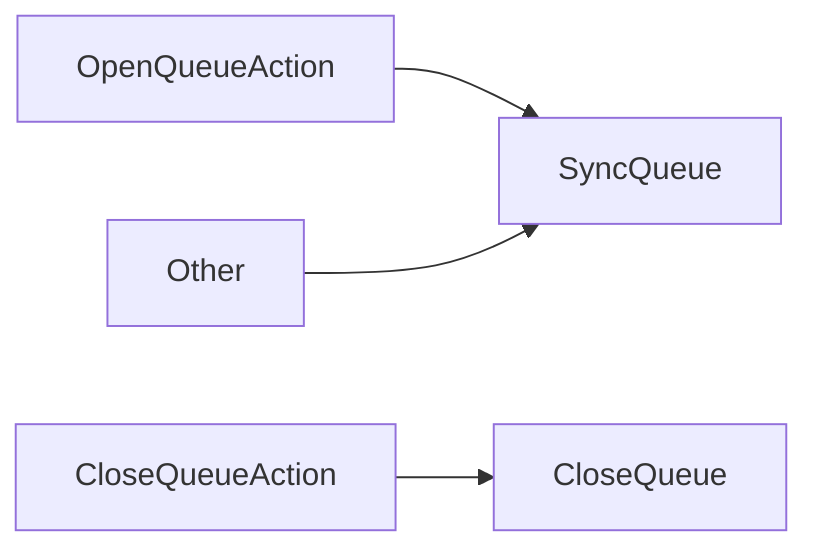
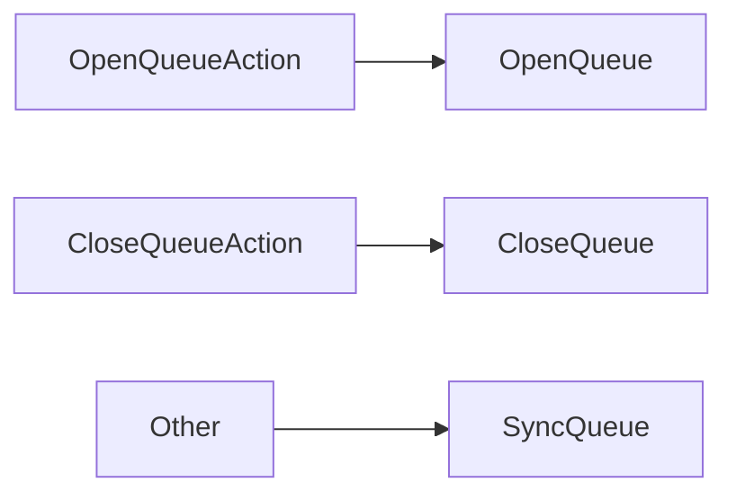
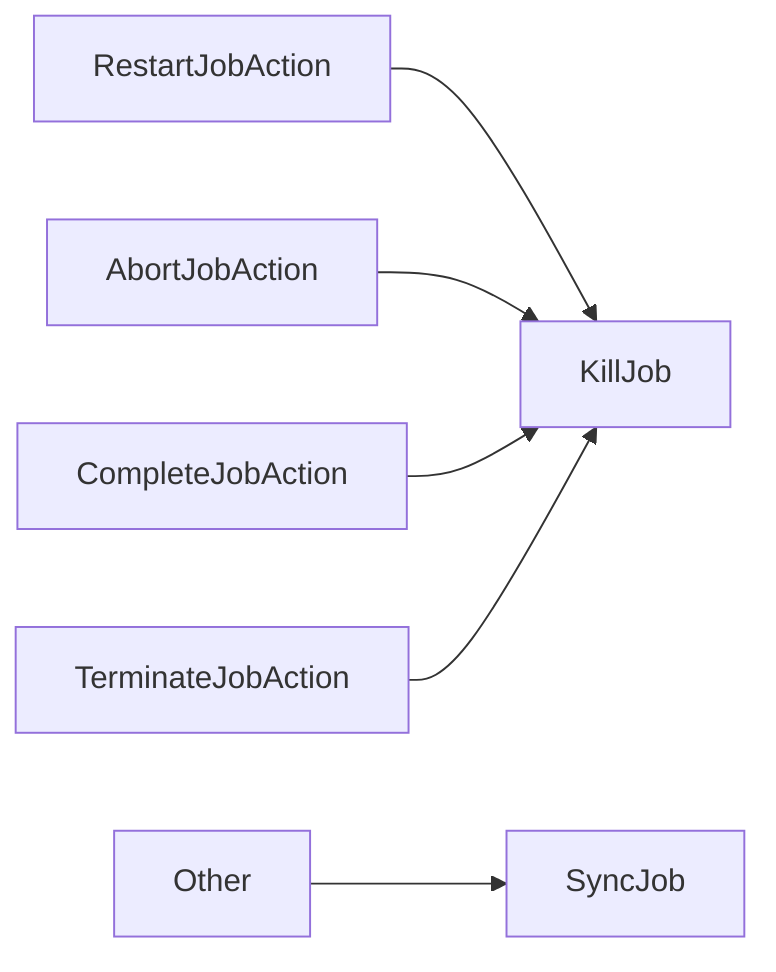
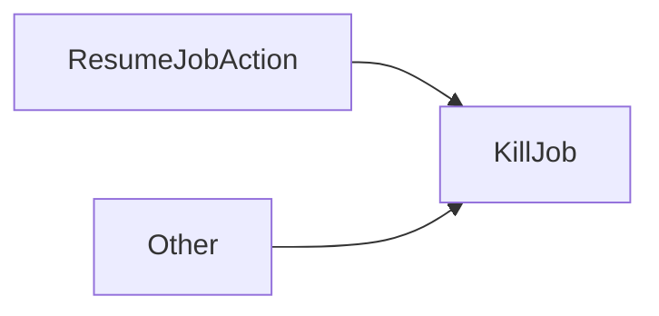
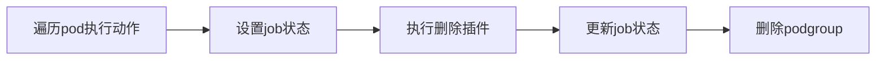
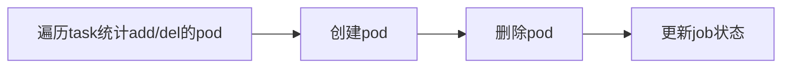

+++
title = 'Volcano Controller控制器源码解析'
date = 2024-01-03T16:36:10+08:00
draft = false
author = "Extreme"
tags = ["volvano"]
categories= ["cloud-native"]
image = "featured.jpg"
+++
<script type="module">
    import mermaid from 'https://cdn.jsdelivr.net/npm/mermaid/dist/mermaid.esm.min.mjs';
    mermaid.initialize({ startOnLoad: true });
</script>
# Volcano Controller控制器源码解析
本文从源码的角度分析Volcano Controller相关功能的实现。 

本篇Volcano版本为v1.8.0。

>Volcano项目地址: [https://github.com/volcano-sh/volcano](https://github.com/volcano-sh/volcano)
>
>controller命令main入口: cmd/controller-manager/main.go
>
>controller相关代码目录: pkg/controllers

整体实现并不复杂， 而且项目比较简洁、风格一致（与k8s controller代码风格也一致）。可以作为学习开发k8s controller的一个参考。

## 代码风格
`controller`需要实现framework中interface的定义。
```go
type Controller interface {
	Name() string
    // 初始化
	Initialize(opt *ControllerOption) error
	// 运行
	Run(stopCh <-chan struct{})
}
```
`Initialize`方法作为根据option初始化controller的入口， 像infomer设置、queue设置、cache设置等都在这里完成。
```go
func (jf *jobflowcontroller) Initialize(opt *framework.ControllerOption) error {
    // client
	jf.kubeClient = opt.KubeClient
	jf.vcClient = opt.VolcanoClient
    // informer
	jf.jobFlowInformer = informerfactory.NewSharedInformerFactory(jf.vcClient, 0).Flow().V1alpha1().JobFlows()
	jf.jobFlowSynced = jf.jobFlowInformer.Informer().HasSynced
	jf.jobFlowLister = jf.jobFlowInformer.Lister()
	jf.jobFlowInformer.Informer().AddEventHandler(cache.ResourceEventHandlerFuncs{
		AddFunc:    jf.addJobFlow,
		UpdateFunc: jf.updateJobFlow,
	})
    // 参数
	jf.maxRequeueNum = opt.MaxRequeueNum
	if jf.maxRequeueNum < 0 {
		jf.maxRequeueNum = -1
	}
    // queue
	jf.queue = workqueue.NewRateLimitingQueue(workqueue.DefaultControllerRateLimiter())
    // 入队的工具函数
	jf.enqueueJobFlow = jf.enqueue
    // 处理队列中数据的处理函数
	jf.syncHandler = jf.handleJobFlow
    // ...
}
```
`Run`方法会运行多个goroutine， 执行操作
```go
func (jf *jobflowcontroller) Run(stopCh <-chan struct{}) {
	defer jf.queue.ShutDown()

	go jf.jobFlowInformer.Informer().Run(stopCh)
	go jf.jobTemplateInformer.Informer().Run(stopCh)
	go jf.jobInformer.Informer().Run(stopCh)

	cache.WaitForCacheSync(stopCh, jf.jobSynced, jf.jobFlowSynced, jf.jobTemplateSynced)
    // 使用 k8s pkg中的util ， 与k8s controller的风格一致
	go wait.Until(jf.worker, time.Second, stopCh)

	klog.Infof("JobFlowController is running ...... ")

	<-stopCh
}
```
`worker`会负责处理队列中的数据， 交给`handler`处理。 `vocalno`中所有的`controller`外层都是这执行逻辑（可能会有细微差别）， 具体的`handler` 是差异化的。所以后面的controller介绍也不会再提这一部分， 会着重handler的实现。
```go
func (jf *jobflowcontroller) worker() {
    // 代理一层
	for jf.processNextWorkItem() {
	}
}

func (jf *jobflowcontroller) processNextWorkItem() bool {
    // 获取数据
	obj, shutdown := jf.queue.Get()
	if shutdown {
		// Stop working
		return false
	}
	defer jf.queue.Done(obj)

	req, ok := obj.(*apis.FlowRequest)
	if !ok {
		klog.Errorf("%v is not a valid queue request struct.", obj)
		return true
	}
    // 具体处理handler
	err := jf.syncHandler(req)
	jf.handleJobFlowErr(err, obj)

	return true
}
```
## Queue Controller
`Queue Controler`主要监听三个资源对象：
- Queue
- PodGroup
- Command

控制器会监听他们的状态，用以更新`Queue资源`的状态，从而实现依据`Queue资源`的调度。
```go
func (c *queuecontroller) Initialize(opt *framework.ControllerOption) error {
    // 省略部分代码
	queueInformer.Informer().AddEventHandler(cache.ResourceEventHandlerFuncs{
		AddFunc:    c.addQueue,
		UpdateFunc: c.updateQueue,
		DeleteFunc: c.deleteQueue,
	})

	pgInformer.Informer().AddEventHandler(cache.ResourceEventHandlerFuncs{
		// 省略部分代码
	})

	if utilfeature.DefaultFeatureGate.Enabled(features.QueueCommandSync) {
		c.cmdInformer = factory.Bus().V1alpha1().Commands()
		c.cmdInformer.Informer().AddEventHandler(cache.FilteringResourceEventHandler{
			FilterFunc: func(obj interface{}) bool {
				switch v := obj.(type) {
				case *busv1alpha1.Command:
					return IsQueueReference(v.TargetObject)
				default:
					return false
				}
			},
			Handler: cache.ResourceEventHandlerFuncs{
				AddFunc: c.addCommand,
			},
		})
		c.cmdLister = c.cmdInformer.Lister()
		c.cmdSynced = c.cmdInformer.Informer().HasSynced
	}
    // 省略部分代码
}
```
监听到的消息会放到队列中, 队列是通过k8s pkg中的`WorkQueue`实现的。
```go
type queuecontroller struct {
    // 省略部分代码
    // ...
	// queues that need to be updated.
	queue        workqueue.RateLimitingInterface
	commandQueue workqueue.RateLimitingInterface
	// queue name -> podgroup namespace/name
	podGroups map[string]map[string]struct{}
    // 省略部分代码
    // ...
}
```
`queuecontroller.queue`接收`apis.Request`对象作为消息，`queuecontroller.commandQueue`接收`busv1alpha1.Command`对象作为消息。

在经过`queuecontroller.handlerCommand`方法处理后， `queuecontroller.commandQueue`中的`busv1alpha1.Command`对象转换成`apis.Request`事件，放到`queuecontroller.queue`中统一处理。
```go
func (c *queuecontroller) handleCommand(cmd *busv1alpha1.Command) error {
    // 接受处理， 删除command
	err := c.vcClient.BusV1alpha1().Commands(cmd.Namespace).Delete(context.TODO(), cmd.Name, metav1.DeleteOptions{})
	if err != nil {
		// 省略部分代码
	}
    // command对象中会有ownerReference， 从中提取queue对象名称
	req := &apis.Request{
		QueueName: cmd.TargetObject.Name,
        // CommandIssuedEvent是内部事件类型， 用户引发命令时， 会触发该事件
		Event:     busv1alpha1.CommandIssuedEvent,
		Action:    busv1alpha1.Action(cmd.Action),
	}
    // 将command事件转换成request事件，放到queue中
	c.enqueueQueue(req)
	return nil
}
```
`queuecontroller.handleQueue`是`queuecontroller.queue`的事件处理函数，主要是根据`request`事件的类型，调用不同的处理函数更新`Queue资源`的状态。
```go
func (c *queuecontroller) handleQueue(req *apis.Request) error {
    // 这里的queue是k8s中的Queue资源对象
	queue, err := c.queueLister.Get(req.QueueName)
	if err != nil {
		// 省略部分代码
	}
    // 根据queue当前的状态， 生成不同执行器
	queueState := queuestate.NewState(queue)
    // 执行操作
	if err := queueState.Execute(req.Action); err != nil {
		// 省略部分代码
	}
	return nil
}
```
`Queue资源`有4中状态（QueueState）， 四种状态分别对应四种执行器：
- Open --> openState
- Closed --> closedState
- Closing --> closingState
- Unknown --> unknownState

以`closeState`执行器为例，代码实现如下：（其他的执行器实现类似，不再举例）
```go
type closedState struct {
	queue *v1beta1.Queue
}
func (cs *closedState) Execute(action v1alpha1.Action) error {
	switch action {
    // 开启动作
	case v1alpha1.OpenQueueAction:
		return OpenQueue(cs.queue, func(status *v1beta1.QueueStatus, podGroupList []string) {
			status.State = v1beta1.QueueStateOpen
		})
    // 关闭动作
	case v1alpha1.CloseQueueAction:
		return SyncQueue(cs.queue, func(status *v1beta1.QueueStatus, podGroupList []string) {
			status.State = v1beta1.QueueStateClosed
		})
    // 默认动作
	default:
		return SyncQueue(cs.queue, func(status *v1beta1.QueueStatus, podGroupList []string) {
			specState := cs.queue.Status.State
			if specState == v1beta1.QueueStateOpen {
				status.State = v1beta1.QueueStateOpen
				return
			}

			if specState == v1beta1.QueueStateClosed {
				status.State = v1beta1.QueueStateClosed
				return
			}

			status.State = v1beta1.QueueStateUnknown
		})
	}
}

```
`Queue资源`在`volcano`中有4种动作（Action）， 执行器中将根据动作执行不同的操作：
- EnqueueJob （这个动作执行器中没有用到）
- SyncQueue （这个动作执行器中执行默认操作）
- OpenQueue
- CloseQueue

实际上， 对应这三个动作会有三个处理函数,他们被定义为`QueueActionFn`类型
```go
type QueueActionFn func(queue *v1beta1.Queue, fn UpdateQueueStatusFn) error
```
因为`Queue资源`可以重复的`Close`或者`Open`, 所以其实执行器中并没有拦截或者限制这种操作， 而是比较简单的对状态进行重置。

操作调用的函数如下：
- `closedState`和`closingState`状态执行器中

- `openState`状态执行器中

- `unknownState`状态执行器中

可以看出， 执行逻辑： 
- 如果当前状态与预期状态一致， 则调用`SyncQueue`同步状态
- 如果当前状态与预期状态不一致， 则调用`OpenQueue`或者`CloseQueue`更新状态
- 如果状态未知， 则调用`SyncQueue`同步状态

然后来看一下具体的函数实现
```go
// syncQueue主要是更新queue中podgroup的状态计数
func (c *queuecontroller) syncQueue(queue *schedulingv1beta1.Queue, updateStateFn state.UpdateQueueStatusFn) error {
    // 获取queue中的podgroup
	podGroups := c.getPodGroups(queue.Name)
	queueStatus := schedulingv1beta1.QueueStatus{}

	for _, pgKey := range podGroups {
		// 获取podgroup对象
		pg, err := c.pgLister.PodGroups(ns).Get(name)
        // 更新计数器
		switch pg.Status.Phase {
		case schedulingv1beta1.PodGroupPending:
			queueStatus.Pending++
		case schedulingv1beta1.PodGroupRunning:
			queueStatus.Running++
		case schedulingv1beta1.PodGroupUnknown:
			queueStatus.Unknown++
		case schedulingv1beta1.PodGroupInqueue:
			queueStatus.Inqueue++
		}
	}
    // updateStateFn是在执行器中定义的函数， 用于更新queue的状态
	if updateStateFn != nil {
		updateStateFn(&queueStatus, podGroups)
	} else {
		queueStatus.State = queue.Status.State
	}
    // 省略部分代码
    // ...
	// 调用api更新queue的状态
	if _, err := c.vcClient.SchedulingV1beta1().Queues().UpdateStatus(context.TODO(), newQueue, metav1.UpdateOptions{}); err != nil {
	}

	return nil
}
func (c *queuecontroller) openQueue(queue *schedulingv1beta1.Queue, updateStateFn state.UpdateQueueStatusFn) error {
	newQueue := queue.DeepCopy()
	newQueue.Status.State = schedulingv1beta1.QueueStateOpen
    // 这里调用Update没有看懂， copy出来的对应应该除了状态，其他的都是一样的
    // 而Update方法是更新对象， 而不是更新状态
	if queue.Status.State != newQueue.Status.State {
		if _, err := c.vcClient.SchedulingV1beta1().Queues().Update(context.TODO(), newQueue, metav1.UpdateOptions{}); err != nil {
			c.recorder.Event(newQueue, v1.EventTypeWarning, string(v1alpha1.OpenQueueAction),
				fmt.Sprintf("Open queue failed for %v", err))
			return err
		}

		c.recorder.Event(newQueue, v1.EventTypeNormal, string(v1alpha1.OpenQueueAction), "Open queue succeed")
	} else {
		return nil
	}
    // 获取queue对象
	q, err := c.vcClient.SchedulingV1beta1().Queues().Get(context.TODO(), newQueue.Name, metav1.GetOptions{})
	newQueue = q.DeepCopy()
    // 执行操作
	if updateStateFn != nil {
		updateStateFn(&newQueue.Status, nil)
	} else {
		return fmt.Errorf("internal error, update state function should be provided")
	}
    // 调用api更新queue的状态
	if queue.Status.State != newQueue.Status.State {
		if _, err := c.vcClient.SchedulingV1beta1().Queues().UpdateStatus(context.TODO(), newQueue, metav1.UpdateOptions{}); err != nil {
		}
	}

	return nil
}
// closeQueue与之类似， 不再举例
```
## PodGroup Controller
`PodGroup Controller`比较简单， 它负责为未指定PodGroup的Pod分配PodGroup。
```go
func (pg *pgcontroller) processNextReq() bool {
	// 省略部分代码
    // 获取pod对象
	pod, err := pg.podLister.Pods(req.podNamespace).Get(req.podName)
    // 根据调度器名称过滤
	if !commonutil.Contains(pg.schedulerNames, pod.Spec.SchedulerName) {
		return true
	}
    // 如果pod已经有podgroup， 则不再处理
	if pod.Annotations != nil && pod.Annotations[scheduling.KubeGroupNameAnnotationKey] != "" {
		return true
	}
	// 为pod分配podgroup
	if err := pg.createNormalPodPGIfNotExist(pod); err != nil {
        // AddRateLimited将在一段时间后重新添加req到队列中
		pg.queue.AddRateLimited(req)
		return true
	}
    // 省略部分代码
}
func (pg *pgcontroller) createNormalPodPGIfNotExist(pod *v1.Pod) error {
    // pgname将以”podgroup-“开头
	pgName := helpers.GeneratePodgroupName(pod)

	if _, err := pg.pgLister.PodGroups(pod.Namespace).Get(pgName); err != nil {
        // podgroup不存在， 则创建
		if !apierrors.IsNotFound(err) {
			return err
		}
        // 省略了一些从pod中继承赋值的代码
		obj := &scheduling.PodGroup{
			ObjectMeta: metav1.ObjectMeta{
                // podgroup的ownerReference是pod
				OwnerReferences: newPGOwnerReferences(pod),
			},
			Spec: scheduling.PodGroupSpec{
                // 最小成员数为1
				MinMember:         1,
			},
			Status: scheduling.PodGroupStatus{
                // 状态为pending
				Phase: scheduling.PodGroupPending,
			},
		}
        // 继承pod的owner信息，写入到annotations
		pg.inheritUpperAnnotations(pod, obj)
		// 继承pod annotations
		if queueName, ok := pod.Annotations[scheduling.QueueNameAnnotationKey]; ok {
			obj.Spec.Queue = queueName
		}
        // 省略annotations继承的代码
        // ...
        // 创建podgroup
		if _, err := pg.vcClient.SchedulingV1beta1().PodGroups(pod.Namespace).Create(context.TODO(), obj, metav1.CreateOptions{}); err != nil {
		}
	}
    // 如果存在pg，则更新pod的annotations
	return pg.updatePodAnnotations(pod, pgName)
}
```
## JobFlow Controller
`JobFlow`是在`volcano 1.8`之后引入的`CRD`对象， 它配合`JobTemplate`使用，用于`vcjob`任务的编排。

`JobFlow Controller`主要监听`JobFlow`和`Job`两个对象的变化， 并更新`JobFlow`的状态。
```go
func (jf *jobflowcontroller) Initialize(opt *framework.ControllerOption) error {
    // ...
	jf.jobFlowInformer.Informer().AddEventHandler(cache.ResourceEventHandlerFuncs{
		AddFunc:    jf.addJobFlow,
		UpdateFunc: jf.updateJobFlow,
	})
    jf.jobInformer.Informer().AddEventHandler(cache.ResourceEventHandlerFuncs{
		UpdateFunc: jf.updateJob,
	})
    // 省略部分代码
}
```
`Job`更新时，会判断是否属于`JobFlow`， 如果是，则将关联的`JobFlow`加入到队列。
```go
func (jf *jobflowcontroller) updateJob(oldObj, newObj interface{}) {
	// ...
	if newJob.ResourceVersion == oldJob.ResourceVersion {
		return
	}
	jobFlowName := getJobFlowNameByJob(newJob)
	if jobFlowName == "" {
		return
	}
	req := &apis.FlowRequest{
		Namespace:   newJob.Namespace,
		JobFlowName: jobFlowName,
		Action:      jobflowv1alpha1.SyncJobFlowAction,
		Event:       jobflowv1alpha1.OutOfSyncEvent,
	}

	jf.queue.Add(req)
}
```
放入队列的`apis.FlowRequest`对象，最终会由`handleJobFlow`函数处理， 然后根据当前`JobFlow`的状态，生成并调用不同执行器。（这里的运行逻辑和`Queue`的差不多）
```go
func (jf *jobflowcontroller) handleJobFlow(req *apis.FlowRequest) error {
    // 省略部分代码
    // ...
	jobflow, err := jf.jobFlowLister.JobFlows(req.Namespace).Get(req.JobFlowName)
    // 根据jobflow的状态， 生成不同的执行器
	jobFlowState := jobflowstate.NewState(jobflow)
	if err := jobFlowState.Execute(req.Action); err != nil {
	}
	return nil
}
```
`JobFlow`有5种状态(Flow Phase), 分别对应5种执行器：:
- Succeed --> succeedState
- Terminating --> terminatingState (这个状态的执行器并没有实际动作，因为资源即将释放)
- Failed --> failedState (这个状态的执行器并没有实际动作，因为状态异常)
- Running --> runningState
- Pending --> pendingState 

`JobFlow`目前只有1种动作`SyncJobFlow`(Action)， 由`SyncJobFlow`函数执行具体操作。
```go
func (jf *jobflowcontroller) syncJobFlow(jobFlow *v1alpha1flow.JobFlow, updateStateFn state.UpdateJobFlowStatusFn) error {
	// ...
    // 如果当前jobflow的状态为succeed， 且job的保留策略为delete, 则删除所有由jobflow创建的job
	if jobFlow.Spec.JobRetainPolicy == v1alpha1flow.Delete && jobFlow.Status.State.Phase == v1alpha1flow.Succeed {
		if err := jf.deleteAllJobsCreatedByJobFlow(jobFlow); err != nil {
		}
		return nil
	}

	// 根据jobflow中声明的jobtemplate创建job， 声明顺序即为创建顺序
	if err := jf.deployJob(jobFlow); err != nil {
	}

	// 获取jobflow下所有job的状态
	jobFlowStatus, err := jf.getAllJobStatus(jobFlow)
	if err != nil {
		return err
	}
    // 更新jobflow的状态
	jobFlow.Status = *jobFlowStatus
	updateStateFn(&jobFlow.Status, len(jobFlow.Spec.Flows))
	_, err = jf.vcClient.FlowV1alpha1().JobFlows(jobFlow.Namespace).UpdateStatus(context.Background(), jobFlow, metav1.UpdateOptions{})
	return nil
}
func (jf *jobflowcontroller) deployJob(jobFlow *v1alpha1flow.JobFlow) error {
	for _, flow := range jobFlow.Spec.Flows {
		jobName := getJobName(jobFlow.Name, flow.Name)
		if _, err := jf.jobLister.Jobs(jobFlow.Namespace).Get(jobName); err != nil {
			if errors.IsNotFound(err) {
				// 如果job没有依赖， 则直接创建
				if flow.DependsOn == nil || flow.DependsOn.Targets == nil {
                    // createJob根据jobtemplat创建job
                    // 创建已经存在的job， 不会报错
					if err := jf.createJob(jobFlow, flow); err != nil {
						return err
					}
				} else {
					// 有依赖则判断依赖的job是否已经完成
                    // 任何一个依赖的job未完成都不会创建
					flag, err := jf.judge(jobFlow, flow)
					if flag {
						if err := jf.createJob(jobFlow, flow); err != nil {
							return err
						}
					}
				}
				continue
			}
			return err
		}
	}
	return nil
}
```
## Job Controller
`Job`是`volcano`中的核心资源对象， 为了避免与k8s中的`Job`对象混淆， 也会称之为`vcjob`或者`vj`。

`Job Controller`监听多个资源对象的变更事件:
```go
func (cc *jobcontroller) Initialize(opt *framework.ControllerOption) error {
    // ...
    cc.jobInformer.Informer().AddEventHandler(cache.ResourceEventHandlerFuncs{
		AddFunc:    cc.addJob,
		UpdateFunc: cc.updateJob,
		DeleteFunc: cc.deleteJob,
	})
    cc.cmdInformer.Informer().AddEventHandler(
		cache.FilteringResourceEventHandler{
			FilterFunc: func(obj interface{}) bool {
				switch v := obj.(type) {
				case *busv1alpha1.Command:
					if v.TargetObject != nil &&
						v.TargetObject.APIVersion == batchv1alpha1.SchemeGroupVersion.String() &&
						v.TargetObject.Kind == "Job" {
						return true
					}

					return false
				default:
					return false
				}
			},
			Handler: cache.ResourceEventHandlerFuncs{
				AddFunc: cc.addCommand,
			},
		},
	)
    cc.podInformer.Informer().AddEventHandler(cache.ResourceEventHandlerFuncs{
		AddFunc:    cc.addPod,
		UpdateFunc: cc.updatePod,
		DeleteFunc: cc.deletePod,
	})
    cc.pgInformer.Informer().AddEventHandler(cache.ResourceEventHandlerFuncs{
		UpdateFunc: cc.updatePodGroup,
	})
    // ...
}
```
`vcjob`的处理量会比较大， 所以`Job Controller`会启动多个`worker`来处理事件, 每个`worker`会有属于自己的`queue`。
```go
func (cc *jobcontroller) Run(stopCh <-chan struct{}) {
    // ...
    // commandQueue是用于处理busv1alpha1.Command对象的队列
    // 与Queue Controller中类似， 最终会转换成apis.Request对象， 放入queue中
	go wait.Until(cc.handleCommands, 0, stopCh)
	var i uint32
    // 启动多个worker
	for i = 0; i < cc.workers; i++ {
		go func(num uint32) {
			wait.Until(
				func() {
					cc.worker(num)
				},
				time.Second,
				stopCh)
		}(i)
	}
    // cache用于缓存资源状态
	go cc.cache.Run(stopCh)
	// 处理错误task
	go wait.Until(cc.processResyncTask, 0, stopCh)
    // ...
}
```
新的事件会通过`getWokerQueue`函数来获取对应的`queue`， 然后放入队列中。
```go
func (cc *jobcontroller) getWorkerQueue(key string) workqueue.RateLimitingInterface {
    // ...
	hashVal = fnv.New32()
	hashVal.Write([]byte(key))
	val = hashVal.Sum32()
    // 通过hash值取模来获取queue
	queue := cc.queueList[val%cc.workers]
	return queue
}
```
`command`事件转换成`request`事件的过程与`Queue Controller`类似， 这里不再赘述。 `queue`中的数据处理是由`processNextReq`函数接收的。
```go
func (cc *jobcontroller) processNextReq(count uint32) bool {
    // 获取queue, queue的数量与worker数量相同并一一对应
	queue := cc.queueList[count]
	req := obj.(apis.Request)

	key := jobcache.JobKeyByReq(&req)
	if !cc.belongsToThisRoutine(key, count) {
		// 这里做了校验， 如果key不属于当前worker， 则重新放入queue中
		queueLocal := cc.getWorkerQueue(key)
		queueLocal.Add(req)
		return true
	}
	jobInfo, err := cc.cache.Get(key)
    // state.NewState 这个名字见过很多次了， 用于生成执行器
	st := state.NewState(jobInfo)
	if st == nil {
		return true
	}
    // 获取当前需要执行的动作
	action := applyPolicies(jobInfo.Job, &req)
    // 非同步动作， 记录事件
	if action != busv1alpha1.SyncJobAction {
		cc.recordJobEvent(jobInfo.Job.Namespace, jobInfo.Job.Name, batchv1alpha1.ExecuteAction, fmt.Sprintf(
			"Start to execute action %s ", action))
	}
    // 执行动作
	if err := st.Execute(action); err != nil {
        // 如果执行失败， 则根据重试次数， 决定是否重新放入queue中。
        // maxRequeueNum -1， 表示无限重试
		if cc.maxRequeueNum == -1 || queue.NumRequeues(req) < cc.maxRequeueNum {
			queue.AddRateLimited(req)
			return true
		}
	}
	// 如果执行成功， 则删除queue中的事件
	queue.Forget(req)
	return true
}
```
`vcjob`有10种状态（JobPhase）， 对应8种执行器：
- Pending --> pendingState
- Aborting --> abortingState
- Aborted --> abortedState
- Running --> runningState
- Restarting --> restartingState
- Completing --> completingState
- Terminating --> terminatingState
- Terminated、Failed、Completed --> terminatedState
  
以`abortedState`为例， 代码实现如下：
```go
func (as *abortedState) Execute(action v1alpha1.Action) error {
	switch action {
	case v1alpha1.ResumeJobAction:
		return KillJob(as.job, PodRetainPhaseSoft, func(status *vcbatch.JobStatus) bool {
			status.State.Phase = vcbatch.Restarting
			status.RetryCount++
			return true
		})
	default:
		return KillJob(as.job, PodRetainPhaseSoft, nil)
	}
}
```
`vcjob`有11种动作（Action）， 执行器中将根据动作执行不同的操作：
- AbortJob 如果设置此操作，整个工作将被中止;所有作业的Pod都将被驱逐，并且不会重新创建任何Pod
- RestartJob 如果设置了此操作，整个作业将重新启动
- RestartTask 如果设置此操作，则仅重新启动任务；默认操作。
- TerminateJob 如果设置了此操作，整个工作将被终止并且无法恢复;所有作业的Pod都将被驱逐，并且不会重新创建任何Pod。
- CompleteJob 如果设置此操作，未完成的pod将被杀死，作业完成。
- ResumeJob 恢复中止的工作。
- SyncJob  同步Job/Pod状态的操作。（内部动作）
- EnqueueJob 同步作业入队状态的操作。(内部动作)
- SyncQueue 同步队列状态的操作。（内部动作）
- OpenQueue 打开队列的操作。（内部动作）
- CloseQueue 关闭队列的操作。（内部动作）

实际上， 对应这些动作会有不同的处理函数,他们被定义为`ActionFn`类型和`KillActionFn`类型。 这两个类型被声明为`SyncJob`和`KillJob`的函数，并被执行器调用。
```go
type ActionFn func(job *apis.JobInfo, fn UpdateStatusFn) error
type KillActionFn func(job *apis.JobInfo, podRetainPhase PhaseMap, fn UpdateStatusFn) error
var (
	// SyncJob将根据Job的规范创建或删除Pod。
	SyncJob ActionFn
	// KillJob 将杀死状态不在podRetainPhase中的pod.
	KillJob KillActionFn
)
```
操作调用的函数如下：(虽然不同动作调用的操作可能相同， 但是会更新不同的状态信息)
- `pendingState`和`runningState`状态执行器中: 

- `restartingState`状态执行器中, 直接调用`KillJob`。
- `finishedState`为最终状态， 所以不会执行任何动作。
- `terminatingState` 直接调用`KillJob`。
- `abortingState`和`abortedState`状态执行器中: 

- `completingState`直接调用`KillJob`。

可以看出， 执行逻辑：
- 如果是干预vcjob状态的动作， 则调用`KillJob`。
- 反之， 则调用`SyncJob`。

然后来看一下具体实现函数。
### killJob
`killJob`对应删除`pod`的操作。

```go
func (cc *jobcontroller) killJob(jobInfo *apis.JobInfo, podRetainPhase state.PhaseMap, updateStatus state.UpdateStatusFn) error {
    // job已经处于删除状态， 则不再处理
	if job.DeletionTimestamp != nil {
		return nil
	}
    // 状态计数器， 用于更新job的状态
	var pending, running, terminating, succeeded, failed, unknown int32
	taskStatusCount := make(map[string]batch.TaskState)

	for _, pods := range jobInfo.Pods {
		for _, pod := range pods {
			total++

			if pod.DeletionTimestamp != nil {
				// pod处于删除状态， 则不再处理
				continue
			}

			maxRetry := job.Spec.MaxRetry
			lastRetry := false
            // 判断是否是最后一次重试
			if job.Status.RetryCount >= maxRetry-1 {
				lastRetry = true
			}
            // 如果是最后一次重试， 则保留失败和成功的pod
			retainPhase := podRetainPhase
			if lastRetry {
                // var PodRetainPhaseSoft = PhaseMap{
                //     v1.PodSucceeded: {},
                //     v1.PodFailed:    {},
                // }
				retainPhase = state.PodRetainPhaseSoft
			}
			_, retain := retainPhase[pod.Status.Phase]
            // 如果不保留pod， 则删除pod
			if !retain {
				err := cc.deleteJobPod(job.Name, pod)
				if err == nil {
					terminating++
					continue
				}
				// 失败放入重试队列
				errs = append(errs, err)
				cc.resyncTask(pod)
			}
            // 更新状态计数器
			classifyAndAddUpPodBaseOnPhase(pod, &pending, &running, &succeeded, &failed, &unknown)
			calcPodStatus(pod, taskStatusCount)
		}
	}

	if len(errs) != 0 {
		return fmt.Errorf("failed to kill %d pods of %d", len(errs), total)
	}
    // 更新job的状态计数
	job = job.DeepCopy()
	job.Status.Version++
	job.Status.Pending = pending
	job.Status.Running = running
	job.Status.Succeeded = succeeded
	job.Status.Failed = failed
	job.Status.Terminating = terminating
	job.Status.Unknown = unknown
	job.Status.TaskStatusCount = taskStatusCount
	// 更新运行持续时间
	job.Status.RunningDuration = &metav1.Duration{Duration: time.Since(jobInfo.Job.CreationTimestamp.Time)}
    // 更新job的状态
	if updateStatus != nil {
		if updateStatus(&job.Status) {
			job.Status.State.LastTransitionTime = metav1.Now()
			jobCondition := newCondition(job.Status.State.Phase, &job.Status.State.LastTransitionTime)
			job.Status.Conditions = append(job.Status.Conditions, jobCondition)
		}
	}

	// 执行删除插件
	if err := cc.pluginOnJobDelete(job); err != nil {
		return err
	}

	// 调用api更新job的状态
	newJob, err := cc.vcClient.BatchV1alpha1().Jobs(job.Namespace).UpdateStatus(context.TODO(), job, metav1.UpdateOptions{})
	if err != nil {
		return err
	}
	if e := cc.cache.Update(newJob); e != nil {
		return e
	}

	// 删除podgroup
	pgName := job.Name + "-" + string(job.UID)
	if err := cc.vcClient.SchedulingV1beta1().PodGroups(job.Namespace).Delete(context.TODO(), pgName, metav1.DeleteOptions{}); err != nil {
		if !apierrors.IsNotFound(err) {
			return err
		}
	}
	return nil
}
```
### syncJob
`syncJob`对应创建`pod`的操作。

```go
func (cc *jobcontroller) syncJob(jobInfo *apis.JobInfo, updateStatus state.UpdateStatusFn) error {
	if jobInfo.Job.DeletionTimestamp != nil {
		return nil
	}
    // ...
	// 获取job的queue信息
	queueInfo, err := cc.GetQueueInfo(job.Spec.Queue)
	if err != nil {
		return err
	}

	var jobForwarding bool
    // ExtendClusters 这个属性没有找到介绍， 好像只在这里用到了
	if len(queueInfo.Spec.ExtendClusters) != 0 {
		jobForwarding = true
		if len(job.Annotations) == 0 {
			job.Annotations = make(map[string]string)
		}
		job.Annotations[batch.JobForwardingKey] = "true"
		job, err = cc.vcClient.BatchV1alpha1().Jobs(job.Namespace).Update(context.TODO(), job, metav1.UpdateOptions{})
		if err != nil {
			return err
		}
	}

	// 初始化job
	if !isInitiated(job) {
        // initiateJob中会更新job状态、调用add插件、更新podgroup
		if job, err = cc.initiateJob(job); err != nil {
			return err
		}
	} else {
		// initOnJobUpdate会调用add插件、更新podgroup
		if err = cc.initOnJobUpdate(job); err != nil {
			return err
		}
	}
    // ... 省略 queueInfo.Spec.ExtendClusters 的处理

	var syncTask bool
	pgName := job.Name + "-" + string(job.UID)
	if pg, _ := cc.pgLister.PodGroups(job.Namespace).Get(pgName); pg != nil {
		if pg.Status.Phase != "" && pg.Status.Phase != scheduling.PodGroupPending {
			syncTask = true
		}
        // ...
	}

	var jobCondition batch.JobCondition
    // 如果包含刚创建的podgroup， 则更新job状态
	if !syncTask {
		if updateStatus != nil {
			if updateStatus(&job.Status) {
				job.Status.State.LastTransitionTime = metav1.Now()
				jobCondition = newCondition(job.Status.State.Phase, &job.Status.State.LastTransitionTime)
				job.Status.Conditions = append(job.Status.Conditions, jobCondition)
			}
		}
		newJob, err := cc.vcClient.BatchV1alpha1().Jobs(job.Namespace).UpdateStatus(context.TODO(), job, metav1.UpdateOptions{})
		// ...
		return nil
	}
    // ... 省略一些计数声明代码
    // ...

	waitCreationGroup := sync.WaitGroup{}
    // 遍历job中的task
	for _, ts := range job.Spec.Tasks {
		// ...

		var podToCreateEachTask []*v1.Pod
        // 根据副本数， 创建或删除pod
		for i := 0; i < int(ts.Replicas); i++ {
			podName := fmt.Sprintf(jobhelpers.PodNameFmt, job.Name, name, i)
			if pod, found := pods[podName]; !found {
				newPod := createJobPod(job, tc, ts.TopologyPolicy, i, jobForwarding)
				if err := cc.pluginOnPodCreate(job, newPod); err != nil {
					return err
				}
				podToCreateEachTask = append(podToCreateEachTask, newPod)
				waitCreationGroup.Add(1)
			} else {
				delete(pods, podName)
				if pod.DeletionTimestamp != nil {
					atomic.AddInt32(&terminating, 1)
					continue
				}
                // 更新状态计数器
				classifyAndAddUpPodBaseOnPhase(pod, &pending, &running, &succeeded, &failed, &unknown)
				calcPodStatus(pod, taskStatusCount)
			}
		}
        // 统计需要创建和删除的pod
		podToCreate[ts.Name] = podToCreateEachTask
		for _, pod := range pods {
			podToDelete = append(podToDelete, pod)
		}
	}
    // 创建pod
	for taskName, podToCreateEachTask := range podToCreate {
		if len(podToCreateEachTask) == 0 {
			continue
		}
		go func(taskName string, podToCreateEachTask []*v1.Pod) {
			taskIndex := jobhelpers.GetTasklndexUnderJob(taskName, job)
			if job.Spec.Tasks[taskIndex].DependsOn != nil {
                // 统一判断依赖关系是否满足需求， 不满足则不创建pod
				if !cc.waitDependsOnTaskMeetCondition(taskName, taskIndex, podToCreateEachTask, job) {
					for _, pod := range podToCreateEachTask {
						go func(pod *v1.Pod) {
							defer waitCreationGroup.Done()
						}(pod)
					}
					return
				}
			}
            // 执行创建
			for _, pod := range podToCreateEachTask {
				go func(pod *v1.Pod) {
					defer waitCreationGroup.Done()
					newPod, err := cc.kubeClient.CoreV1().Pods(pod.Namespace).Create(context.TODO(), pod, metav1.CreateOptions{})
					if err != nil && !apierrors.IsAlreadyExists(err) {
						appendError(&creationErrs, fmt.Errorf("failed to create pod %s, err: %#v", pod.Name, err))
					} else {
						classifyAndAddUpPodBaseOnPhase(newPod, &pending, &running, &succeeded, &failed, &unknown)
						calcPodStatus(pod, taskStatusCount)
					}
				}(pod)
			}
		}(taskName, podToCreateEachTask)
	}
    // 等待创建完成
	waitCreationGroup.Wait()

	if len(creationErrs) != 0 {
		return fmt.Errorf("failed to create %d pods of %d", len(creationErrs), len(podToCreate))
	}

	// 删除pod
	for _, pod := range podToDelete {
		go func(pod *v1.Pod) {
			defer waitDeletionGroup.Done()
			err := cc.deleteJobPod(job.Name, pod)
			if err != nil {
				appendError(&deletionErrs, err)
				cc.resyncTask(pod)
			} else {
				klog.V(3).Infof("Deleted Task <%s> of Job <%s/%s>",
					pod.Name, job.Namespace, job.Name)
				atomic.AddInt32(&terminating, 1)
			}
		}(pod)
	}
    // 等待删除完成
	waitDeletionGroup.Wait()
	if len(deletionErrs) != 0 {
		return fmt.Errorf("failed to delete %d pods of %d", len(deletionErrs), len(podToDelete))
	}
	job.Status = batch.JobStatus{
		State: job.Status.State,

		Pending:             pending,
		Running:             running,
		Succeeded:           succeeded,
		Failed:              failed,
		Terminating:         terminating,
		Unknown:             unknown,
		Version:             job.Status.Version,
		MinAvailable:        job.Spec.MinAvailable,
		TaskStatusCount:     taskStatusCount,
		ControlledResources: job.Status.ControlledResources,
		Conditions:          job.Status.Conditions,
		RetryCount:          job.Status.RetryCount,
	}
    // 更新job状态
	if updateStatus != nil && updateStatus(&job.Status) {
		job.Status.State.LastTransitionTime = metav1.Now()
		jobCondition = newCondition(job.Status.State.Phase, &job.Status.State.LastTransitionTime)
		job.Status.Conditions = append(job.Status.Conditions, jobCondition)
	}
    // 调用api更新job状态
	newJob, err := cc.vcClient.BatchV1alpha1().Jobs(job.Namespace).UpdateStatus(context.TODO(), job, metav1.UpdateOptions{})
	if err != nil {
		klog.Errorf("Failed to update status of Job %v/%v: %v",
			job.Namespace, job.Name, err)
		return err
	}
	if e := cc.cache.Update(newJob); e != nil {
		return e
	}

	return nil
}
```
## 其他控制器
其他一些控制器因为逻辑比较简单，就不再从代码解析了：
- `jobTemplate controller`  监听`vcjob`和`jobtemplate`， 用于更新`jobtemplate` 状态中的`JobDependsOnList`， 即有哪些`vcjob`依赖于该`jobtemplate`。`jobTemplate`被官方称之为`vcjob`的套壳（jobTemplate.spec = vcjob.spec）， 目的是为了职责区分。
- `gc controller` 监听具有`.spec.ttlSecondsAfterFinished`属性的`vcjob`, ttl过期则删除`job`。