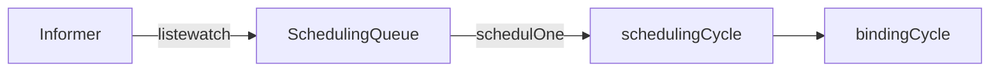
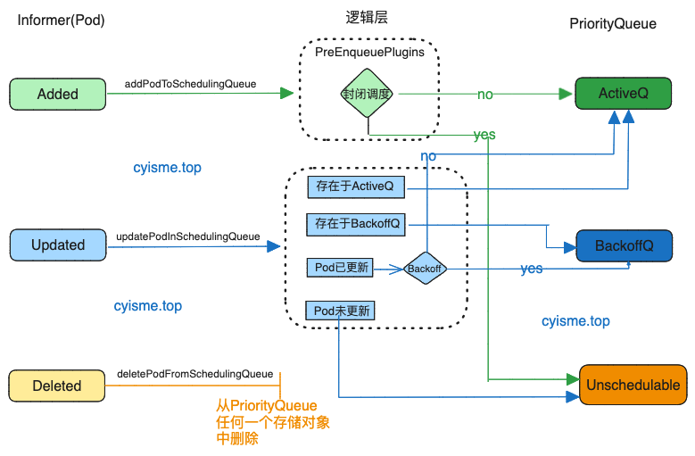
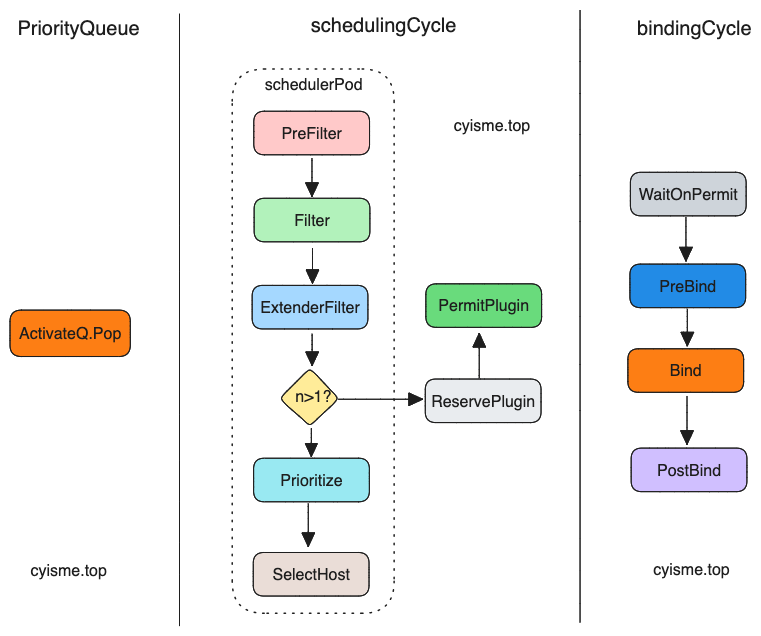

# 从源码解析KubeScheduler调度过程
本文从源码的角度分析KubeScheduler调度过程以及相关功能的实现。 

本篇kubernetes版本为v1.27.3。

>kubernetes项目地址: [https://github.com/kubernetes/kubernetes](https://github.com/kubernetes/kubernetes)
>
>scheduler命令main入口: cmd/kube-scheduler/scheduler.go
>
>scheduler相关代码目录: pkg/scheduler

`scheduler`大致运行流程:

`scheduler`中的数据流转，基本都进行了解耦处理，数据流转通过`queue`传输。
## SchedulingQueue
### Infomer监听资源
`scheduler`通过informer的`liste/watch`机制监听`pod`的变化，当`pod`发生变化时，`informer.EventHandler`会将`pod`添加到`schedulingQueue`中。

`schedulingQueue`在`NewScheduler`时创建,并添加`EventHandler`。`schedulingQueue`实际上是`PriorityQueue`对象。
```go
// scheduler.go
// line 313
// New returns a Scheduler
func New(client clientset.Interface,
	informerFactory informers.SharedInformerFactory,
	dynInformerFactory dynamicinformer.DynamicSharedInformerFactory,
	recorderFactory profile.RecorderFactory,
	stopCh <-chan struct{},
	opts ...Option) (*Scheduler, error) {
	// 省略无关代码
	podQueue := internalqueue.NewSchedulingQueue(
		profiles[options.profiles[0].SchedulerName].QueueSortFunc(),
		informerFactory,
		internalqueue.WithPodInitialBackoffDuration(time.Duration(options.podInitialBackoffSeconds)*time.Second),
		internalqueue.WithPodMaxBackoffDuration(time.Duration(options.podMaxBackoffSeconds)*time.Second),
		internalqueue.WithPodLister(podLister),
		internalqueue.WithClusterEventMap(clusterEventMap),
		internalqueue.WithPodMaxInUnschedulablePodsDuration(options.podMaxInUnschedulablePodsDuration),
		internalqueue.WithPreEnqueuePluginMap(preEnqueuePluginMap),
		internalqueue.WithPluginMetricsSamplePercent(pluginMetricsSamplePercent),
		internalqueue.WithMetricsRecorder(*metricsRecorder),
	)
    // 省略无关代码
    addAllEventHandlers(sched, informerFactory, dynInformerFactory, unionedGVKs(clusterEventMap))
}
```
`addAllEventHandlers`注册了事件处理方法，`scheduler`中会监听以下几个资源事件:
1. Pod。用于获取需要调度的对象
2. Node。用于获取调度节点的信息
3. 其他用于辅助调度的资源。如`PV`,`PVC`,`CSINode`等
### Pod事件处理流程
在添加事件处理函数时， 区分了已经调度过和未调度过的`pod`。处理解析有些区别，但是最终都是落入到`SchedulingQueue`中。

`SchedulingQueue`中有三个存储对象:
1. `activeQ`。可以调度的`pod`队列
2. `unschedulablePods`。不可调度的/待调度的`pod`队列
3. `podBackoffQ`。调度失败的`pod`队列
```go
// eventhandlers.go
// line 251
func addAllEventHandlers(
	sched *Scheduler,
	informerFactory informers.SharedInformerFactory,
	dynInformerFactory dynamicinformer.DynamicSharedInformerFactory,
	gvkMap map[framework.GVK]framework.ActionType,
) {
    // 已经调度过的pod
	// scheduled pod cache
	informerFactory.Core().V1().Pods().Informer().AddEventHandler(
		cache.FilteringResourceEventHandler{
			FilterFunc: func(obj interface{}) bool {
				switch t := obj.(type) {
				case *v1.Pod:
                    // 这个函数利用pod中的spec.nodeName判断pod是否已经调度过
                    // 如果nodeName不为空，则已经调度过
					return assignedPod(t)
                // 删除状态的pod
				case cache.DeletedFinalStateUnknown:
					if _, ok := t.Obj.(*v1.Pod); ok {
						return true
					}
					utilruntime.HandleError(fmt.Errorf("unable to convert object %T to *v1.Pod in %T", obj, sched))
					return false
				default:
					utilruntime.HandleError(fmt.Errorf("unable to handle object in %T: %T", sched, obj))
					return false
				}
			},
			Handler: cache.ResourceEventHandlerFuncs{
				AddFunc:    sched.addPodToCache,
				UpdateFunc: sched.updatePodInCache,
				DeleteFunc: sched.deletePodFromCache,
			},
		},
	)
    // 未调度过的pod
	// unscheduled pod queue
	informerFactory.Core().V1().Pods().Informer().AddEventHandler(
		cache.FilteringResourceEventHandler{
			FilterFunc: func(obj interface{}) bool {
				switch t := obj.(type) {
				case *v1.Pod:
                    // assignedPod与上文代码一致
                    // responsibleForPod判断是否是当前scheduler负责的pod
					return !assignedPod(t) && responsibleForPod(t, sched.Profiles)
				// 省略重复代码
			},
			Handler: cache.ResourceEventHandlerFuncs{
				AddFunc:    sched.addPodToSchedulingQueue,
				UpdateFunc: sched.updatePodInSchedulingQueue,
				DeleteFunc: sched.deletePodFromSchedulingQueue,
			},
		},
	)
    // 省略无关代码
}
```
#### 首次调度pod
首先看一下首次调度的`pod`事件处理流程。

`Added`事件。如果`PreEnqueuePlugins`允许`pod`调度， 将会加入`ActiveQ`中。
```go
func (sched *Scheduler) addPodToSchedulingQueue(obj interface{}) {
	pod := obj.(*v1.Pod)
	klog.V(3).InfoS("Add event for unscheduled pod", "pod", klog.KObj(pod))
    // 实际处理函数
	if err := sched.SchedulingQueue.Add(pod); err != nil {
		utilruntime.HandleError(fmt.Errorf("unable to queue %T: %v", obj, err))
	}
}
// internal/queue/scheduling_queue.go
// line 398
func (p *PriorityQueue) Add(pod *v1.Pod) error {
	p.lock.Lock()
	defer p.lock.Unlock()

	pInfo := p.newQueuedPodInfo(pod)
	gated := pInfo.Gated
    // gated为true，表示pod被阻塞，不会被调度
    // p.addToActiveQ方法中会调用PreEnqueuePlugins对pod进行过滤， gated为true的将会放入到unschedulablePods中
	if added, err := p.addToActiveQ(pInfo); !added {
		return err
	}
    // 已经放入到ActiveQ后，执行清理操作
	if p.unschedulablePods.get(pod) != nil {
		klog.ErrorS(nil, "Error: pod is already in the unschedulable queue", "pod", klog.KObj(pod))
		p.unschedulablePods.delete(pod, gated)
	}
	// Delete pod from backoffQ if it is backing off
	if err := p.podBackoffQ.Delete(pInfo); err == nil {
		klog.ErrorS(nil, "Error: pod is already in the podBackoff queue", "pod", klog.KObj(pod))
	}
	// 省略无关代码
	return nil
}
```
`Updated`事件。
```go
func (p *PriorityQueue) Update(oldPod, newPod *v1.Pod) error {
	p.lock.Lock()
	defer p.lock.Unlock()

	if oldPod != nil {
		oldPodInfo := newQueuedPodInfoForLookup(oldPod)
		// 如果pod已经在active队列中，在active队列中更新它。
		if oldPodInfo, exists, _ := p.activeQ.Get(oldPodInfo); exists {
			pInfo := updatePod(oldPodInfo, newPod)
			p.updateNominatedPodUnlocked(oldPod, pInfo.PodInfo)
			return p.activeQ.Update(pInfo)
		}

		// 如果pod在backoff队列中，backoff更新它。
		if oldPodInfo, exists, _ := p.podBackoffQ.Get(oldPodInfo); exists {
			pInfo := updatePod(oldPodInfo, newPod)
			p.updateNominatedPodUnlocked(oldPod, pInfo.PodInfo)
			return p.podBackoffQ.Update(pInfo)
		}
	}

	// 如果pod在unschedulable队列中
	if usPodInfo := p.unschedulablePods.get(newPod); usPodInfo != nil {
		pInfo := updatePod(usPodInfo, newPod)
		p.updateNominatedPodUnlocked(oldPod, pInfo.PodInfo)
        // 如果pod已经更新
		if isPodUpdated(oldPod, newPod) {
			gated := usPodInfo.Gated
			if p.isPodBackingoff(usPodInfo) {
                // 如果pod时backoff状态, 将pod放入到backoff队列中, 并从unschedulable队列中删除
				if err := p.podBackoffQ.Add(pInfo); err != nil {
					return err
				}
				p.unschedulablePods.delete(usPodInfo.Pod, gated)
			} else {
                // 反之，将pod放入到active队列中，并从unschedulable队列中删除
				if added, err := p.addToActiveQ(pInfo); !added {
					return err
				}
				p.unschedulablePods.delete(usPodInfo.Pod, gated)
			}
		} else {
            //放入到unschedulable队列中
			p.unschedulablePods.addOrUpdate(pInfo)
		}
		return nil
	}
	// 如果不在任何队列中，将pod放入到active队列中
	pInfo := p.newQueuedPodInfo(newPod)
	if added, err := p.addToActiveQ(pInfo); !added {
		return err
	}
    // 省略无关代码
}
```
`Deleted`事件比较简单， 从任何一个队列中移除数据。
```go
func (p *PriorityQueue) Delete(pod *v1.Pod) error {
	p.lock.Lock()
	defer p.lock.Unlock()
	p.deleteNominatedPodIfExistsUnlocked(pod)
	pInfo := newQueuedPodInfoForLookup(pod)
	if err := p.activeQ.Delete(pInfo); err != nil {
		p.podBackoffQ.Delete(pInfo)
		if pInfo = p.unschedulablePods.get(pod); pInfo != nil {
			p.unschedulablePods.delete(pod, pInfo.Gated)
		}
	}
	return nil
}
```
#### 重新调度的pod
重新调度的`pod`可能是曾经因为某些原因调度失败，或者之前不是当前`scheduler`处理的。

我们省略上层调用的函数， 直接找到最终的`movePodsToActiveOrBackoffQueue`函数。

`isPodBackingoff`函数会根据`pod`上次调度的时间，判断当前是否可以进行调度。这就是为什么`pod`在调度失败后会间隔一段时间才会再次调度。这个函数在上文以及多处都有用到。
> backoffduration的计算方式，是通过上次调度时间和重试次数计算出来的。 代码中默认的Max为10s。
`Added`事件
```go
// internal/queue/scheduling_queue.go
// line 768
func (p *PriorityQueue) movePodsToActiveOrBackoffQueue(podInfoList []*framework.QueuedPodInfo, event framework.ClusterEvent) {
	activated := false
	for _, pInfo := range podInfoList {
		// 如果UnschedulablePlugins不为0， 那么pod不是因为某些插件不允许调度而失败的。
        // 如果podMatchesEvent也匹配不到可以调度的事件，那这个pod意味着无法运行。
        // 这种情况下pod不会被重新调度，而是等待pod更新事件后才会调度。
		if len(pInfo.UnschedulablePlugins) != 0 && !p.podMatchesEvent(pInfo, event) {
			continue
		}

		pod := pInfo.Pod
		if p.isPodBackingoff(pInfo) {
			// p.podBackoffQ.Add(pInfo)
            // 省略无关代码
		} else {
			// p.addToActiveQ(pInfo)
            // 省略无关代码
		}
	}
}
```
`Updated`事件中会判断这个`pod`是否进行了资源调整， 如果调整过，那么会尝试将`pod`从`unschedulablePods`中放入到`active`队列或者`backoff`队列中。
> unschedulablePods中的pod可能是因为资源不够或者其他原因而失败的。
>
> 所以当已经存在的pod进行了资源调整后，可能会满足调度条件，所以需要重新调度。
```go
// internal/queue/scheduling_queue.go
// 732
func (p *PriorityQueue) AssignedPodUpdated(pod *v1.Pod) {
	p.lock.Lock()
    // 是否进行了资源调整
	if isPodResourcesResizedDown(pod) {
        // 将unschedulablePods中的pod取出， 尝试放到active队列或者backoff队列中
		p.moveAllToActiveOrBackoffQueue(AssignedPodUpdate, nil)
	} else {
		p.movePodsToActiveOrBackoffQueue(p.getUnschedulablePodsWithMatchingAffinityTerm(pod), AssignedPodUpdate)
	}
	p.lock.Unlock()
}
```
`Deleted`事件和`Updated相似`, 也会调用`p.moveAllToActiveOrBackoffQueue`尝试调度。这里省略代码。
### Node事件处理流程
因为`Node`的变化不论新增还是更新，都会涉及到所有所有未调度的pod， 所以都会调用`p.moveAllToActiveOrBackoffQueue`方法。

至于`Node`的删除操作所导致的`Pod`驱逐以及重新调度的事件，并不是在这里监听的。
```go
// informerFactory.Core().V1().Nodes().Informer().AddEventHandler(
//     cache.ResourceEventHandlerFuncs{
//         AddFunc:    sched.addNodeToCache,
//         UpdateFunc: sched.updateNodeInCache,
//         DeleteFunc: sched.deleteNodeFromCache,
//     },
// )
func (sched *Scheduler) addNodeToCache(obj interface{}) {
    // 省略无关代码
	sched.SchedulingQueue.MoveAllToActiveOrBackoffQueue(queue.NodeAdd, preCheckForNode(nodeInfo))
}
func (sched *Scheduler) updateNodeInCache(oldObj, newObj interface{}) {
	// 省略无关代码
	if event := nodeSchedulingPropertiesChange(newNode, oldNode); event != nil {
		sched.SchedulingQueue.MoveAllToActiveOrBackoffQueue(*event, preCheckForNode(nodeInfo))
	}
}
func (sched *Scheduler) deleteNodeFromCache(obj interface{}) {
    // 省略无关代码
	if err := sched.Cache.RemoveNode(node); err != nil {
		klog.ErrorS(err, "Scheduler cache RemoveNode failed")
	}
}
```
`sched.Cache`对象在pod和node事件中都有出现， 他的作用时缓存pod和node的信息， 以及一些辅助调度的信息。
### 辅助调度资源
```go
func addAllEventHandlers(){
    // 省略无关代码
    buildEvtResHandler := func(at framework.ActionType, gvk framework.GVK, shortGVK string) cache.ResourceEventHandlerFuncs {
		funcs := cache.ResourceEventHandlerFuncs{}
		if at&framework.Add != 0 {
			evt := framework.ClusterEvent{Resource: gvk, ActionType: framework.Add, Label: fmt.Sprintf("%vAdd", shortGVK)}
			funcs.AddFunc = func(_ interface{}) {
				sched.SchedulingQueue.MoveAllToActiveOrBackoffQueue(evt, nil)
			}
		}
		if at&framework.Update != 0 {
			evt := framework.ClusterEvent{Resource: gvk, ActionType: framework.Update, Label: fmt.Sprintf("%vUpdate", shortGVK)}
			funcs.UpdateFunc = func(_, _ interface{}) {
				sched.SchedulingQueue.MoveAllToActiveOrBackoffQueue(evt, nil)
			}
		}
		if at&framework.Delete != 0 {
			evt := framework.ClusterEvent{Resource: gvk, ActionType: framework.Delete, Label: fmt.Sprintf("%vDelete", shortGVK)}
			funcs.DeleteFunc = func(_ interface{}) {
				sched.SchedulingQueue.MoveAllToActiveOrBackoffQueue(evt, nil)
			}
		}
		return funcs
	}
    // 省略无关代码
    for gvk, at := range gvkMap {
    switch gvk {
    case framework.Node, framework.Pod:
        // Do nothing.
    case framework.CSINode:
        informerFactory.Storage().V1().CSINodes().Informer().AddEventHandler(
            buildEvtResHandler(at, framework.CSINode, "CSINode"),
        )
        //...省略无关代码
    }
}
```
辅助调度资源的变更，实际上和`pod`资源发生调整的概念差不多， 都会影响到所有未调度的`pod`。所以都会调用`p.moveAllToActiveOrBackoffQueue`方法。
## Scheduler.Run
上文中的`New`方法，会创建一个`scheduler`实例，并初始化相关组件。紧接着会调用`scheduler.Run`方法。

`scheduler.Run`中分为两部分:
1. 针对队列中的`pod`的处理。
2. 调度逻辑。
```go
func (sched *Scheduler) Run(ctx context.Context) {
	// 针对队列中的`pod`的处理
	sched.SchedulingQueue.Run()
	// 调度逻辑
	go wait.UntilWithContext(ctx, sched.scheduleOne, 0)

	<-ctx.Done()
	sched.SchedulingQueue.Close()
}
// sched.SchedulingQueue.Run()
// internal/queue/scheduling_queue.go
// line 333
func (p *PriorityQueue) Run() {
	// 检查backoff队列中的pod是否已到"冷静"时间，是否可以调度
	// 如果可以调度，将pod从backoff队列中弹出，放入到active队列中
	// 每次检查间隔1s
	go wait.Until(p.flushBackoffQCompleted, 1.0*time.Second, p.stop)
	// 首先检查unschedulable队列中的pod，是否到达了最大未调度等待时间，代码中默认为5分钟。
	// 如果到达则将其放到可能调度的数组中，
	// 接下来检查数组中的pod状态，
	// 如果为backoff状态，将pod从unschedulable队列中移除，放入到backoff队列中
	// 否则，将pod从unschedulable队列中移除，放入到active队列中
	// 每次检查间隔30s
	go wait.Until(p.flushUnschedulablePodsLeftover, 30*time.Second, p.stop)
}
```
实际调度函数-`scheduleOne`
```go
func (sched *Scheduler) scheduleOne(ctx context.Context) {
	// 获取下一个pod
	// 实际调用的是schedulingQueue中的Pop方法, 从active队列中取出pod
	// 这个方法会阻塞，直到有pod可以调度
	podInfo := sched.NextPod()
	// 省略无关代码
	pod := podInfo.Pod
	// 获取pod对应的framework， framework是调度的核心，筛选节点，打分等都是通过framework来实现的
	fwk, err := sched.frameworkForPod(pod)
	// 省略无关代码

	// 获取调度节点
	scheduleResult, assumedPodInfo, status := sched.schedulingCycle(schedulingCycleCtx, state, fwk, podInfo, start, podsToActivate)
	// 省略无关代码

	// 尝试绑定，调度pod到节点
	go func() {
		// 省略无关代码
		status := sched.bindingCycle(bindingCycleCtx, state, fwk, scheduleResult, assumedPodInfo, start, podsToActivate)
	}()
}
```
### schedulingCycle
`schedulingCycle`方法中，主要是调用`framework`的`filter`和`preempt`方法，对`pod`进行筛选和抢占。

`schedulingCycle`函数的主体稍后再看，先来看实现主要的调度逻辑的 `schedulePod`函数。
```go
func (sched *Scheduler) schedulePod(ctx context.Context, fwk framework.Framework, state *framework.CycleState, pod *v1.Pod) (result ScheduleResult, err error) {
	// 省略无关代码
	// node为0，表示没有可用的节点
	if sched.nodeInfoSnapshot.NumNodes() == 0 {
		return result, ErrNoNodesAvailable
	}
	// 筛选节点
	feasibleNodes, diagnosis, err := sched.findNodesThatFitPod(ctx, fwk, state, pod)
	if err != nil {
		return result, err
	}
	
	// 筛选后没有可用的节点，直接返回
	if len(feasibleNodes) == 0 {
		return result, &framework.FitError{
			Pod:         pod,
			NumAllNodes: sched.nodeInfoSnapshot.NumNodes(),
			Diagnosis:   diagnosis,
		}
	}

	// 当只有一个节点时，直接使用它。
	if len(feasibleNodes) == 1 {
		return ScheduleResult{
			SuggestedHost:  feasibleNodes[0].Name,
			EvaluatedNodes: 1 + len(diagnosis.NodeToStatusMap),
			FeasibleNodes:  1,
		}, nil
	}
	// 大于一个节点时， 需要对节点进行打分
	priorityList, err := prioritizeNodes(ctx, sched.Extenders, fwk, state, pod, feasibleNodes)
	// 选择最优的节点
	host, err := selectHost(priorityList)
	return ScheduleResult{
		SuggestedHost:  host,
		EvaluatedNodes: len(feasibleNodes) + len(diagnosis.NodeToStatusMap),
		FeasibleNodes:  len(feasibleNodes),
	}, err
}
```
筛选节点`sched.findNodesThatFitPod`将依次调用：
- RunPreFilterPlugins 预筛选，主要是一些可以快速找到匹配节点的操作
- RunFilterPlugins 筛选
- findNodesThatPassExtenders 扩展筛选器

我们跳过`RunPreFilterPlugins`的包装函数逻辑不复杂,直接来看 `RunFilterPlugins`。
```go
// 这个函数中调用了RunFilterPlugins
func (sched *Scheduler) findNodesThatPassFilters(
	// 省略参数
	) ([]*v1.Node, error) {
	// 计算需要筛选的节点数量
	numAllNodes := len(nodes)
	numNodesToFind := sched.numFeasibleNodesToFind(fwk.PercentageOfNodesToScore(), int32(numAllNodes))
	// 省略无关代码...

	// 检查node是否符合pod的要求
	checkNode := func(i int) {
		// 每次取出一个node， 运行filter插件
		// nextStartNodeIndex 为下次开始的节点索引， 每次调度后都会更新
		// 所有节点都有相同的机会被调度
		nodeInfo := nodes[(sched.nextStartNodeIndex+i)%numAllNodes]
		// 运行filter插件
		status := fwk.RunFilterPluginsWithNominatedPods(ctx, state, pod, nodeInfo)
		if status.Code() == framework.Error {
			errCh.SendErrorWithCancel(status.AsError(), cancel)
			return
		}
		// 省略状态判断，数据更新代码
	}
	// 省略metrics更新代码
	// 
	// 运行上方的cheknode函数， 这里面会根据chunkSize的大小， 并发运行checkNode函数
	// chunksize的计算公式为  node数量/ parallelism +1, parallelism默认为16
	// 1< chunksize < node数量的平方根 
	fwk.Parallelizer().Until(ctx, numAllNodes, checkNode, metrics.Filter)
	feasibleNodes = feasibleNodes[:feasibleNodesLen]
	if err := errCh.ReceiveError(); err != nil {
		statusCode = framework.Error
		return feasibleNodes, err
	}
	return feasibleNodes, nil
}
```
> 具体默认插件集的定义可以参考`pkg/scheduler/apis/config/testing/defaults/defaults.go`文件。
> 
>`RunFilterPlugins`其实是由`sched.findNodesThatPassFilters`函数调用的，这个函数中有个问题值得一说。思考一下， 假如集群中有1w个节点， 每次都会对这1w个节点进行筛选吗？
>
> `sched.findNodesThatPassFilters`中定义了计算进行筛选节点数量的规则。当节点数量小于100时，会对所有节点进行筛选。当节点数量大于100时，会随机选择100个节点进行筛选。反之会使用公式: numAllNodes * (50 - numAllNodes/125) / 100  ， (50 - numAllNodes/125)的值最小为5。
节点评分`prioritizeNodes`将依次调用：
- RunPreScorePlugins 预评分
- RunScorePlugins 评分
- extenders.Prioritize 扩展器加权分数计算

在`selectHost`选择最有节点时,为了避免出现多个评分相同的节点而导致调度倾斜的情况，会对"平分"节点进行一个随机选择的动作:
```go
func selectHost(nodeScores []framework.NodePluginScores) (string, error) {
	if len(nodeScores) == 0 {
		return "", fmt.Errorf("empty priorityList")
	}
	maxScore := nodeScores[0].TotalScore
	selected := nodeScores[0].Name
	cntOfMaxScore := 1
	for _, ns := range nodeScores[1:] {
		if ns.TotalScore > maxScore {
			maxScore = ns.TotalScore
			selected = ns.Name
			cntOfMaxScore = 1
		} else if ns.TotalScore == maxScore {
			cntOfMaxScore++
			if rand.Intn(cntOfMaxScore) == 0 {
				// 替换的概率为 1/cntOfMaxScore
				selected = ns.Name
			}
		}
	}
	return selected, nil
}
```
再回头来看`schedulingCycle`方法。
```go
func (sched *Scheduler) schedulingCycle(
	// 省略参数...
	) (ScheduleResult, *framework.QueuedPodInfo, *framework.Status) {
	pod := podInfo.Pod
	// 上文中的调度方法
	scheduleResult, err := sched.SchedulePod(ctx, fwk, state, pod)
	if err != nil {
		// 当错误为FitError时， 即主机资源检查插件返回错误
		// 尝试对pod下次调度执行预抢占

		// 运行postFilter插件， 插件会返回node的提名信息， 下次pod将会优先调度到这个node
		result, status := fwk.RunPostFilterPlugins(ctx, state, pod, fitError.Diagnosis.NodeToStatusMap)
		msg := status.Message()
		fitError.Diagnosis.PostFilterMsg = msg
		var nominatingInfo *framework.NominatingInfo
		if result != nil {
			nominatingInfo = result.NominatingInfo
		}
		return ScheduleResult{nominatingInfo: nominatingInfo}, podInfo, framework.NewStatus(framework.Unschedulable).WithError(err)
	}

	// RunReservePluginsReserve 在将 Pod 调度到节点之前，对节点上的资源进行一些预留或检查的逻辑。
	if sts := fwk.RunReservePluginsReserve(ctx, state, assumedPod, scheduleResult.SuggestedHost); !sts.IsSuccess() {
		// 省略无关代码
	}

	// RunPermitPlugins 检查许可证插件是否允许调度 pod 到节点上。
	// 这个里面目前没有官方实现。
	runPermitStatus := fwk.RunPermitPlugins(ctx, state, assumedPod, scheduleResult.SuggestedHost)
	if !runPermitStatus.IsWait() && !runPermitStatus.IsSuccess() {
		// 省略无关代码
	}
	// 省略无关代码
	return scheduleResult, assumedPodInfo, nil
}
```
### bindingCycle
在`schedulingCycle`中，我们已经为`pod`找到了目标节点，还需要将`pod`绑定到节点上。`bindingCycle`是异步执行的。
```go
func (sched *Scheduler) bindingCycle(
	// 省略参数...
	) *framework.Status {

	assumedPod := assumedPodInfo.Pod
	// 等待准许插件
	if status := fwk.WaitOnPermit(ctx, assumedPod); !status.IsSuccess() {
		return status
	}
	// 预绑定插件
	// 如volumeBinding插件，pod运行前需要准备好volume
	if status := fwk.RunPreBindPlugins(ctx, state, assumedPod, scheduleResult.SuggestedHost); !status.IsSuccess() {
		return status
	}
	// 绑定
	if status := sched.bind(ctx, fwk, assumedPod, scheduleResult.SuggestedHost, state); !status.IsSuccess() {
		return status
	}
	// 后置插件
	fwk.RunPostBindPlugins(ctx, state, assumedPod, scheduleResult.SuggestedHost)
	return nil
}
```
## 总结

调度过程大致如下:
1. `scheduler`通过`informer`监听`pod`和`node`的变化， 并将`pod`添加到`schedulingQueue`中。
2. `schedulingQueue`中有三个队列， `activeQ`，`unschedulablePods`，`podBackoffQ`。`activeQ`中的`pod`可以被调度，`unschedulablePods`中的`pod`不可被调度(未调度)，`podBackoffQ`中的`pod`是调度失败的`pod`。
3. `schedulingOne`方法中，会从`activeQ`中取出`pod`，由`schedulingCycle`调用`framework`运行插件的筛选与评分函数， 最终选出最优的节点，由`bindingCycle`将`pod`绑定到节点上。
`scheduler`的调度过程是单线程的， 通过`schedulingQueue`的阻塞`Pop`实现， 保证了调度的顺序性。

通过`node`提名机制，实现`pod`优先调度到指定的节点上。


