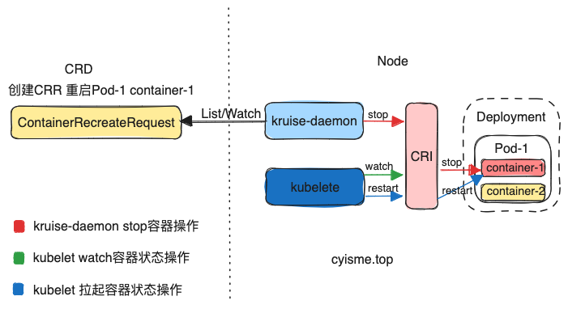
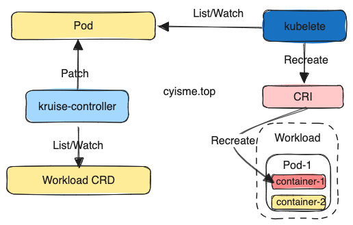

# 从源码解析Kruise原地升级原理
本文从源码的角度分析 Kruise 原地升级相关功能的实现。 

>本篇Kruise版本为v1.5.2。
>
>Kruise项目地址: [https://github.com/openkruise/kruise](https://github.com/openkruise/kruise)

## 原地升级的概念
当我们使用`deployment`等`Workload`， 我们更改镜像版本时，`k8s`会删除原有pod进行重建，重建后pod的相关属性都有可能会变化， 比如uid、node、ipd等。

原地升级的目的就是保持pod的相关属性不变，只更改镜像版本。

下面的测试可以帮助理解kubelet的原地升级功能。
### 测试一： 修改deployment镜像版本
比如当前deployment使用nginx作为镜像, 且有一个pod实例：
```bash
~|⇒ kubectl get deployment test -o jsonpath="{.spec.template.spec.containers[0]}"
{"image":"nginx","imagePullPolicy":"Always","name":"nginx","resources":{},"terminationMessagePath":"/dev/termination-log","terminationMessagePolicy":"File"}
~|⇒ kubectl get pod
NAME                    READY   STATUS    RESTARTS      AGE
test-5746d4c59f-nwc6q   1/1     Running   0             10m
web-0                   1/1     Running   1 (71m ago)   18d
```
修改镜像版本后， pod会被重建：
```bash
~|⇒ kubectl edit deployment test
deployment.apps/test edited
~|⇒ kubectl get pod
NAME                    READY   STATUS              RESTARTS      AGE
test-5746d4c59f-nwc6q   1/1     Running             0             11m
test-674d57777c-8qc7c   0/1     ContainerCreating   0             2s
web-0                   1/1     Running             1 (72m ago)   18d
~|⇒ kubectl get pod
NAME                    READY   STATUS    RESTARTS      AGE
test-674d57777c-8qc7c   1/1     Running   0             42s
```
> 可以看到，pod被重建后，pod的名称（以及其他属性）发生了变化。

### 测试二： 修改pod的镜像版本
比如当前deployment使用nginx:1.25作为镜像, 且有一个pod实例：
```bash
~|⇒ kubectl get deployment test -o jsonpath="{.spec.template.spec.containers[0]}"
{"image":"nginx:1.25","imagePullPolicy":"Always","name":"nginx","resources":{},"terminationMessagePath":"/dev/termination-log","terminationMessagePolicy":"File"}%
~|⇒ kubectl get pod
NAME                    READY   STATUS    RESTARTS      AGE
test-76f8989b6c-8s9s2   1/1     Running   0             3m17s
```
直接修改pod的镜像版本后， pod不会被重建(但是会增加一次restart)：
```bash
~|⇒ kubectl edit pod test-76f8989b6c-8s9s2
pod/test-76f8989b6c-8s9s2 edited
~|⇒ kubectl get pod
NAME                    READY   STATUS    RESTARTS      AGE
test-76f8989b6c-8s9s2   1/1     Running   1 (4s ago)    5m38s
```
pod的镜像版本变动后，并不会逆向同步到deployment。
```bash
~|⇒ kubectl get deployment test -o jsonpath="{.spec.template.spec.containers[0]}"
{"image":"nginx:1.25","imagePullPolicy":"Always","name":"nginx","resources":{},"terminationMessagePath":"/dev/termination-log","terminationMessagePolicy":"File"}%
```
但是pod的镜像版本变化了， uid、名称的属性都没有变化。
```yaml
-- old
apiVersion: v1
kind: Pod
metadata:
  creationTimestamp: "2024-02-20T03:53:34Z"
  generateName: test-76f8989b6c-
  labels:
    app: test
    pod-template-hash: 76f8989b6c
  name: test-76f8989b6c-8s9s2
  namespace: default
  ownerReferences:
  - apiVersion: apps/v1
    blockOwnerDeletion: true
    controller: true
    kind: ReplicaSet
    name: test-76f8989b6c
    uid: 68434490-0948-4c88-bf59-e1f63887e02f
  resourceVersion: "2160531"
  uid: 9f5fb37b-01ae-45a6-b50f-fc2385b6e317
spec:
  containers:
  - image: nginx:1.25
    imagePullPolicy: Always
    name: nginx
--- new
apiVersion: v1
kind: Pod
metadata:
  creationTimestamp: "2024-02-20T03:53:34Z"
  generateName: test-76f8989b6c-
  labels:
    app: test
    pod-template-hash: 76f8989b6c
  name: test-76f8989b6c-8s9s2
  namespace: default
  ownerReferences:
  - apiVersion: apps/v1
    blockOwnerDeletion: true
    controller: true
    kind: ReplicaSet
    name: test-76f8989b6c
    uid: 68434490-0948-4c88-bf59-e1f63887e02f
  resourceVersion: "2161008"
  uid: 9f5fb37b-01ae-45a6-b50f-fc2385b6e317
spec:
  containers:
  - image: nginx:1.25.4
    imagePullPolicy: Always
    name: nginx
```
### 测试三： 停止pod内容器
依旧是“测试二”中的pod：
```bash
~|⇒ kubectl get pod
NAME                    READY   STATUS    RESTARTS        AGE
test-76f8989b6c-8s9s2   1/1     Running   1 (112m ago)    118m
```
找到其对应的容器， 对其进行停止操作：
```bash
# 正在运行无法直接删除， 可以强制删除或者先停止
$ docker rm 518f1b0accada9c9587cd5d7655cbda0bc7a33bebaf11f0ec99877b6a9c92222
Error response from daemon: You cannot remove a running container 518f1b0accada9c9587cd5d7655cbda0bc7a33bebaf11f0ec99877b6a9c92222. Stop the container before attempting removal or force remove
$ docker stop 518f1b0accada9c9587cd5d7655cbda0bc7a33bebaf11f0ec99877b6a9c92222
518f1b0accada9c9587cd5d7655cbda0bc7a33bebaf11f0ec99877b6a9c92222
# 已经停止
$ docker ps | grep 518f1b0accada9c9587cd5d7655cbda0bc7a33bebaf11f0ec99877b6a9c92222
# 拉起了新的容器
$ docker ps | grep nginx
ebb42aafa572   nginx                             "/docker-entrypoint.…"   3 minutes ago   Up 3 minutes             k8s_nginx_test-76f8989b6c-8s9s2_default_9f5fb37b-01ae-45a6-b50f-fc2385b6e317_2
```
容器停止后， 会被`kubelet`中的`Runonce`方法拉起， pod的属性不会变化, 状态中的`containerID`会更新。
### 结论
pod本身其实具备原地升级的能力，所以简单来说(一个pod多个容器仅其中一个升级的状况会更复杂)， 对deployment实现原地升级只需要几步就可以做到：
1. 修改workload镜像版本，但是需要拦截pod重建动作
2. 提前拉取新版镜像， 加快过程
3. 更新pod镜像版本，重新启动容器
## kruise原地升级原理
### Container Restart


`ContainerRecreateRequest`是一个`CRD`,可以帮助用户重启/重建存量 Pod 中一个或多个容器。下文称之为`CRR`

和 Kruise 提供的原地升级类似，当一个容器重建的时候，Pod 中的其他容器还保持正常运行。重建完成后，Pod 中除了该容器的 restartCount 增加以外不会有什么其他变化。 注意，之前临时写到旧容器 rootfs 中的文件会丢失，但是 volume mount 挂载卷中的数据都还存在。

> `CRR`的具体管理者是`kruise-daemon`进程。
>
> `kruise-daemon` 除此之外还会管理`NnodeImage`CRD
> 
> `CRR`资源管理的实现在`pkg/daemon/containerrecreate`

资源的处理最终会由`Controller.sync`方法执行
```go
func (c *Controller) sync(key string) (retErr error) {
	namespace, podName, err := cache.SplitMetaNamespaceKey(key)
	objectList, err := c.crrInformer.GetIndexer().ByIndex(CRRPodNameIndex, podName)
	crrList := make([]*appsv1alpha1.ContainerRecreateRequest, 0, len(objectList))
	// 弹出一个CRR进行处理
	crr, err := c.pickRecreateRequest(crrList)
	if err != nil || crr == nil {
		return err
	}
    // ...
    // 省略一些状态判断

	return c.manage(crr)
}

func (c *Controller) manage(crr *appsv1alpha1.ContainerRecreateRequest) error {
	runtimeManager, err := c.newRuntimeManager(c.runtimeFactory, crr)
	pod := convertCRRToPod(crr)
	podStatus, err := runtimeManager.GetPodStatus(pod.UID, pod.Name, pod.Namespace)
	newCRRContainerRecreateStates := getCurrentCRRContainersRecreateStates(crr, podStatus)
	if !reflect.DeepEqual(crr.Status.ContainerRecreateStates, newCRRContainerRecreateStates) {
		return c.patchCRRContainerRecreateStates(crr, newCRRContainerRecreateStates)
	}

	var completedCount int
	for i := range newCRRContainerRecreateStates {
		state := &newCRRContainerRecreateStates[i]
		// ...
        // 省略一些状态判断

        // 从pod状态中获取容器id，调用cri停止对应容器
		err := runtimeManager.KillContainer(pod, kubeContainerStatus.ID, state.Name, msg, nil)
		if err != nil {
			if crr.Spec.Strategy.FailurePolicy == appsv1alpha1.ContainerRecreateRequestFailurePolicyIgnore {
				continue
			}
			return c.patchCRRContainerRecreateStates(crr, newCRRContainerRecreateStates)
		}
		state.IsKilled = true
		state.Phase = appsv1alpha1.ContainerRecreateRequestRecreating
		break
	}
    // 更新CCR状态
	if !reflect.DeepEqual(crr.Status.ContainerRecreateStates, newCRRContainerRecreateStates) {
		return c.patchCRRContainerRecreateStates(crr, newCRRContainerRecreateStates)
	}
	if completedCount == len(newCRRContainerRecreateStates) {
		return c.completeCRRStatus(crr, "")
	}
	if crr.Spec.Strategy != nil && crr.Spec.Strategy.MinStartedSeconds > 0 {
		c.queue.AddAfter(objectKey(crr), time.Duration(crr.Spec.Strategy.MinStartedSeconds)*time.Second)
	}
	return nil
}
```
可以看到整体逻辑比较简单， 主要是越过上层`workload`资源，直接停止对应的容器，利用k8s kubelet本身的container状态监控机制再次拉起， 完成原地重启。

总的来说所，他与我们手动去删除容器的操作大体相同， 不过帮我们省略其中查找容器、登陆node的重复操作， 并提供了一些状态控制机制。
```yaml
apiVersion: apps.kruise.io/v1alpha1
kind: ContainerRecreateRequest
metadata:
  namespace: pod-namespace
  name: xxx
spec:
  podName: pod-name
  containers:       # 要重建的容器名字列表，至少要有 1 个
  - name: app
  - name: sidecar
  strategy:
    failurePolicy: Fail                 # 'Fail' 或 'Ignore'，表示一旦有某个容器停止或重建失败， CRR 立即结束
    orderedRecreate: false              # 'true' 表示要等前一个容器重建完成了，再开始重建下一个
    terminationGracePeriodSeconds: 30   # 等待容器优雅退出的时间，不填默认用 Pod 中定义的
    unreadyGracePeriodSeconds: 3        # 在重建之前先把 Pod 设为 not ready，并等待这段时间后再开始执行重建
    minStartedSeconds: 10               # 重建后新容器至少保持运行这段时间，才认为该容器重建成功
  activeDeadlineSeconds: 300        # 如果 CRR 执行超过这个时间，则直接标记为结束（未结束的容器标记为失败）
  ttlSecondsAfterFinished: 1800     # CRR 结束后，过了这段时间自动被删除掉
```
### cloneSet原地升级


原地升级与上面的`CRR`的原理基本相同， 不过多了一步修改信息的操作（如image、annotation）.

kruise中支持原地升级的`workload`类型， 基本上用的是同一套代码逻辑， 我们以`cloneSet`为例进行分析。
> 代码路径: pkg/controller/cloneset
> 
> 本文中不会对代码实现全部展开分析， 会更加偏向于整体流程的理解。
#### controller
kruise controller中通过`Reconciler`来实现`workload`状态同步，interface定义如下：
```go
type Reconciler interface {
	Reconcile(context.Context, Request) (Result, error)
}
```
`workload`会实现这个interface，并在其中实现状态同步的逻辑。这里面就包含原地升级。

我们忽略`cloneSet`控制器中其他的逻辑， 只关注原地升级， 最终定位到`sync/cloneset_update.go/realControl.updatePod`这个方法。
```go
func (c *realControl) updatePod(cs *appsv1alpha1.CloneSet, coreControl clonesetcore.Control,
	updateRevision *apps.ControllerRevision, revisions []*apps.ControllerRevision,
	pod *v1.Pod, pvcs []*v1.PersistentVolumeClaim,
) (time.Duration, error) {

	if cs.Spec.UpdateStrategy.Type == appsv1alpha1.InPlaceIfPossibleCloneSetUpdateStrategyType ||
		// ...
        // 省略一些状态判断
        // 判断是否可以原地升级
		if c.inplaceControl.CanUpdateInPlace(oldRevision, updateRevision, coreControl.GetUpdateOptions()) {
			// ...
            // 省略一些状态判断
            // 原地升级
			opts := coreControl.GetUpdateOptions()
			opts.AdditionalFuncs = append(opts.AdditionalFuncs, lifecycle.SetPodLifecycle(appspub.LifecycleStateUpdating))
            // 执行升级动作
			res := c.inplaceControl.Update(pod, oldRevision, updateRevision, opts)
			if res.InPlaceUpdate {
				if res.UpdateErr == nil {
					clonesetutils.ResourceVersionExpectations.Expect(&metav1.ObjectMeta{UID: pod.UID, ResourceVersion: res.NewResourceVersion})
					return res.DelayDuration, nil
				}
				return res.DelayDuration, res.UpdateErr
			}
		}

		if cs.Spec.UpdateStrategy.Type == appsv1alpha1.InPlaceOnlyCloneSetUpdateStrategyType {
			return 0, fmt.Errorf("find Pod %s update strategy is InPlaceOnly but can not update in-place", pod.Name)
		}
	}
    // 省略状态更新
    // ...
	return 0, nil
}
```
可以看到， 关键的处理逻辑在`c.inplaceControl`这个对象中。这个对象是`inplaceupdate.Interface`类型。

#### inplaceupdate
查看文件`pkg/util/inplaceupdate/inplace_update.go`
```go
type Interface interface {
    // 判断是否可以原地升级
	CanUpdateInPlace(oldRevision, newRevision *apps.ControllerRevision, opts *UpdateOptions) bool
    // 执行原地升级
	Update(pod *v1.Pod, oldRevision, newRevision *apps.ControllerRevision, opts *UpdateOptions) UpdateResult
    // 刷新一些状态信息
	Refresh(pod *v1.Pod, opts *UpdateOptions) RefreshResult
}
```
`UpdateOptions`包含了一些重要的函数， 比如需要计算更新的字段、更新字段等。 
```go
type UpdateOptions struct {
	GracePeriodSeconds int32
	AdditionalFuncs    []func(*v1.Pod)

    // 计算更新的字段, 也用于判断是否可以原地升级
	CalculateSpec                  func(oldRevision, newRevision *apps.ControllerRevision, opts *UpdateOptions) *UpdateSpec
    // 更新字段
	PatchSpecToPod                 func(pod *v1.Pod, spec *UpdateSpec, state *appspub.InPlaceUpdateState) (*v1.Pod, error)
    // 检查更新状态
	CheckPodUpdateCompleted        func(pod *v1.Pod) error
    // 检查容器更新状态
	CheckContainersUpdateCompleted func(pod *v1.Pod, state *appspub.InPlaceUpdateState) error
	GetRevision                    func(rev *apps.ControllerRevision) string
}
// 默认CalculateSpec函数, 这里体现出只支持label、annotation、镜像的更新的原地升级
func defaultCalculateInPlaceUpdateSpec(oldRevision, newRevision *apps.ControllerRevision, opts *UpdateOptions) *UpdateSpec {
	// ...
	for _, op := range patches {
        // 计算更新镜像
		op.Path = strings.Replace(op.Path, "/spec/template", "", 1)

		if !strings.HasPrefix(op.Path, "/spec/") {
			if strings.HasPrefix(op.Path, "/metadata/") {
				metadataPatches = append(metadataPatches, op)
				continue
			}
			return nil
		}
		if op.Operation != "replace" || !containerImagePatchRexp.MatchString(op.Path) {
			return nil
		}
		// for example: /spec/containers/0/image
		words := strings.Split(op.Path, "/")
		idx, _ := strconv.Atoi(words[3])
		if len(oldTemp.Spec.Containers) <= idx {
			return nil
		}
		updateSpec.ContainerImages[oldTemp.Spec.Containers[idx].Name] = op.Value.(string)
	}
	if len(metadataPatches) > 0 {
        // 计算lbels、annotations的更新
		if utilfeature.DefaultFeatureGate.Enabled(features.InPlaceUpdateEnvFromMetadata) {
			for _, op := range metadataPatches {
				//...
				for i := range newTemp.Spec.Containers {
					c := &newTemp.Spec.Containers[i]
					objMeta := updateSpec.ContainerRefMetadata[c.Name]
					switch words[2] {
					case "labels":
						// ...

					case "annotations":
						// ...
					}

					updateSpec.ContainerRefMetadata[c.Name] = objMeta
					updateSpec.UpdateEnvFromMetadata = true
				}
			}
		}
		// ...
		updateSpec.MetaDataPatch = patchBytes
	}
	return updateSpec
}
// 默认CheckContainersUpdateCompleted函数， 实际CheckPodUpdateCompleted也是调用的这个
func defaultCheckContainersInPlaceUpdateCompleted(pod *v1.Pod, inPlaceUpdateState *appspub.InPlaceUpdateState) error {
    // ...
	containerImages := make(map[string]string, len(pod.Spec.Containers))
	for i := range pod.Spec.Containers {
		c := &pod.Spec.Containers[i]
		containerImages[c.Name] = c.Image
		if len(strings.Split(c.Image, ":")) <= 1 {
			containerImages[c.Name] = fmt.Sprintf("%s:latest", c.Image)
		}
	}

	for _, cs := range pod.Status.ContainerStatuses {
		if oldStatus, ok := inPlaceUpdateState.LastContainerStatuses[cs.Name]; ok {
			// 通过判断镜像id是否变化来判断是否更新
			if oldStatus.ImageID == cs.ImageID {
				if containerImages[cs.Name] != cs.Image {
					return fmt.Errorf("container %s imageID not changed", cs.Name)
				}
			}
			delete(inPlaceUpdateState.LastContainerStatuses, cs.Name)
		}
	}
    // ...
	return nil
}
```
`realControl`实现了`inplaceupdate.Interface`。 
```go
func (c *realControl) CanUpdateInPlace(oldRevision, newRevision *apps.ControllerRevision, opts *UpdateOptions) bool {
	opts = SetOptionsDefaults(opts)
    // 判断是否可以原地升级, 通过计算更新的字段来判断
	return opts.CalculateSpec(oldRevision, newRevision, opts) != nil
}
func (c *realControl) Update(pod *v1.Pod, oldRevision, newRevision *apps.ControllerRevision, opts *UpdateOptions) UpdateResult {
	opts = SetOptionsDefaults(opts)

	// 1. 计算更新字段
	spec := opts.CalculateSpec(oldRevision, newRevision, opts)
	// 2. 更新状态
	if containsReadinessGate(pod) {
		newCondition := v1.PodCondition{
			Type:               appspub.InPlaceUpdateReady,
			LastTransitionTime: metav1.NewTime(Clock.Now()),
			Status:             v1.ConditionFalse,
			Reason:             "StartInPlaceUpdate",
		}
		if err := c.updateCondition(pod, newCondition); err != nil {
			return UpdateResult{InPlaceUpdate: true, UpdateErr: err}
		}
	}
	// 3.更新镜像信息
	newResourceVersion, err := c.updatePodInPlace(pod, spec, opts)
	// ...
	return UpdateResult{InPlaceUpdate: true, DelayDuration: delayDuration, NewResourceVersion: newResourceVersion}
}
// 3.更新镜像信息
// newResourceVersion, err := c.updatePodInPlace(pod, spec, opts)
func (c *realControl) updatePodInPlace(pod *v1.Pod, spec *UpdateSpec, opts *UpdateOptions) (string, error) {
	var newResourceVersion string
	retryErr := retry.RetryOnConflict(retry.DefaultBackoff, func() error {
        // 1. 准备：获取pod
		clone, err := c.podAdapter.GetPod(pod.Namespace, pod.Name)
		// 2. 准备：设置Annotations， 记录相关信息
		inPlaceUpdateState := appspub.InPlaceUpdateState{
			Revision:              spec.Revision,
			UpdateTimestamp:       metav1.NewTime(Clock.Now()),
			UpdateEnvFromMetadata: spec.UpdateEnvFromMetadata,
		}
		inPlaceUpdateStateJSON, _ := json.Marshal(inPlaceUpdateState)
		clone.Annotations[appspub.InPlaceUpdateStateKey] = string(inPlaceUpdateStateJSON)
		delete(clone.Annotations, appspub.InPlaceUpdateStateKeyOld)
        // 3. 更新pod
        if spec.GraceSeconds <= 0 {
            // GraceSeconds <= 0时会立即更新pod状态为notready
			if clone, err = opts.PatchSpecToPod(clone, spec, &inPlaceUpdateState); err != nil {
				return err
			}
			appspub.RemoveInPlaceUpdateGrace(clone)
		} else {
			inPlaceUpdateSpecJSON, _ := json.Marshal(spec)
			clone.Annotations[appspub.InPlaceUpdateGraceKey] = string(inPlaceUpdateSpecJSON)
		}
        // 执行更新，这时会调用k8s API将数据更新到server， 后续的容器重建工作由kubelet完成
		newPod, updateErr := c.podAdapter.UpdatePod(clone)
		if updateErr == nil {
			newResourceVersion = newPod.ResourceVersion
		}
		return updateErr
	})
	return newResourceVersion, retryErr
}
```
## 总结
原地升级的原理比较简单， 主要还是利用了pod自身的特性和`kubelet`的拉起功能。 

`kruise`中仅对自己的`CRD Workload`支持原地升级， 其实也可以扩展到对原生资源的支持（如一开始的测试），但会存在一些问题和限制（如测试二中deployment的镜像版本不会发生改变）。