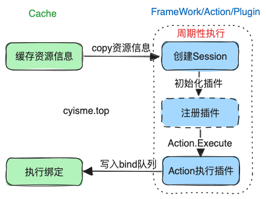
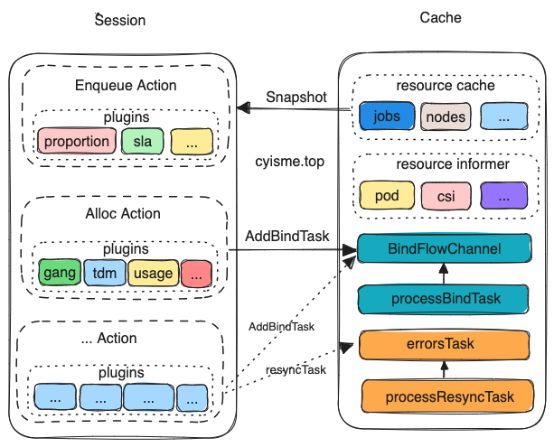

# Volcano Scheduler调度器源码解析
本文从源码的角度分析Volcano Scheduler相关功能的实现。 

本篇Volcano版本为v1.8.0。

>Volcano项目地址: [https://github.com/volcano-sh/volcano](https://github.com/volcano-sh/volcano)
>
>controller命令main入口: cmd/scheduler/main.go
>
>controller相关代码目录: pkg/scheduler

看过我之前文章[《从源码解析KubeScheduler调度过程》](cloud_native/k8s/scheduler/scheduler_flow)的朋友应该已经大致了解了`k8s`原生调度器的运行逻辑了。

`k8s scheduler`大致运行流程:

`k8s scheduler`的调度大概是从`infomer`监听事件到之后，就会对这个事件进行调度，期间会运行`framework`插件，最终绑定到目标`node`上。

`volcano scheduler`的调度和`k8s scheduler`的流程略有不同， 但是思想差不多。


`volcano scheduler`调度不是监听到事件后就执行调度， 而是周期性的(open ssn动作是周期性执行的)。 每过一段时间（默认1s）就会执行一次调度，期间会运行`plugin`插件，最终绑定到目标`node`上。



## Cache
`cache`组件会list/watch， 维护最新的资源信息。 注册`informer`事件的代码这里不做展示。
```go
type SchedulerCache struct {
    // ...
    // 一些informer...
	podInformer                infov1.PodInformer
	nodeInformer               infov1.NodeInformer
	podGroupInformerV1beta1    vcinformerv1.PodGroupInformer
	queueInformerV1beta1       vcinformerv1.QueueInformer
	pvInformer                 infov1.PersistentVolumeInformer
	pvcInformer                infov1.PersistentVolumeClaimInformer
	scInformer                 storagev1.StorageClassInformer
	pcInformer                 schedv1.PriorityClassInformer
	quotaInformer              infov1.ResourceQuotaInformer
	csiNodeInformer            storagev1.CSINodeInformer
	csiDriverInformer          storagev1.CSIDriverInformer
	csiStorageCapacityInformer storagev1beta1.CSIStorageCapacityInformer
	cpuInformer                cpuinformerv1.NumatopologyInformer
    // 用于绑定node
	Binder         Binder
    // 存储list/watch到的资源
    Jobs                 map[schedulingapi.JobID]*schedulingapi.JobInfo
	Nodes                map[string]*schedulingapi.NodeInfo
	Queues               map[schedulingapi.QueueID]*schedulingapi.QueueInfo
	PriorityClasses      map[string]*schedulingv1.PriorityClass
	NodeList             []string
	defaultPriorityClass *schedulingv1.PriorityClass
	defaultPriority      int32
	CSINodesStatus       map[string]*schedulingapi.CSINodeStatusInfo
    // ...
}
```
`cache`启动时，我们关注三个`goroutine`的工作职责。
```go
func (sc *SchedulerCache) Run(stopCh <-chan struct{}) {
	sc.informerFactory.Start(stopCh)
	sc.vcInformerFactory.Start(stopCh)
	// 处理错误的任务
	go wait.Until(sc.processResyncTask, 0, stopCh)
	// 清理job
	go wait.Until(sc.processCleanupJob, 0, stopCh)
    // 执行绑定操作
	go wait.Until(sc.processBindTask, time.Millisecond*20, stopCh)
    // ...
}
```
`processResyncTask`会从`errTasks`队列中， 取出`task`， 并重新从`apiserver`中获取资源信息更新它。
```go
func (sc *SchedulerCache) processResyncTask() {
	obj, shutdown := sc.errTasks.Get()
	// 省略一些代码
    // syncTask 会用从apiserver中获取到资源信息更新task
	if err := sc.syncTask(task); err != nil {
		sc.resyncTask(task)
	}
}
```
`processCleanupJob`会从`DeletedJobs`队列中， 取出`job`， 如果`job`已经完成，则删除`cache`中的`job`信息。
```go
func (sc *SchedulerCache) processCleanupJob() {
	obj, shutdown := sc.DeletedJobs.Get()
	if shutdown {
		return
	}
    // 省略一些代码
    // 
    // 判断job是否已经完成。如果pg和task都为空，则认为job已经完成
	if schedulingapi.JobTerminated(job) {
        // 从cache中删除job
		delete(sc.Jobs, job.UID)
	} else {
		// Retry
		sc.deleteJob(job)
	}
}
```
`processBindTask`会从`BindFlowChannel`channel中， 取出数个`task`， 执行绑定操作。
```go
func (sc *SchedulerCache) processBindTask() {
	for {
		select {
		case taskInfo, ok := <-sc.BindFlowChannel:
			if !ok {
				return
			}

			sc.bindCache = append(sc.bindCache, taskInfo)
            // 如果绑定任务达到batchNum，则执行绑定操作
            // batchNum默认为1
			if len(sc.bindCache) == sc.batchNum {
				sc.BindTask()
			}
		default:
		}

		if len(sc.BindFlowChannel) == 0 {
			break
		}
	}

	if len(sc.bindCache) == 0 {
		return
	}
	sc.BindTask()
}
func (sc *SchedulerCache) BindTask() {
	// 拷贝一份绑定任务
	var tmpBindCache []*schedulingapi.TaskInfo = make([]*schedulingapi.TaskInfo, len(sc.bindCache))
	copy(tmpBindCache, sc.bindCache)
    // 异步执行绑定操作
	go func(tasks []*schedulingapi.TaskInfo) {
		successfulTasks := make([]*schedulingapi.TaskInfo, 0)
		for _, task := range tasks {
            // 检查voluem是否已经准备好， 过滤出可以绑定的task
			if err := sc.VolumeBinder.BindVolumes(task, task.PodVolumes); err != nil {
				sc.VolumeBinder.RevertVolumes(task, task.PodVolumes)
                // 如果volume没有准备好，放到errTasks队列中，等待更新信息
				sc.resyncTask(task)
			} else {
				successfulTasks = append(successfulTasks, task)
			}
		}

		bindTasks := make([]*schedulingapi.TaskInfo, len(successfulTasks))
		copy(bindTasks, successfulTasks)
        // 执行绑定操作， 调用k8s api
		if err := sc.Bind(bindTasks); err != nil {
			return
		}
	}(tmpBindCache)
    // 清空列表
	sc.bindCache = sc.bindCache[0:0]
}
```
## Framework
`framework`中的主要对象其实是`session`, 一个调度周期会开启一个`session`, 调度工作将会在这个`session`中进行。 
> 如果参照`k8s scheduler`， `session`其实对应的就是`k8s framework`。

`session`是插件的载体与管理者， 由`Action`触发。 

`session`会存储当前的资源信息， 以及插件的注册信息。
```go
type Session struct {
    // 省略一些代码
    // 用于存储cache中的资源信息, 这些信息是深拷贝的
	Jobs           map[api.JobID]*api.JobInfo
	Nodes          map[string]*api.NodeInfo
	CSINodesStatus map[string]*api.CSINodeStatusInfo
	RevocableNodes map[string]*api.NodeInfo
	Queues         map[api.QueueID]*api.QueueInfo
	NamespaceInfo  map[api.NamespaceName]*api.NamespaceInfo
    // 存储启用的插件名称
	Tiers          []conf.Tier
    // 存储插件对象
    plugins           map[string]Plugin
    // 存储事件处理函数
    eventHandlers     []*EventHandler
    // 这些func用于判断资源需要调用哪些插件
    // map[插件名称]具体方法
    // 插件中会根据自己的需求， 将自己的名称以及对应的方法注册到session中
    // 这些方法将会在不同的Action中调用
	jobOrderFns       map[string]api.CompareFn
	clusterOrderFns   map[string]api.CompareFn
	jobStarvingFns    map[string]api.ValidateFn
    // 省略了一些*Fns 
    // ...
}
```
### session的生命周期
`OpenSission`方法会返回一个新的`session`对象, 对应一个新的调度周期。 

```go
func OpenSession(cache cache.Cache, tiers []conf.Tier, configurations []conf.Configuration) *Session {
	ssn := openSession(cache)
    // 省略一些代码
    // 
	for _, tier := range tiers {
		for _, plugin := range tier.Plugins {
            // scheduler启动时会将每个插件的名称以及对应的构建方法注册到一个pluginBuilders map中
            // 这里会根据这个map， 获取到插件的构建方法， 并执行构建方法， 返回一个插件对象
			if pb, found := GetPluginBuilder(plugin.Name); !found {
				klog.Errorf("Failed to get plugin %s.", plugin.Name)
			} else {
				plugin := pb(plugin.Arguments)
				ssn.plugins[plugin.Name()] = plugin
				onSessionOpenStart := time.Now()
                // OnSessionOpen 中会注册上述的 *Fns 
				plugin.OnSessionOpen(ssn)
			}
		}
	}
	return ssn
}
func openSession(cache cache.Cache) *Session {
	ssn := &Session{
		// 省略一些代码
	}
    // 从cache中获取资源信息， 并深拷贝到session中
	snapshot := cache.Snapshot()

	ssn.Jobs = snapshot.Jobs
	for _, job := range ssn.Jobs {
		// only conditions will be updated periodically
		if job.PodGroup != nil && job.PodGroup.Status.Conditions != nil {
			ssn.podGroupStatus[job.UID] = *job.PodGroup.Status.DeepCopy()
		}
        // 检查job是否可以调度， jobValid目前只有gang插件注册了
		if vjr := ssn.JobValid(job); vjr != nil {
			if !vjr.Pass {
				jc := &scheduling.PodGroupCondition{
					Type:               scheduling.PodGroupUnschedulableType,
					Status:             v1.ConditionTrue,
					LastTransitionTime: metav1.Now(),
					TransitionID:       string(ssn.UID),
					Reason:             vjr.Reason,
					Message:            vjr.Message,
				}

				if err := ssn.UpdatePodGroupCondition(job, jc); err != nil {
					klog.Errorf("Failed to update job condition: %v", err)
				}
			}

			delete(ssn.Jobs, job.UID)
		}
	}
    // 深拷贝其他资源信息
    ssn.Nodes = snapshot.Nodes
    // 省略...

	return ssn
}
```

对应的`CloseSession`方法会在调度周期结束时调用, 执行收尾工作，并清理`session`中数据。
```go
func CloseSession(ssn *Session) {
	for _, plugin := range ssn.plugins {
		onSessionCloseStart := time.Now()
        // 调用插件的OnSessionClose方法， 方法中会有如设置pg状态等收尾工作
		plugin.OnSessionClose(ssn)
		metrics.UpdatePluginDuration(plugin.Name(), metrics.OnSessionClose, metrics.Duration(onSessionCloseStart))
	}

	closeSession(ssn)
}
func closeSession(ssn *Session) {
    // 更新cache中的数据状态
	ju := newJobUpdater(ssn)
	ju.UpdateAll()
	updateQueueStatus(ssn)
    // 清理session中的数据
	ssn.Jobs = nil
    // 省略...
}
```
### statement
`statement`用于存储这一次“打包”调度的信息， 最终统一提交或取消。
```go
// 存储task的操作信息
type operation struct {
	// 操作名称， Evict/Pipeline/Allocate
	name   Operation
	// 操作的task
	task   *api.TaskInfo
	// 操作的原因
	reason string
}
type Statement struct {
	operations []operation
	ssn        *Session
}
```
对应三个操作名称， 有三个方法，供`plugin`调用。以`Evict`举例：
```go
func (s *Statement) Evict(reclaimee *api.TaskInfo, reason string) error {
	// 更新session中的job状态
	if job, found := s.ssn.Jobs[reclaimee.Job]; found {
		if err := job.UpdateTaskStatus(reclaimee, api.Releasing); err != nil {
		}
	} else {
	}

	// 更新node中task的状态
	if node, found := s.ssn.Nodes[reclaimee.NodeName]; found {
		err := node.UpdateTask(reclaimee)
		if err != nil {
			return err
		}
	}
	// 触发session中的事件处理函数
	for _, eh := range s.ssn.eventHandlers {
		if eh.DeallocateFunc != nil {
			eh.DeallocateFunc(&Event{
				Task: reclaimee,
			})
		}
	}
	// 加入到待处理列表
	s.operations = append(s.operations, operation{
		name:   Evict,
		task:   reclaimee,
		reason: reason,
	})

	return nil
}
// evict用于提交操作， cache组件会调用api更新。
func (s *Statement) evict(reclaimee *api.TaskInfo, reason string) error {
	if err := s.ssn.cache.Evict(reclaimee, reason); err != nil {
		if e := s.unevict(reclaimee); e != nil {
			klog.Errorf("Faled to unevict task <%v/%v>: %v.", reclaimee.Namespace, reclaimee.Name, e)
		}
		return err
	}

	return nil
}
// unevict用于撤销操作恢复task状态, 是上面的逆操作
func (s *Statement) unevict(reclaimee *api.TaskInfo) error {
	// Update status in session
	job, found := s.ssn.Jobs[reclaimee.Job]
	if found {
		if err := job.UpdateTaskStatus(reclaimee, api.Running); err != nil {
		}
	} else {
	
	}

	// Update task in node.
	if node, found := s.ssn.Nodes[reclaimee.NodeName]; found {
		err := node.UpdateTask(reclaimee)
		if err != nil {
			return err
		}
	}

	for _, eh := range s.ssn.eventHandlers {
		if eh.AllocateFunc != nil {
			eh.AllocateFunc(&Event{
				Task: reclaimee,
			})
		}
	}

	return nil
}
```
`plugin`会在最后根据情况判断是否提交或者取消。
```go
// 撤销
func (s *Statement) Discard() {
	for i := len(s.operations) - 1; i >= 0; i-- {
		op := s.operations[i]
		op.task.GenerateLastTxContext()
		switch op.name {
		case Evict:
			err := s.unevict(op.task)
		case Pipeline:
			err := s.unpipeline(op.task)
		case Allocate:
			err := s.unallocate(op.task)
		}
	}
}
// 提交
func (s *Statement) Commit() {
	klog.V(3).Info("Committing operations ...")
	for _, op := range s.operations {
		op.task.ClearLastTxContext()
		switch op.name {
		case Evict:
			err := s.evict(op.task, op.reason)
		case Pipeline:
			s.pipeline(op.task)
		case Allocate:
			err := s.allocate(op.task)
		}
	}
}
```
## Actions
`action`是触发执行`plugin`的动作。
> 如果参照`k8s scheduler`， `action`相当于preFilter、Fileter、PostFilter、PreBind、Bind、PostBind等这些动作。

`action`有6种：
- Enqueue 调度器的准备阶段， 判断资源是否满足调度条件。一般作为调度的前置条件。 Enqueue 能够防止集群下有大量不能调度的pod，提高了调度器的性能。
- Allocate 执行调度操作（分配node）， 是必不可缺的一步
- Preempt 抢占资源， 用于处理高优先级调度问题。 可以在同queue或同job中抢占资源。
- Backfill 回填步骤，处理待调度Pod列表中没有指明资源申请量的Pod调度。 Backfill能够提高集群吞吐量，提高资源利用率。
- Reclaim 根据队列权重回收队列的资源。
- Shuffle 根据资源状况重新分配节点

可以在volcano的配置中，指定使用哪些`action`以及`plugin`。
```yaml
# kubectl get configmap volcano-scheduler-configmap -nvolcano-system -oyaml
apiVersion: v1
data:
volcano-scheduler.conf: |
actions: "enqueue, allocate, backfill"
tiers:
- plugins:
  - name: priority
  - name: gang
  - name: conformance
- plugins:
  - name: drf
  - name: predicates
  - name: proportion
  - name: nodeorder
  - name: binpack
kind: ConfigMap
metadata:
annotations:
creationTimestamp: "2020-08-15T04:01:02Z"
name: volcano-scheduler-configmap
namespace: volcano-system
```
配置文件中声明的`actions`顺序即为实际执行的顺序， 在上面的配置文件的声明中，将依次执行`enqueue, allocate, backfill`三个`action`。

`volcano`并不会检查`action`顺序的合理性，`action`可以任意顺序。

`action`需要实现`framework`中定义的`Action interface`。
```go
type Action interface {
	// 唯一名称
	Name() string
	// 初始化动作
	Initialize()
	// 执行动作
	Execute(ssn *Session)
	// 取消初始化
	UnInitialize()
}
```
`Execute`中会调用`session`中由`plugins`注册的方法, 以`enqueue`动作为例：
```go
func (enqueue *Action) Execute(ssn *framework.Session) {

	for _, job := range ssn.Jobs {
		//...
	}

	for {
		// ...
		// ssn.JobEnqueueable调用plugin方法
		if job.PodGroup.Spec.MinResources == nil || ssn.JobEnqueueable(job) {
			ssn.JobEnqueued(job)
			job.PodGroup.Status.Phase = scheduling.PodGroupInqueue
			ssn.Jobs[job.UID] = job
		}

		// Added Queue back until no job in Queue.
		queues.Push(queue)
	}
}
// ssn.JobEnqueueable
func (ssn *Session) JobEnqueueable(obj interface{}) bool {
	var hasFound bool
	for _, tier := range ssn.Tiers {
		for _, plugin := range tier.Plugins {
			// 未启用enqueue动作则跳过
			if !isEnabled(plugin.EnabledJobEnqueued) {
				continue
			}
			// 未注册方法则跳过
			fn, found := ssn.jobEnqueueableFns[plugin.Name]
			if !found {
				continue
			}
			// 执行
			res := fn(obj)
			if res < 0 {
				return false
			}
			if res > 0 {
				hasFound = true
			}
		}
		// 如果存在enqueue插件， 则代表允许排队， 这个函数中，不再执行下一Tiers的插件
		if hasFound {
			return true
		}
	}

	return true
}
``` 

## Plugins
`plugins`是`volcano`实现调度逻辑的核心， 也是`volcano`的核心竞争力。

`plugins`在`init`方法中注册自己的初始化函数到`pluginBuilders`中， 供`session`在`OpenSession`时调用。
```go
func init() {
	framework.RegisterPluginBuilder(drf.PluginName, drf.New)
	framework.RegisterPluginBuilder(gang.PluginName, gang.New)
	// 省略...
}
```
`plugin`需要实现`framework`中定义的`Plugin interface`。
```go
type Plugin interface {
	// 插件唯一名称
	Name() string
	// 在OpenSession时调用
	OnSessionOpen(ssn *Session)
	// 在CloseSession时调用
	OnSessionClose(ssn *Session)
}
```
`OpenSession`时会调用`plugin`的`OnSessionOpen`方法， `plugin`会在这时向`session`注册自己的方法。

如`gang`插件中会注册数个方法:
```go
func (gp *gangPlugin) OnSessionOpen(ssn *framework.Session) {
	validJobFn := func(obj interface{}) *api.ValidateResult {
		//...
	}
	ssn.AddJobValidFn(gp.Name(), validJobFn)
	preemptableFn := func(preemptor *api.TaskInfo, preemptees []*api.TaskInfo) ([]*api.TaskInfo, int){
		//...
	}
	ssn.AddReclaimableFn(gp.Name(), preemptableFn)
	ssn.AddPreemptableFn(gp.Name(), preemptableFn)
	//....
}
```
`CloseSession`时会调用`plugin`的`OnSessionClose`方法， `plugin`会在这时会执行清理、检查等收尾工作。
```go
func (gp *gangPlugin) OnSessionClose(ssn *framework.Session) {
	var unreadyTaskCount int32
	var unScheduleJobCount int
	for _, job := range ssn.Jobs {
		if !job.Ready() {
			// ...
			// 检查未就绪的task数量
			unreadyTaskCount = job.MinAvailable - schedulableTaskNum()
			// 更新pg状态
			jc := &scheduling.PodGroupCondition{
				Type:               scheduling.PodGroupUnschedulableType,
				Status:             v1.ConditionTrue,
				LastTransitionTime: metav1.Now(),
				TransitionID:       string(ssn.UID),
				Reason:             v1beta1.NotEnoughResourcesReason,
				Message:            msg,
			}

			if err := ssn.UpdatePodGroupCondition(job, jc); err != nil {
				klog.Errorf("Failed to update job <%s/%s> condition: %v",
					job.Namespace, job.Name, err)
			}
			// 省略...
	}
}
```
## 运行流程

`scheduler.Run`会启动整个调度器。
```go
func (pc *Scheduler) Run(stopCh <-chan struct{}) {
	// 监听配置文件变化
	pc.loadSchedulerConf()
	go pc.watchSchedulerConf(stopCh)
	// 启动cache
	pc.cache.SetMetricsConf(pc.metricsConf)
	pc.cache.Run(stopCh)
	pc.cache.WaitForCacheSync(stopCh)
	// 启动调度， 每隔一段时间执行一次
	go wait.Until(pc.runOnce, pc.schedulePeriod, stopCh)
	if options.ServerOpts.EnableCacheDumper {
		pc.dumper.ListenForSignal(stopCh)
	}
}
```
`runOnce`会每隔一段时间执行一次， 创建一个新的`session`执行动作。
```go
func (pc *Scheduler) runOnce() {
	// 周期性调度
	pc.mutex.Lock()
	actions := pc.actions
	plugins := pc.plugins
	configurations := pc.configurations
	pc.mutex.Unlock()

	// 动态watch配置， 所以每次调度都会重新加载配置
	conf.EnabledActionMap = make(map[string]bool)
	for _, action := range actions {
		conf.EnabledActionMap[action.Name()] = true
	}
	// 打开一个session
	ssn := framework.OpenSession(pc.cache, plugins, configurations)
	defer func() {
		// 关闭session
		framework.CloseSession(ssn)
		metrics.UpdateE2eDuration(metrics.Duration(scheduleStartTime))
	}()
	// 执行actions
	for _, action := range actions {
		actionStartTime := time.Now()
		// 执行plugins
		action.Execute(ssn)
		metrics.UpdateActionDuration(action.Name(), metrics.Duration(actionStartTime))
	}
}
```
会按照配置文件中的顺序执行`action`, `action.Execute`会调用`plugin`注册的方法, 对task、job进行处理， 最终会由`backfill`、`alloc`或者`preempt`动作中调用对应的方法添加到`cache`的`BindFlowChannel`中， 等待绑定。 


