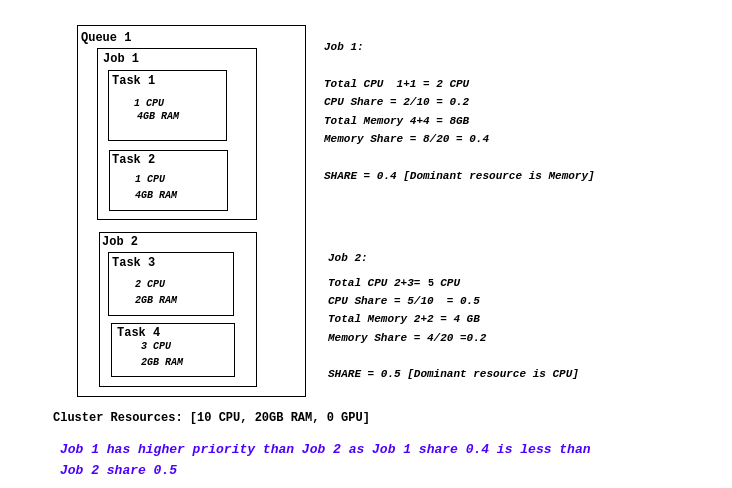

# Volcano Scheduler(Plugins&Actions)调度器源码解析
本文从源码的角度分析Volcano Scheduler中`Actions`和`Plugins`相关功能的实现。 

本篇Volcano版本为v1.8.0。

>Volcano项目地址: [https://github.com/volcano-sh/volcano](https://github.com/volcano-sh/volcano)
>
>controller命令main入口: cmd/scheduler/main.go
>
>controller相关代码目录: pkg/scheduler

`Volcano`的调度过程可以查看[《Volcano Scheduler调度器源码解析》](/cloud_native/volcano/scheduler/flow/)

> 感觉`volcano`中插件的方法类型实在太多了， 对于开发者学习成本很大。
>
> 而且里面有很多奇奇怪怪不通顺的逻辑（个人感觉）， 比如：
> 
> 用action去触发plugin， 而不是plugin向action中注册方法，感觉很别扭～
>
> 像MinAvailable这样的管理属性， 在podgroup上， 使用时是从job的角度取用， 而podgroup又ref job， 感觉也很奇怪。
>

## Actions
### enqueue
`enqueue`会对`Queue`和`Job`这两个资源排序， 然后按照此顺序，判断当前环境是否满足`job`运行条件,满足的`job`(PodGroup)将会被标记为“Inqueue”状态。 

所调用的插件方法,以及提供此方法的插件：
- QueueOrderFn 用于排序`Queue`资源
  - drf
  - proportion
- jobOrderFn 用于排序`Job`资源
  - drf
  - gang
  - priority
  - sla
  - tdm
- JobEnqueueable 用于判断`Job`是否可以被调度
  - extender
  - overcommit
  - proportion
  - resourcequota
  - sla
- JobEnqueued 用于标记`Job`已经开始调度
  - overcommit
```go
func (enqueue *Action) Execute(ssn *framework.Session) {
    // 数据准备阶段
    // 传入queue排序方法，对queue进行排序
    // 实际是用的堆排序
	queues := util.NewPriorityQueue(ssn.QueueOrderFn)
    // 用于去重
	queueSet := sets.NewString()
    // 存储queue中的job
    // {queueID: [job,job2]}
	jobsMap := map[api.QueueID]*util.PriorityQueue{}

	for _, job := range ssn.Jobs {
        // 如果job的queue不存在，跳过
		if queue, found := ssn.Queues[job.Queue]; !found {
			continue
		} else if !queueSet.Has(string(queue.UID)) {
			// 如果queue没有添加到queues中，添加到queues中
			queueSet.Insert(string(queue.UID))
			queues.Push(queue)
		}
        // 如果job是pending状态，添加到jobsMap中
		if job.IsPending() {
			if _, found := jobsMap[job.Queue]; !found {
                // 如果jobsMap中没有queue，创建一个queue
                // 一样是用的堆排序
				jobsMap[job.Queue] = util.NewPriorityQueue(ssn.JobOrderFn)
			}
			jobsMap[job.Queue].Push(job)
		}
	}
    // 数据处理阶段
    // 遍历queues，对每个queue中的job进行准入判断
    // 这意味将会阻塞当前这个session
	for {
        // 如果queues为空，跳出循环
		if queues.Empty() {
			break
		}
        // 取出queue
		queue := queues.Pop().(*api.QueueInfo)
		// 如果queue中没有job，跳过
		jobs, found := jobsMap[queue.UID]
		if !found || jobs.Empty() {
			continue
		}
		job := jobs.Pop().(*api.JobInfo)
        // 如果job没有资源要求， 或者JobEnqueueable允许，标记job已经开始调度
		if job.PodGroup.Spec.MinResources == nil || ssn.JobEnqueueable(job) {
			ssn.JobEnqueued(job)
            // 将podgroup的状态设置为Inqueue
			job.PodGroup.Status.Phase = scheduling.PodGroupInqueue
			ssn.Jobs[job.UID] = job
		}

		// 再次将queue加入到queues中
        // 这是因为在这次处理中， queue中的job有可能并没有全部处理完成
		queues.Push(queue)
	}
}
```
### allocate
`allocate`对`Queue`和`Job`这两个资源排序， 如果`job`状态为`pending`，则会尝试为其分配`node`资源。

`node`的选择会经历筛选、评分和选优三个阶段。

所调用的插件方法,以及提供此方法的插件：
- QueueOrderFn 用于排序`Queue`资源
  - 参照上文
- jobOrderFn 用于排序`Job`资源
  - 参照上文
- TaskOrderFn 用于排序`Task`资源
  - priority
  - topology
- JobValid 判断`job`是否可以进行分配
  - gang
- PredicateFn 判断`node`是否满足`task`的运行需求
  - extender
  - numaaware
  - predicates
  - tdm
  - usage
- Overused 判断`queue`是否超出资源限制
  - extender
  - proportion
- Allocatable 判断指定`queue`是否可以对`task`进行分配
  - priority
- PrePredicateFn 判断`task`是否可以进行分配
  - predicates
- BatchNodeOrderFn 不同维度对`node`评分
  - extender
  - nodeorder
  - numaaware
- NodeOrderMapFn 不同维度对`node`评分
  - binpack
  - nodeorder
  - topology
  - tdm
  - usage 
- NodeOrderReduceFn 不同维度对`node`评分
  - 暂无
- BestNodeFn 选择最佳的`node`
  - 暂无
- JobReady 判断`job`是否可以执行分配动作
  - extender
  - gang
- JobPipelined 判断`job`是否在排序等待资源中
  - gang
  - sla
  - tdm

```go
func (alloc *Action) Execute(ssn *framework.Session) {
    // 数据准备阶段
    // 创建存储变量
	queues := util.NewPriorityQueue(ssn.QueueOrderFn)
	jobsMap := map[api.QueueID]*util.PriorityQueue{}

	for _, job := range ssn.Jobs {
		// 如果开启了enqueue
		if conf.EnabledActionMap["enqueue"] {
            // 且job是pending状态，跳过
			if job.IsPending() {
				continue
			}
		} else if job.IsPending() {
			// 反之则将job标记为Inqueue状态
			job.PodGroup.Status.Phase = scheduling.PodGroupInqueue
		}
		if vr := ssn.JobValid(job); vr != nil && !vr.Pass {
            // 如果job不具备分配条件，跳过
			continue
		}
		if _, found := ssn.Queues[job.Queue]; !found {
			// 如果job的queue不存在，跳过
			continue
		}
        // 添加queue和job
		if _, found := jobsMap[job.Queue]; !found {
			jobsMap[job.Queue] = util.NewPriorityQueue(ssn.JobOrderFn)
			queues.Push(ssn.Queues[job.Queue])
		}
		jobsMap[job.Queue].Push(job)
	}

    // 检测node资源是否满足task的需求
	predicateFn := func(task *api.TaskInfo, node *api.NodeInfo) ([]*api.Status, error) {
		// Check for Resource Predicate
		if ok, resources := task.InitResreq.LessEqualWithResourcesName(node.FutureIdle(), api.Zero); !ok {
			return nil, api.NewFitError(task, node, api.WrapInsufficientResourceReason(resources))
		}
		var statusSets util.StatusSets
		statusSets, err := ssn.PredicateFn(task, node)
		if err != nil {
			return nil, fmt.Errorf("predicates failed in allocate for task <%s/%s> on node <%s>: %v",
				task.Namespace, task.Name, node.Name, err)
		}

		if statusSets.ContainsUnschedulable() || statusSets.ContainsUnschedulableAndUnresolvable() ||
			statusSets.ContainsErrorSkipOrWait() {
			return nil, fmt.Errorf("predicates failed in allocate for task <%s/%s> on node <%s>, status is not success",
				task.Namespace, task.Name, node.Name)
		}
		return nil, nil
	}
    // 开始处理
	for {
		if queues.Empty() {
			break
		}
		queue := queues.Pop().(*api.QueueInfo)
		if ssn.Overused(queue) {
			// 如果queue超出资源限制，跳过
			continue
		}
		jobs, found := jobsMap[queue.UID]
		if !found || jobs.Empty() {
			continue
		}
		job := jobs.Pop().(*api.JobInfo)
		if _, found = pendingTasks[job.UID]; !found {
			tasks := util.NewPriorityQueue(ssn.TaskOrderFn)
			for _, task := range job.TaskStatusIndex[api.Pending] {
				// 如果task没有资源需求，跳过
				if task.Resreq.IsEmpty() {
					continue
				}

				tasks.Push(task)
			}
            // 更新pendingTasks
			pendingTasks[job.UID] = tasks
		}
        // 取出job的pendingTasks， 
		tasks := pendingTasks[job.UID]
		queues.Push(queue)
		if tasks.Empty() {
			continue
		}
        // 为本次分配创建一个statement
		stmt := framework.NewStatement(ssn)
        // 用于存储node的检测结果
		ph := util.NewPredicateHelper()
		for !tasks.Empty() {
			task := tasks.Pop().(*api.TaskInfo)

			if !ssn.Allocatable(queue, task) {
				// 如果queue不具备分配条件，跳过
				continue
			}
            // 预检测task是否可以分配
			if err := ssn.PrePredicateFn(task); err != nil {
				fitErrors := api.NewFitErrors()
				for _, ni := range allNodes {
					fitErrors.SetNodeError(ni.Name, err)
				}
				job.NodesFitErrors[task.UID] = fitErrors
				break
			}
            // 对node进行筛选
			predicateNodes, fitErrors := ph.PredicateNodes(task, allNodes, predicateFn, true)
			if len(predicateNodes) == 0 {
                // predicateNodes为0，说明没有node满足task的需求
				job.NodesFitErrors[task.UID] = fitErrors
				break
			}
            // 候选节点分为两种
            // 1. idleCandidateNodes： 当前资源满足task的需求
            // 2. futureIdleCandidateNodes： 释放资源后（未来）满足task的需求
			var candidateNodes [][]*api.NodeInfo
			var idleCandidateNodes []*api.NodeInfo
			var futureIdleCandidateNodes []*api.NodeInfo
			for _, n := range predicateNodes {
				if task.InitResreq.LessEqual(n.Idle, api.Zero) {
					idleCandidateNodes = append(idleCandidateNodes, n)
				} else if task.InitResreq.LessEqual(n.FutureIdle(), api.Zero) {
					futureIdleCandidateNodes = append(futureIdleCandidateNodes, n)
				} else {
				}
			}
			candidateNodes = append(candidateNodes, idleCandidateNodes)
			candidateNodes = append(candidateNodes, futureIdleCandidateNodes)

			var bestNode *api.NodeInfo
			for index, nodes := range candidateNodes {
				switch {
				case len(nodes) == 0: // 没得选了
				case len(nodes) == 1: // 只有一个node，直接使用
					bestNode = nodes[0]
				case len(nodes) > 1: // 多个node，进行评分
					nodeScores := util.PrioritizeNodes(task, nodes, ssn.BatchNodeOrderFn, ssn.NodeOrderMapFn, ssn.NodeOrderReduceFn)

					bestNode = ssn.BestNodeFn(task, nodeScores)
					if bestNode == nil {
                        // 暂时没有实现ssn.BestNodeFn的插件
                        // 所以会直接走到这里。 这里会选择评分最高的那一组node，然后从中随机选择一个
						bestNode = util.SelectBestNode(nodeScores)
					}
				}
                // 优先选择idleCandidateNodes
                // 如果找到了node，跳出循环
				if bestNode != nil {
					break
				}
			}

			// 对比node资源情况，如果当前node资源满足task的需求，直接分配
			if task.InitResreq.LessEqual(bestNode.Idle, api.Zero) {
				if err := stmt.Allocate(task, bestNode); err != nil {
				} else {
				}
			} else {
                // 未来可能满足需求， 将task标记为pipelined状态
				if task.InitResreq.LessEqual(bestNode.FutureIdle(), api.Zero) {
					if err := stmt.Pipeline(task, bestNode.Name); err != nil {
					} else {
					}
				}
			}
            // 如果已经job已经准备好了， 并且tasks不为空，将剩余的task重新放回tasks中
			if ssn.JobReady(job) && !tasks.Empty() {
				jobs.Push(job)
				break
			}
		}
        // 提交或者丢弃statement
		if ssn.JobReady(job) {
			stmt.Commit()
		} else {
			if !ssn.JobPipelined(job) {
				stmt.Discard()
			}
		}
	}
}
```
### preemt
`preemt`会查看当前处于调度过程中的`job`是否需要更多的资源，如果需要，会尝试从其他`job`中抢占资源。

所调用的插件方法,以及提供此方法的插件：
- jobOrderFn 用于排序`Job`资源
  - 参照上文
- TaskOrderFn 用于排序`Task`资源
  - priority
  - topology
- JobValid 判断`job`是否可以进行分配
  - gang
- JobStarving 判断`job`是否需要更多资源
  - gang
  - priority
  - tdm
- PredicateFn 判断`node`是否满足`task`的运行需求
  - 参照上文
- PrePredicateFn 判断`task`是否可以进行分配
  - 参照上文
- BatchNodeOrderFn NodeOrderMapFn NodeOrderReduceFn 多维度评分
  - 参照上文
- Preemptable 返回可以被抢占的受害者`task`列表
  - cdp
  - conformance
  - drf
  - extender
  - gang
  - priority
  - tdm 
- VictimTasks 获取需要驱逐的`task`
  - reschduler
  - tdm

```go
func (pmpt *Action) Execute(ssn *framework.Session) {
	klog.V(5).Infof("Enter Preempt ...")
	defer klog.V(5).Infof("Leaving Preempt ...")
    // 有抢占需求的： queue和jobs的映射关系
	preemptorsMap := map[api.QueueID]*util.PriorityQueue{}
    // 有抢占需求的： job和task的映射关系
	preemptorTasks := map[api.JobID]*util.PriorityQueue{}
    // 省略数据准备阶段
    // ...

	ph := util.NewPredicateHelper()
	// jobs抢占的范围为queue内
	for _, queue := range queues {
		for {
            // 获取一个job对象， 查看是否有抢占需求
			preemptorJob := preemptors.Pop().(*api.JobInfo)

			stmt := framework.NewStatement(ssn)
			assigned := false
			for {
				// 如果job没有抢占需求，跳过
				if !ssn.JobStarving(preemptorJob) {
					break
				}
				// 如果没有job内没有抢占需求，跳过
				if preemptorTasks[preemptorJob.UID].Empty() {
					break
				}
                // 取出一个task，为它进行抢占
				preemptor := preemptorTasks[preemptorJob.UID].Pop().(*api.TaskInfo)
                // preempt用于判断和处理抢占状态, func参数用于判断指定的task是否可以被抢占
				if preempted, _ := preempt(ssn, stmt, preemptor, func(task *api.TaskInfo) bool {
					if task.Status != api.Running {
						return false
					}
					if task.Resreq.IsEmpty() {
						return false
					}
					if !task.Preemptable {
						return false
					}
					job, found := ssn.Jobs[task.Job]
					if !found {
						return false
					}
					// 同一个队列内， 不抢占自己
					return job.Queue == preemptorJob.Queue && preemptor.Job != task.Job
				}, ph); preempted {
					assigned = true
				}
			}

			// 如果job已经准备好了，处于pipelined状态， 提交statement
			if ssn.JobPipelined(preemptorJob) {
				stmt.Commit()
			} else {
				stmt.Discard()
				continue
			}
            
			if assigned {
				preemptors.Push(preemptorJob)
			}
		}
		// underRequest为需要抢占的job， 里面的job数量不会因为抢占的结果和改变
        // 他将使抢占的job的优先级高于其他job
		for _, job := range underRequest {
			preemptorTasks[job.UID] = util.NewPriorityQueue(ssn.TaskOrderFn)
            // 将pending状态的task加入到preemptorTasks中
			for _, task := range job.TaskStatusIndex[api.Pending] {
				preemptorTasks[job.UID].Push(task)
			}
			for {
				preemptor := preemptorTasks[job.UID].Pop().(*api.TaskInfo)
				stmt := framework.NewStatement(ssn)
				assigned, _ := preempt(ssn, stmt, preemptor, func(task *api.TaskInfo) bool {
					if task.Status != api.Running {
						return false
					}
					if task.Resreq.IsEmpty() {
						return false
					}
					return preemptor.Job == task.Job
				}, ph)
				stmt.Commit()
				if !assigned {
					break
				}
			}
		}
	}

	// 执行驱逐
	victimTasks(ssn)
}
```
`preempt`包含了主要逻辑
```go
func preempt(
	ssn *framework.Session,
	stmt *framework.Statement,
	preemptor *api.TaskInfo,
	filter func(*api.TaskInfo) bool,
	predicateHelper util.PredicateHelper,
) (bool, error) {
	assigned := false
	// 省略node筛选的代码， 可以参考allocate
    // ...
    // 选择最佳的nodes
	selectedNodes := util.SortNodes(nodeScores)

	for _, node := range selectedNodes {
        // 有可能可以被驱逐的task
		var preemptees []*api.TaskInfo
		for _, task := range node.Tasks {
			if filter == nil {
				preemptees = append(preemptees, task.Clone())
			} else if filter(task) {
				preemptees = append(preemptees, task.Clone())
			}
		}
        // 获取可以被驱逐的task
		victims := ssn.Preemptable(preemptor, preemptees)
        // 可以驱逐的task排序， 优先级低的先被驱逐
		victimsQueue := util.NewPriorityQueue(func(l, r interface{}) bool {
			lv := l.(*api.TaskInfo)
			rv := r.(*api.TaskInfo)
			if lv.Job != rv.Job {
				return !ssn.JobOrderFn(ssn.Jobs[lv.Job], ssn.Jobs[rv.Job])
			}
			return !ssn.TaskOrderFn(l, r)
		})
		for _, victim := range victims {
			victimsQueue.Push(victim)
		}

		for !victimsQueue.Empty() {
			// 如果有足够的资源了就跳出循环
			if !ssn.Overused(currentQueue) && preemptor.InitResreq.LessEqual(node.FutureIdle(), api.Zero) {
				break
			}
			preemptee := victimsQueue.Pop().(*api.TaskInfo)
			if err := stmt.Evict(preemptee, "preempt"); err != nil {
				continue
			}
		}
		if !ssn.Overused(currentQueue) && preemptor.InitResreq.LessEqual(node.FutureIdle(), api.Zero) {
			if err := stmt.Pipeline(preemptor, node.Name); err != nil {
			}
			assigned = true
			break
		}
	}
	return assigned, nil
}
```
### reclaim
根据队列权重回收队列的资源。

所调用的插件方法,以及提供此方法的插件：
- Reclaimable 获取可以被回收的task
  - conformance
  - drf
  - extender
  - gang
  - priority
- 其他重复的方法，不再赘述
```go
func (ra *Action) Execute(ssn *framework.Session) {

	queues := util.NewPriorityQueue(ssn.QueueOrderFn)
	queueMap := map[api.QueueID]*api.QueueInfo{}

	preemptorsMap := map[api.QueueID]*util.PriorityQueue{}
	preemptorTasks := map[api.JobID]*util.PriorityQueue{}
    // 省略数据准备阶段， pendingTasks的获取
    // ...

	for {
		// If no queues, break
		if queues.Empty() {
			break
		}

		var job *api.JobInfo
		var task *api.TaskInfo
        // 省略数据弹出和能否调度的判断
        // ...

		assigned := false
		for _, n := range ssn.Nodes {
			// 省略node能否被调度节点的判断
            // ...
			var reclaimees []*api.TaskInfo 
			for _, task := range n.Tasks {
				// Ignore non running task.
				if task.Status != api.Running {
					continue
				}
				if !task.Preemptable {
					continue
				}
				if j, found := ssn.Jobs[task.Job]; !found {
					continue
				} else if j.Queue != job.Queue {
					q := ssn.Queues[j.Queue]
                    // 判断队列是否可以被回收， 取的是spec.reclaimable
					if !q.Reclaimable() {
						continue
					}
					reclaimees = append(reclaimees, task.Clone())
				}
			}

			if len(reclaimees) == 0 {
				continue
			}
            // 获取可以被驱逐的task
			victims := ssn.Reclaimable(task, reclaimees)
            // 执行驱逐
			for _, reclaimee := range victims {
				if err := ssn.Evict(reclaimee, "reclaim"); err != nil {
					continue
				}
				reclaimed.Add(reclaimee.Resreq)
				if resreq.LessEqual(reclaimed, api.Zero) {
					break
				}
			}
            // 如果资源已经回收完成，跳出循环
			if task.InitResreq.LessEqual(reclaimed, api.Zero) {
				if err := ssn.Pipeline(task, n.Name); err != nil {
				}
				assigned = true

				break
			}
		}

		if assigned {
			jobs.Push(job)
		}
		queues.Push(queue)
	}
}
```

### 其他
- backfill 比较简单， 将未声明资源需求的task执行一遍PrePredicateFn、PredicateFn， 然后执行分配，且代码中todo太多， 不介绍
- shuffle 直接将运行中的job驱逐重新调度， 感觉没啥用...

## Plugins
举例一些常用的`plugins`实现方式。 插件有两个关键方法`OnSessionOpen`和`OnSessionClose`， 用于在session开始和结束时执行。 下面会按向“session”注册的方法（*Fns）拆分解析这两个方法。

### gang
依据podgroup中的`MinAvailable`和`MinTaskMember`， 只有当符合这两个条件时才会调度。观察Job下的Pod已调度数量是否满足了最小运行数量，当Job的最小运行数量得到满足时，为Job下的所有Pod执行调度动作，否则，不执行。它满足了调度过程中的“All or nothing”的调度需求。
#### OnSessionOpen 
`validJobFn`检查运行的pod最小成员数量是否满足要求
```go
// ... 
validJobFn := func(obj interface{}) *api.ValidateResult {
    job, ok := obj.(*api.JobInfo)
    // 检查是否符合podGroup中 MinTaskMember 的需求
    if valid := job.CheckTaskValid(); !valid {
        return &api.ValidateResult{
            Pass:    false,
            Reason:  v1beta1.NotEnoughPodsOfTaskReason,
            Message: "Not enough valid pods of each task for gang-scheduling",
        }
    }
    // 检查是否符合podGroup中 MinAvailable 的需求
    vtn := job.ValidTaskNum()
    if vtn < job.MinAvailable {
        return &api.ValidateResult{
            Pass:   false,
            Reason: v1beta1.NotEnoughPodsReason,
            Message: fmt.Sprintf("Not enough valid tasks for gang-scheduling, valid: %d, min: %d",
                vtn, job.MinAvailable),
        }
    }
    return nil
}

ssn.AddJobValidFn(gp.Name(), validJobFn)
// ...    
```
`preemptableFn`检查job中运行的数量是否大于`MinAvailable`， 如果大于， 则多出来的部分可以被抢占。
```go
	preemptableFn := func(preemptor *api.TaskInfo, preemptees []*api.TaskInfo) ([]*api.TaskInfo, int) {
		var victims []*api.TaskInfo
		jobOccupiedMap := map[api.JobID]int32{} // 实际运行的task数量
		for _, preemptee := range preemptees {
			job := ssn.Jobs[preemptee.Job]
			if _, found := jobOccupiedMap[job.UID]; !found {
				jobOccupiedMap[job.UID] = job.ReadyTaskNum() // 计算job中实际运行的task数量
			}
			if jobOccupiedMap[job.UID] > job.MinAvailable { // 如果job中运行的task数量大于MinAvailable， 则这部分可以被抢占
				jobOccupiedMap[job.UID]--
				victims = append(victims, preemptee)
			} else {
			}
		}
		return victims, util.Permit
	}
	ssn.AddReclaimableFn(gp.Name(), preemptableFn)
	ssn.AddPreemptableFn(gp.Name(), preemptableFn)
```
`pipelinedFn`判断当前`job`的等待+运行的task数量是否达到 MinAvailable的要求
```go
pipelinedFn := func(obj interface{}) int {
		ji := obj.(*api.JobInfo)
		occupied := ji.WaitingTaskNum() + ji.ReadyTaskNum()
        // CheckTaskPipelined 检查pipelined、Succeeded、BestEffort的task数量和是否满足TaskMinAvailable
		if ji.CheckTaskPipelined() && occupied >= ji.MinAvailable {
			return util.Permit
		}
		return util.Reject
	}
ssn.AddJobPipelinedFn(gp.Name(), pipelinedFn)
```
`jobStarvingFn` 判断当前`job`的等待+运行的task数量是否未达到 MinAvailable的要求
```go
	jobStarvingFn := func(obj interface{}) bool {
		ji := obj.(*api.JobInfo)
		occupied := ji.WaitingTaskNum() + ji.ReadyTaskNum()
		return occupied < ji.MinAvailable
	}
	ssn.AddJobStarvingFns(gp.Name(), jobStarvingFn)
```
以下两个方法比较简单， 不再展开代码：
- `jobOrderFn` 根据`job`的ready状态排序， ready的计算是当前运行的task数量是否>=MinAvailable
- `AddJobReadyFn` 根据当前task的数量， 判段是否与 MinAvailable 和 MinTaskMember 的要求一致 
#### OnSessionOpen 
统计调度状态(job还有多少未ready的)， 更新gp的状态信息
### priority
#### OnSessionOpen
`preemptableFn` 目标被抢占`task`的优先级低于 需要抢占资源`task`的优先级时， 目标`task`会被添加到受害者列表
```go
// preemptor 需要抢占资源的task
// preemptees 目标被抢占的tasks
preemptableFn := func(preemptor *api.TaskInfo, preemptees []*api.TaskInfo) ([]*api.TaskInfo, int) {
    preemptorJob := ssn.Jobs[preemptor.Job]
    var victims []*api.TaskInfo
    for _, preemptee := range preemptees {
        preempteeJob := ssn.Jobs[preemptee.Job]
        if preempteeJob.UID != preemptorJob.UID {
            if preempteeJob.Priority >= preemptorJob.Priority { 
                // 对比优先级， 只有优先级低的才会被抢占
            } else {
                victims = append(victims, preemptee)
            }
        } else {
            if preemptee.Priority >= preemptor.Priority {
               // 同一个job的不同task， 比较task的优先级
            } else {
                victims = append(victims, preemptee)
            }
        }
    }
    return victims, util.Permit
}
ssn.AddPreemptableFn(pp.Name(), preemptableFn)
```
不再展开代码的方法：
- `taskOrderFn` 根据`task`中的优先级排序，即pod.spec.priority
- `jobOrderFn` 根据`job`的优先级排序， 即podgroup.spec.priority
- `jobStarvingFn` 如果`job`中waiting+running的task数量小于`job`中定义的`task`数量， 则认为需要更多资源
#### OnSessionClose
无
### drf
`drf`中涉及到资源公平调度算法（drf）和分层公平调度算法（hdrf）不在此文章讨论范围内。具体原理可查看[https://github.com/volcano-sh/volcano/blob/master/docs/design/hdrf.md](https://github.com/volcano-sh/volcano/blob/master/docs/design/hdrf.md)

`drf`会根据`task`的share值为依据执行操作。

#### OnSessionOpen
`preemptableFn` share值高于`preemptor`的`task`会被添加到受害者列表
```go
preemptableFn := func(preemptor *api.TaskInfo, preemptees []*api.TaskInfo) ([]*api.TaskInfo, int) {
    var victims []*api.TaskInfo
    latt := drf.jobAttrs[preemptor.Job]
    // 计算需要抢占的task ，假如抢占成功后的share值
    lalloc := latt.allocated.Clone().Add(preemptor.Resreq)
    _, ls := drf.calculateShare(lalloc, drf.totalResource)
    allocations := map[api.JobID]*api.Resource{}
    // 寻找受害者～
    for _, preemptee := range preemptees {
        if _, found := allocations[preemptee.Job]; !found {
            ratt := drf.jobAttrs[preemptee.Job]
            allocations[preemptee.Job] = ratt.allocated.Clone()
        }
        // 计算可能被抢占的task，被抢占成功后（释放资源后）的share值
        ralloc := allocations[preemptee.Job].Sub(preemptee.Resreq)
        _, rs := drf.calculateShare(ralloc, drf.totalResource)
        // 高share值的task会被抢占
        if ls < rs || math.Abs(ls-rs) <= shareDelta {
            addVictim(preemptee)
        }
    }
    return victims, util.Permit
}
ssn.AddPreemptableFn(drf.Name(), preemptableFn)
```
不再展开代码的方法：
- `reclaimFn` 在开启`hdrf`时后被注册，同样也是使用share值判断， 这里不再展开
- `jobOrderFn` 使用`job`share值排序
- `EventHandler` 因为`drf`需要对所以`job`计算share值， 所以注册了事件方法， 在`job`分配/释放时更新缓存的数据。
#### OnSessionClose
清理缓存数据
```go
func (drf *drfPlugin) OnSessionClose(session *framework.Session) {
	// Clean schedule data.
	drf.totalResource = api.EmptyResource()
	drf.totalAllocated = api.EmptyResource()
	drf.jobAttrs = map[api.JobID]*drfAttr{}
}
```
### binpack
`binpack`会优先填满资源利用率越高的节点， 所以资源利用率越高的节点会有更高的分数。 `scheduler`的配置文件中可以指定`binpack`中每种资源的权重，这回影响最终的评分结果。
```yaml
actions: "enqueue, reclaim, allocate, backfill, preempt"
tiers:
- plugins:
    - name: binpack
    arguments:
        binpack.weight: 10
        binpack.cpu: 5
        binpack.memory: 1
        binpack.resources: nvidia.com/gpu, example.com/foo
        binpack.resources.nvidia.com/gpu: 2
        binpack.resources.example.com/foo: 3
```
#### OnSessionOpen
`nodeOrderFn` 如果请求的资源大于节点的资源，为0分； 反之使用权重计算分数
```go
// nodeOrderFn := func(task *api.TaskInfo, node *api.NodeInfo) (float64, error) {
// 		binPackingScore := BinPackingScore(task, node, bp.weight)
// 		return binPackingScore, nil
// 	}
// if bp.weight.BinPackingWeight != 0 {
//     ssn.AddNodeOrderFn(bp.Name(), nodeOrderFn)
// }
func BinPackingScore(task *api.TaskInfo, node *api.NodeInfo, weight priorityWeight) float64 {
	score := 0.0 // 分数
	weightSum := 0 // 权重和
	requested := task.Resreq // 目标task的资源需求
	allocatable := node.Allocatable // node的可用资源
	used := node.Used // node的已用资源

	for _, resource := range requested.ResourceNames() {
		request := requested.Get(resource) // 获取某个资源的需求
		if request == 0 {
			continue
		}
		allocate := allocatable.Get(resource) // 获取某个资源的可用数量
		nodeUsed := used.Get(resource) // 获取某个资源的已用数量
        // 获取某个资源的权重， 未配置则跳过这个资源
		resourceWeight, found := weight.BinPackingResources[resource]  
		if !found {
			continue
		}
        // 计算这个资源的分数
		resourceScore, err := ResourceBinPackingScore(request, allocate, nodeUsed, resourceWeight)
		if err != nil {
			return 0
		}
		score += resourceScore
		weightSum += resourceWeight
	}
	// 计算最终分数
	if weightSum > 0 {
		score /= float64(weightSum)
	}
	score *= float64(k8sFramework.MaxNodeScore * int64(weight.BinPackingWeight))
	return score
}
// 计算分数
func ResourceBinPackingScore(requested, capacity, used float64, weight int) (float64, error) {
	if capacity == 0 || weight == 0 {
		return 0, nil
	}
	usedFinally := requested + used
	if usedFinally > capacity {
		return 0, fmt.Errorf("not enough")
	}
	score := usedFinally * float64(weight) / capacity
	return score, nil
}
```
### overcommit
`overcommit`可以通过`overCommitFactor`参数设置集群资源的容忍度。 实际是将集群的资源数量扩大"overCommitFactor"倍，作为集群的资源数量。
```yaml
actions: "enqueue, allocate, backfill"
tiers:
- plugins:
  - name: overcommit
    arguments:
    overcommit-factor: 1.0
*/
```
#### OnSessionOpen
`AddJobEnqueueableFn` 检查当前集群的剩余资源能否满足`job`的资源需求， 满足即可入队
```go
ssn.AddJobEnqueueableFn(op.Name(), func(obj interface{}) int {
    job := obj.(*api.JobInfo)
    idle := op.idleResource
    inqueue := api.EmptyResource()
    inqueue.Add(op.inqueueResource)
    if job.PodGroup.Spec.MinResources == nil {
        // 没有声明资源需求， 直接入队
        return util.Permit
    }
    jobMinReq := api.NewResource(*job.PodGroup.Spec.MinResources)
    if inqueue.Add(jobMinReq).LessEqual(idle, api.Zero) {
        // 计算资源是否足够
        return util.Permit
    }
    ssn.RecordPodGroupEvent(job.PodGroup, v1.EventTypeNormal, string(scheduling.PodGroupUnschedulableType), "resource in cluster is overused")
    return util.Reject
})
```
`AddJobEnqueuedFn`更新缓存的数据
```go
ssn.AddJobEnqueuedFn(op.Name(), func(obj interface{}) {
    job := obj.(*api.JobInfo)
    if job.PodGroup.Spec.MinResources == nil {
        return
    }
    jobMinReq := api.NewResource(*job.PodGroup.Spec.MinResources)
    op.inqueueResource.Add(jobMinReq)
})
```